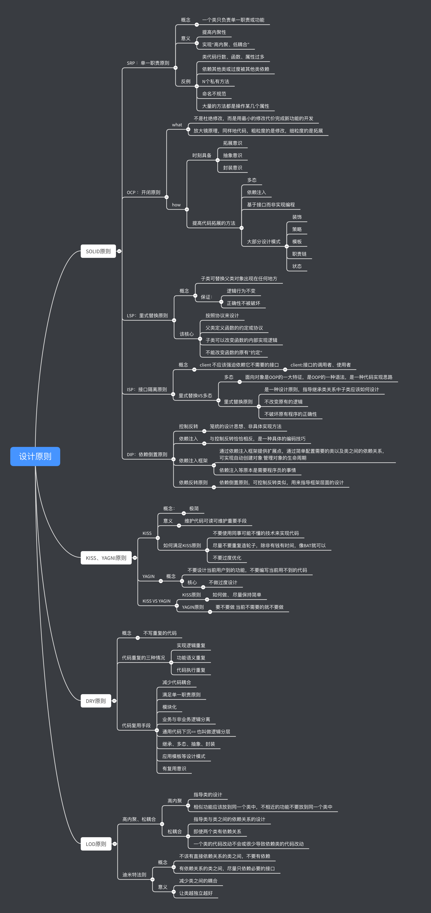

# 《 架构师的功夫》
>  英文 《KongFuOfArchitect》

## 版本 2.2.3

## [完整在线文档](https://xiaomiwujiecao.github.io/KongFuOfArchitect/)

[Full Documentation](https://xiaomiwujiecao.github.io/KongFuOfArchitect/)

## 致谢

感谢   [JetBrains的支持](https://www.jetbrains.com/?from=KongFuOfArchitect) ， 让我不必受开发工具的限制，提高书写效率。

## 前言

### 关于科学与计算机科学的一些思考

#### 从变化中寻找不变

科学是建立于思考上的，但它不是”真实“，它是建立于生活上的，但它不是生活。

从麦克斯韦开始到爱因斯坦，我们的科学大厦建立于这些杰出的科学家的伟大杰作之上。而我仅是站在巨人肩膀上的一个下里巴人。

科学是思考的最强有力的工具，但我们的认知却一直在变化，从出生到死亡，从一开始的不变到为什么不变，再到什么一直不变。

作为科学发展中最有力的实用利器，计算机科学，程序所表现的调节性与环境的适应性，一直都作为科学家们不断争论的课题。

而看不到调节性和适用性的互补会让解决问题变得越来越复杂，科学家们致力于打造完美的封闭式实验环境，或者趋近于此。

而作为观察者的实验者是否也是处于变量中的一个因素呢，毕竟只有观察者观察了实验中的白盒或者黑盒，才能得到一些近似于”规律“的东西。

我们确定的以及坚定的相信未来，相信未来是确定的，但这样的包含所有可能的公式，是否存在或即便存在，也会穷尽许多科学家的一生。

我们探索、认知、反省、但很多事物或规律是经过简化的，是的，科学最有力的解决复杂问题的方式就是拆解，拆解之后再复原。

人的思考能力有限，拆解是最好的方式，也是最好的思维工具，但是我们不能确定的是经过拆解和简化条件的”自然规律“是否还是原来的那个”它“。

我们要无限趋近于”事实“的本身，并最终发现真正的”真理“，只有科学不断的完善和强大，还原最接近”完美"的规律，而我只是这些浪花中的一滴水。

#### 简化的力量

一切都建立在差异化、简化的基础上。

我们的痛苦、快乐、愤怒、悲伤只有在差异化发生的时候。它才能被我们关注！

并存储于记忆的片段中。这就是痛苦的人为什么对痛苦的自己感到无能为力的一个主要因素。

差异化在符合人们的认知方式的体系中，占据着主导地位。如果将一个三维的物体表示在一个二维的平面上，

我们可能丢失一部分信息，而我们如果能够物体切片，并记录下来足够多的投影信息，那么在还原它的时候，我们能够保证一定的准确性。

假设我们将投影这种技术记为一种变换 `F` ，那么我们实际上就是通过 `F` 来转换并存储足够多的信息，而原来的球体信息就是我们的输入 `I` 。

那么对于任何一个投影，我们都可以表示为 `S(投)  = F(I) `, 假设我们要考虑到额外的变量 `V`，例如来自立方体的属性，我们可以将其

添加到我们变量中来，例如 `S(投)  = F(I,V)`, 假设这些变量是使用我们的计算机模拟表示，

我们可以记作为 `V= g(p,v)`,因此我们可以得出 `S(投)  = F(I,g(p,v))`。

通过一般性的归纳，我们可以更加方便的探索自然科学的规律。假设一开始我们就想着直接通过实验阐释庞大系统的一般性规律，往往实验会以失败而告终。

对于一个陌生的、庞大的、复杂的系统，例如银行系所有星星的精确轨迹，即使你能观察其中的规律，我想可能要花费和宇宙年龄差不多的时间。

### win 用户开发效率提升方法

- [windows 流畅开发准备工作](https://ai.nodejs7.com/2020/01/14/118.html)
- [在windows 7| 8| 10 .etc 中使用 `vim` 作为 `ide` 的配置方法](https://github.com/xiaomiwujiecao/use_vim_in_winX)

## 架构师的成长路线

> 根据极客时间 `《从0开始学架构》`与`《斗罗大陆》`对比整理

### 内功：

#### 架构师

- 判断力
- 执行力
- 创新力

对照：

##### 封号斗罗：

- 紫极魔瞳
- 玄天功
- 鬼影迷踪

### 能力来源

#### 架构师：

- 经验
- 视野
- 思考

#### 封号斗罗：

- 魂力--魂师等级
- 魂环
- 魂骨
- 魂灵

### 指导原则

#### 架构师：

- 积累经验
- 拓宽视野
- 深度思考

#### 封号斗罗:

- 战斗经验
- 游走大陆
- 战术与战略

### 等级成长

#### 工程师 == 魂师

- 特征： 在别人的指导下完成开发

- 技能：
    - 语法、基本数据结构
    - 各种工具
    - 数据库、缓存
    - 业务系统的基本流程

#### 高级工程师 == 大魂师

- 特征： 独立完成开发

- 技能：
    - 深度：
        - 知道how 、 知道 why
        - 实现原理
    - 理论：
        - 前人总结出来的成熟的设计经验
        - 研究源码
        - 系统学习
        - 源码

#### 技术专家 == 魂尊 || 魂宗

- 特征: 某个领域的专家

- 技能：
    - 拓展技术宽度
        - 学习业界成熟的开源方案
        - 研究业界的经验分享
        - 深入去理解每个技术的原理、优缺点、应用场景
        
#### 初级架构师 == 魂王 || 魂帝

- 特征：独立完成一个系统的架构设计

- 技能：   
    - 形成自己的“架构设计方法论
        - 架构设计目的
        - 架构设计原则
        - 架构设计步骤
        - 架构设计模式
    学习手段：
        - 系统学习架构设计方法论
            - 订阅专栏
            - 阅读书籍
        - 深入研究成熟开源系统的架构设计
            - 聚焦于学习其架构设计原理和思想
- 与专家的区别:

> 架构师是基于完善的架构设计方法论的指导来进行架构设计，而技术专家更多的是基于经验进行架构设计

#### 中级架构师 == 魂圣 || 魂斗罗

- 特征:能够完成复杂系统的架构设计

- 技能
    - 技术理论
        - CAP、BASE
            > 异地多活的设计理论基础
        - Paxos
            > 是分布式一致性的基础算法
        - 2PC、3PC
            > 分布式事务的基础算法
    - 技术深度
        - Kafka
            > 磁盘顺序写
        - Disruptor
            > CPU 预读取机制、缓存行、无锁设计等基础
        - Storm
            > 高效异或确认机制
        - Flink
            > 分布式快照算法

#### 高级架构师 == 封号斗罗

- 特征：创造新的架构模式

- 可能诞生创造性架构的背景条件：
    - 足够复杂的业务场景
        - 谷歌大数据
        - 阿里的双十一
        - Facebook 的海量用户
    - 足够强大的技术团队
        - 大公司
        - 知名的研究机构
    - 不满足于现状的态度
        - Docker
        - Storm
    - 尊重技术价值的文化
        - OKR 而不是 KPI

##  IT界国内"七大宗门"

- BAT

- TMD

- P

> 以上内容部分引自 [极客时间](https://time.geekbang.org/)  -- 高效学习、快乐学习

## 项目主旨

《架构师的功夫》教程合集、文章合集包含:

- 思想指引
- 资源汇总
- 范式编程
- 高效成长
- 必备算法
- 数据结构
- 架构思想
- 机器学习
- 区块链
- ...

## 引言

> 无名，天下之始；有名，天下之母  -- 《道德经》

> 当人类的文明发展到一定的阶段，一些基本性的问题就会被提出讨论，像是宇宙本源、万物之母，往往成为科学家与哲学家争论的焦点。

## 序

一般的，从简化问题角度出发，我先提出作为技术出身的人的疑问.

1. 我们是否能跨行业、专业去思考技术问题？

2. 是否被自己的职业认知所限制？

3. 传统经典读物,是否有利于提升技术修养？

4. 我们口中的 "道" 和 架构有哪些根本的联系？

以上的问题只是一小部分，问题的答案没有标准，问题的提出，是为了让我们能够从本源出发，认识自己。

下面我就谈谈我们需要注重的几点：

## 第一步：认识自己

如何找到最根本的问题的答案，要从柏拉图说的:"认识你自己"，卢梭说的: "伟大的人是决不会滥用他们的优点的，他们看出他们超过别人的地方，并且意识到这一点，然而绝不会因此就不谦虚。他们的过人之处越多，他们越认识到他们的不足"。

在我看来， 架构设计和 "道" 存在着微妙的关系，对"道"的理解越深，思想和认知的层次越深，那么我们能知道如何化繁为简，如何跳出认知的局限，看到我们自身的不足，从而真正的提升自己，成为那个心中的自己 -- 一名合格的架构师

## 第二步: 全局观

> 天地万物都是自己化育、自己成长。所以说「天地不仁，以万物为刍狗」，大道以及天地都无所谓意志、无所谓仁慈，一任万物自生自灭；万物自生自灭，即是遵循「道」、遵循自然的规律，这就是「万物归焉」。

任何事物都有自己的生命周期，这个在我们出生的时候就已经写在了我们的 `DNA` 中 ，每个人都会经历出生、青年、壮年、老年、死亡，这个过程。

"人法地,地法天，天法道，道法自然"。自然就是最伟大的架构师。

> 无生有，有生万物

认识架构过程我个人理解为如下几个层次

1. 自我对于自身的认知，认知的越深、知道自身的不足越多、提升越快

2. 领悟 "道" 和 架构设计之间的微妙关系，练就全局视角的掌控力

3. 架构设计的落地，作为一名架构师、如何设计基础、各个终端、如何形成较好的架构思维、架构范式、软件工程等等

## 第三步：实战出真知

> 实践，是个伟大的揭发者，它暴露一切欺人和自欺。——车尔尼雪夫斯基（俄）

> 每个人都会有缺陷，就像被上帝咬过的苹果，有的人缺陷比较大，正是因为上帝特别喜欢他的芬芳。—— 列夫托尔斯泰

理论再高深，他只是理论，作为一名工程师或架构师，当我们想要将一件事情做好的时候，我们可以将这件事当做学术问题来研究，也就是 `科学精神(学术精神)`。

我们日常的生活中，不缺乏很多只会高谈阔论的"学者",我觉的做什么都可以，关键人家要看你这个人做的事情的结果，而不是你理论。

## 第四步：职业认知

软件工程没有"银弹"，同样，软件工程里也没有真正的《九阴真经》，学会了就可以驰骋天下，这个只会出现在小说里。

认识自己，是我们一辈子的事情，相同的，如果想把软件工程当成一辈子事业来做，是更加的困难，只是困难，不是不能。

最后引用"左耳朵耗子"的一句话来结束我的浅述。

> “我们学计算机当程序员最大的福气不是可以到大公司里加班和 996，而是我们生活在了第三次工业革命的信息化时代，这才是最大的福气，所以，我们应该努力地提升自己，而不是把自己当劳动力一样的卖了！在这样的一个时代，你要做的不是通过加班和拼命来跪着挣钱，而是通过技能来躺着挣钱……”

## 整体目录

- [part1 | 架构基础 --->点击进入](./part1/README.md)
- [part2 | 算法与数据 --->点击进入](./part2/README.md)
- [part3 | 范式编程](./part3/README.md)
  - [第一章 `JAVA` 技术栈--->点击进入](./part3/java/README.md)
  - [第二章 `GO` 函数式编程--->点击进入](./part3/go/README.md)
  - [第三章 `Scala` 编程--->点击进入](./part3/scala/README.md)
  - [第四章 `LISP`编程 --->点击进入](./part3/lisp/README.md)
  - [第五章 `Prolog`编程--->点击进入 ](./part3/prolog/README.md)
  - [第六章 `yaml` 数据序列化 --->点击进入 ](./part3/yaml/README.md)
  - [第六章 `Erlang` 函数式编程 --->点击进入 ](./part3/erlang/README.md)
  - [第七章 `C++` 与 `标准库` --->点击进入 ](./part3/c++_stl/README.md)
- [part4 | 高效成长 --->点击进入](./part4/README.md)
    - [**JAVA** 并发编程](./part4/java_concurrency/README.md)
    
    - [**JAVA** 并发编程-在线文档版](/part4/java_concurrency/README.md)
    
    - [**JAVA** `Class` 与 `JVM`](./part4/java_class_jvm/README.md)
    
    - [**JAVA** `Class` 与 `JVM` -在线文档版](/part4/java_class_jvm/README.md)
    
    - [**JAVA** 设计模式--笔记-- ](./part4/java_designPattern/README.md)
    
    - [**JAVA** 设计模式--笔记-- -在线文档版](/part4/java_designPattern/README.md)
- [part5 | 资源汇总 --->点击进入](./part5/README.md)
- [part6 | 大道至简--->暂未更新](./part6/README.md)
- [part7 | AI与区块链--->暂未更新](./part7/README.md)
- [part8 | 微服务与自动化--->暂未更新](./part8/README.md)
- [part9 | 负载均衡--->暂未更新](./part9/README.md)
- [part10 | 编译原理--->点击进入](part10/README.md)
- [part11 | 安全与渗透--->暂未更新](part11/README.md)
    - [汇编基础--->点击进入](https://github.com/xiaomiwujiecao/GAB)
    - [ios庖丁解牛--->点击进入](https://github.com/xiaomiwujiecao/iosKnife)
- [part12 | Shell脚本 --->点击进入](https://github.com/xiaomiwujiecao/cleverShell)

## 大纲描述

- 架构基础
  - 大部分`架构`基础知识
- 算法与数据
  - 常用的`算法`与数据结构
- 范式编程
  - 如何认知编程的`本质`
- 高效成长
  - 作为技术人 如何高效`自学成才`
- 资源汇总
  - 整理架构相关的`资源`
- 大道至简
  - 如何提高自身的认知和逻辑`思维层次`  
- AI与区块链
  - `AI`基础知识
  - `区块链`基础知识
- 微服务与自动化 
  - 微服务架构基础知识
  - 自动化流程 、 `DevOps`   
 

## "攻城狮"的自学路线指北
 
> 根据《极客时间》APP 整理 ，只包含路线

### 计算机专业课

-  计算机组成原理
-  linux 系统
    - 操作系统基础知识
    - 网络协议
    - Socket 套接字编程
-  数学基础课
    - 数学基础课
    - 线性代数
    - 微积分
-  算法
-  数据结构
-  软件工程
-  设计模式
-  编译原理
- 软件设计    
- 软件工程

### web 与 架构

> （一般的，以JAVA工业级语言为准）

-   脉络图
    -   《左耳听风》
-   JAVA基础知识
-   架构基础知识
-   虚拟机原理
-   分布式技术栈、分布式架构 
-   架构基础知识
-   框架分析与编程思想
-   Linux性能优化
-   Web 安全
-   C++ 系列
-   数据库系列
-   各种原理解析

### 前端与移动端、桌面端 -> 统称 客户端

- web
    - Http 协议
    - Nodejs
    - TS
    - webpack ,rollup ...
    - React
    - Vue
    - V8
    - 安全
    
-   移动端    
    - 混合
        - Flutter
        - RN
        - 微软系列
        - 
    - mp(小程序)    
       -  ...
        
    - 原生
        - Android
            - Kotlin
            - Java
        - IOS
            - Swift
            - OC
-   桌面端
    -   Electron    
    -   .Net Core
    -   NW.js
    - ...
    
- 原理

### 人工智能与大数据
-   大数据
    -   从零开始
    -   中台
    -   大数据检索
    -   大数据处理
-   人工智能
    -   Python 基础
    -   人工智能基础
    -   TF(tensorflow)
    -   数据分析实战
    -   推荐系统
    -   技术内参
    -    NLP

## 高质量代码指北

> 引用内容 极客时间《设计模式之美》

### 如何编写高质量代码

### 设计模式

### 质量评估标准

### 面向对象

### 设计原则

### 规范与重构 

    

## ISSUES 问题

 如果您有任何建议和错误反馈，例如发现了错别字，请在 `ISSUES` 中直接指出，谢谢！

## 问题讨论 

请阁下移步：https://github.com/xiaomiwujiecao/KongFuOfArchitect/issues/

## 贡献

`fork` 此项目并 `pull request` 你新增的源码

## 项目维护周期

本项目长期维护 LTS

## 遵循协议

## CHANGE LOG

- 2020年07月25日
    
    - [+] [汇编基础](https://github.com/xiaomiwujiecao/GAB)
    
    - [+] [ios庖丁解牛](https://github.com/xiaomiwujiecao/iosKnife)

- 2020年07月07日 

    - [+] `安全与渗透` 教程
    - [+] `自学指北` 

- 2020年05月03日
  
  - [+] `LISP` 基础编程文字教程
  - [branch] 增加 `spring` , `Algorithm` 维护者增加

- 2020年04月01日

  - [+] 增加廖雪峰博客`JAVA`教程笔记

## 致谢

感谢阁下的star，感谢关注此项目
