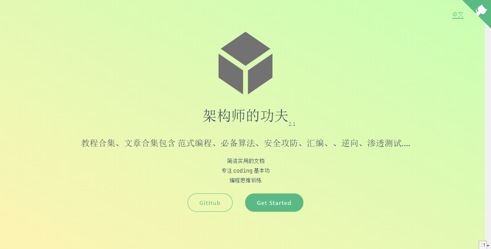

# 《 架构师的功夫》
>  英文 《KongFuOfArchitect》

> 补充一句： 所有教程均为 `md` 与 实际代码的方式，因为代码量较大，且很多项目目录较深，请使用 `IDE` 打开 或者找到项目目录按照单个项目打开

## 前言

### 关于科学与计算机科学的一些思考

[一些思考](./thought.md)

### win 用户开发效率提升方法

[高效方法](./effective.md)

## 架构师的成长路线

[成长路线](./path.md)

## 项目主旨

[主要包含](./major.md)

## 序言

[序言](./sequence.md)

## 整体目录

- [part1 | 架构基础 --->点击进入](./part1/README.md)
- [part2 | 算法与数据 --->点击进入](./part2/README.md)
- [part3 | 范式编程](./part3/README.md)
  - [第一章 `JAVA` 技术栈--->点击进入](./part3/java/README.md)
  - [第二章 `GO` 函数式编程--->点击进入](./part3/go/README.md)
  - [第三章 `Scala` 编程--->点击进入](./part3/scala/README.md)
  - [第四章 `LISP`编程 --->点击进入](./part3/lisp/README.md)
  - [第五章 `Prolog`编程--->点击进入 ](./part3/prolog/README.md)
  - [第六章 `yaml` 数据序列化 --->点击进入 ](./part3/yaml/README.md)
  - [第六章 `Erlang` 函数式编程 --->点击进入 ](./part3/erlang/README.md)
  - [第七章 `C++` 与 `标准库` --->点击进入 ](./part3/c++_stl/README.md)
- [part4 | 高效成长 --->点击进入](./part4/README.md)
    - [**JAVA** 并发编程](./part4/java_concurrency/README.md)
    
    - [**JAVA** 并发编程-在线文档版](/part4/java_concurrency/README.md)
    
    - [**JAVA** `Class` 与 `JVM`](./part4/java_class_jvm/README.md)
    
    - [**JAVA** `Class` 与 `JVM` -在线文档版](/part4/java_class_jvm/README.md)
    
    - [**JAVA** 设计模式--笔记-- ](./part4/java_designPattern/README.md)
    
    - [**JAVA** 设计模式--笔记-- -在线文档版](/part4/java_designPattern/README.md)
- [part5 | 资源汇总 --->点击进入](./part5/README.md)
- [part6 | 大道至简--->暂未更新](./part6/README.md)
- [part7 | AI与区块链--->暂未更新](./part7/README.md)
- [part8 | 微服务与自动化--->暂未更新](./part8/README.md)
- [part9 | 负载均衡--->暂未更新](./part9/README.md)
- [part10 | 编译原理--->点击进入](part10/README.md)
- [part11 | 安全与渗透--->暂未更新](part11/README.md)
    - [汇编基础--->点击进入](https://github.com/xiaomiwujiecao/GAB)
    - [汇编游记--->点击进入](part11/assembly/README.md)
    - [ios庖丁解牛--->点击进入](https://github.com/xiaomiwujiecao/iosKnife)
- [part12 | Shell脚本 --->点击进入](https://github.com/xiaomiwujiecao/cleverShell)
- [part13 | 大前端](./part13/README.md)
- [part14 | 案例实战](./part14/README.md)
## 大纲描述

[大纲](./framework.md)

## "攻城狮"的自学路线指北
 
[自学指北](./self_charge.md)

## 高质量代码指北

[代码质量](./high_quality_code.md)
    

## ISSUES 问题

 如果您有任何建议和错误反馈，例如发现了错别字，请在 `ISSUES` 中直接指出，谢谢！

## 问题讨论 

请阁下移步：https://github.com/xiaomiwujiecao/KongFuOfArchitect/issues/

## 版本 2.2.3

## [完整在线文档](https://xiaomiwujiecao.github.io/KongFuOfArchitect/)

[Full Documentation](https://xiaomiwujiecao.github.io/KongFuOfArchitect/)

## 致谢

感谢   [JetBrains的支持](https://www.jetbrains.com/?from=KongFuOfArchitect) ， 让我不必受开发工具的限制，提高书写效率。

## 项目维护周期

本项目长期维护 `LTS`

## 遵循协议

## CHANGE LOG

[更改记录](change_log.md)

## 博客缩略图/点击即达

