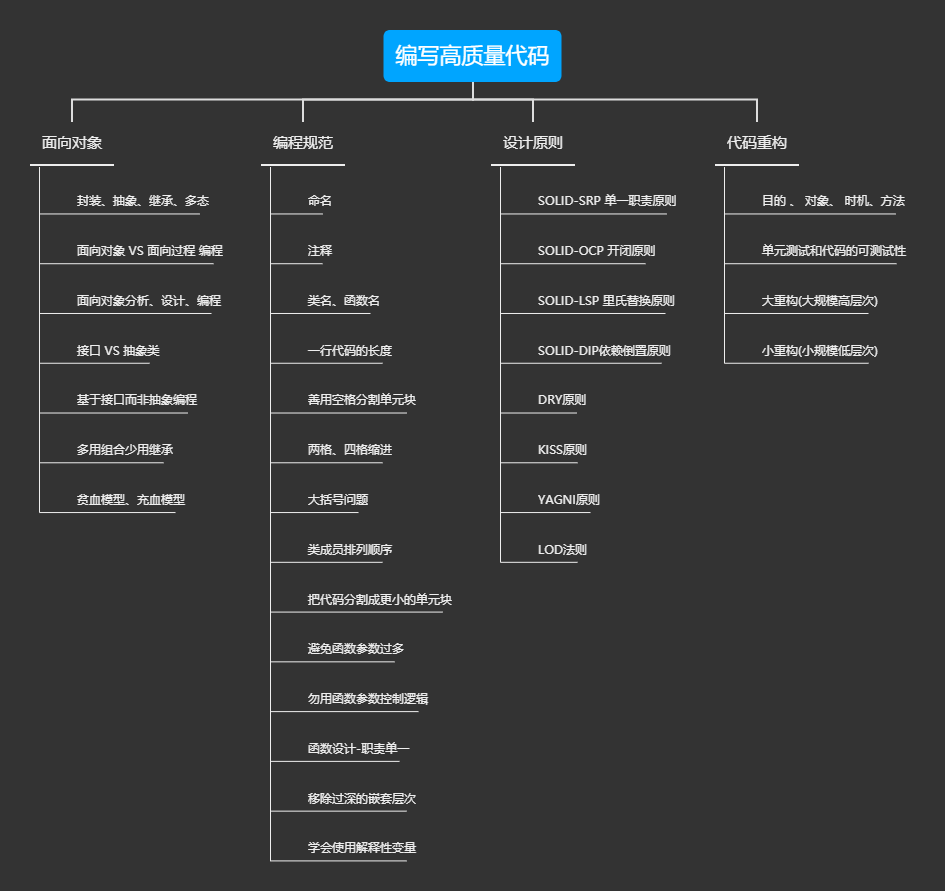
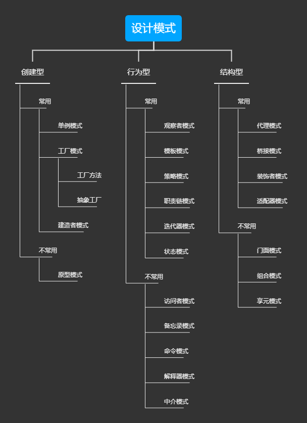
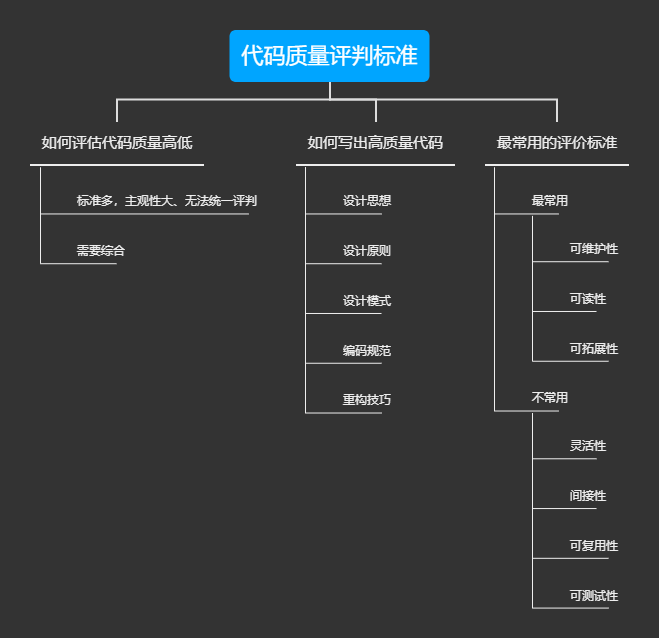
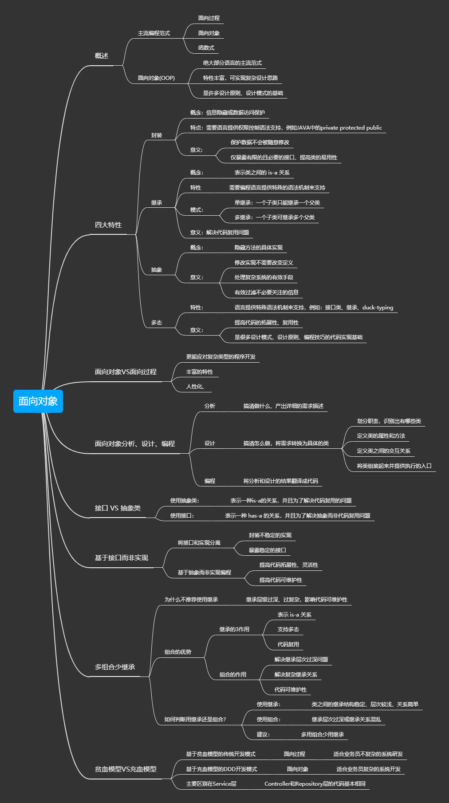

# 《 架构师的功夫》

>  英文 《KongFuOfArchitect》


## 前言

### 工欲善其事必先利其器

Windows平台开发如何能够更快捷，更舒适，请 Windows 的看官务必读一下这篇：

[windows 流畅开发准备工作](https://ai.nodejs7.com/2020/01/14/118.html)

## 项目主旨

《架构师的功夫》教程合集、文章合集包含:

- 思想指引
- 资源汇总
- 范式编程
- 高效成长
- 必备算法
- 数据结构
- 架构思想
- 机器学习
- 区块链
- ...

## 项目维护周期

本项目长期维护 LTS


## 遵循协议

[](https://github.com/996icu/996.ICU/blob/master/LICENSE)
[](https://996.icu)

## CHANGE LOG

- 2020年07月07日 

- 增加 `安全与渗透` 教程
- 增加 `自学指北` 


- 2020年05月03日
  
  - 增加 `LISP` 基础编程文字教程
  - 分支 增加 `spring` , `Algorithm` 维护者增加

- 2020年04月01日

  - 增加廖雪峰博客`JAVA`教程笔记


## 引言

> 无名，天下之始；有名，天下之母  -- 《道德经》

> 当人类的文明发展到一定的阶段，一些基本性的问题就会被提出讨论，像是宇宙本源、万物之母，往往成为科学家与哲学家争论的焦点。


## 序

一般的，从简化问题角度出发，我先提出作为技术出身的人的疑问.

1. 我们是否能跨行业、专业去思考技术问题？

2. 是否被自己的职业认知所限制？

3. 传统经典读物,是否有利于提升技术修养？

4. 我们口中的 "道" 和 架构有哪些根本的联系？


以上的问题只是一小部分，问题的答案没有标准，问题的提出，是为了让我们能够从本源出发，认识自己。

下面我就谈谈我们需要注重的几点：

## 第一步：认识自己

如何找到最根本的问题的答案，要从柏拉图说的:"认识你自己"，卢梭说的: "伟大的人是决不会滥用他们的优点的，他们看出他们超过别人的地方，并且意识到这一点，然而绝不会因此就不谦虚。他们的过人之处越多，他们越认识到他们的不足"。

在我看来， 架构设计和 "道" 存在着微妙的关系，对"道"的理解越深，思想和认知的层次越深，那么我们能知道如何化繁为简，如何跳出认知的局限，看到我们自身的不足，从而真正的提升自己，成为那个心中的自己 -- 一名合格的架构师

## 第二步: 全局观

> 天地万物都是自己化育、自己成长。所以说「天地不仁，以万物为刍狗」，大道以及天地都无所谓意志、无所谓仁慈，一任万物自生自灭；万物自生自灭，即是遵循「道」、遵循自然的规律，这就是「万物归焉」。

任何事物都有自己的生命周期，这个在我们出生的时候就已经写在了我们的 `DNA` 中 ，每个人都会经历出生、青年、壮年、老年、死亡，这个过程。

"人法地,地法天，天法道，道法自然"。自然就是最伟大的架构师。

> 无生有，有生万物

认识架构过程我个人理解为如下几个层次

1. 自我对于自身的认知，认知的越深、知道自身的不足越多、提升越快

2. 领悟 "道" 和 架构设计之间的微妙关系，练就全局视角的掌控力

3. 架构设计的落地，作为一名架构师、如何设计基础、各个终端、如何形成较好的架构思维、架构范式、软件工程等等


## 第三步：实战出真知

> 实践，是个伟大的揭发者，它暴露一切欺人和自欺。——车尔尼雪夫斯基（俄）

> 每个人都会有缺陷，就像被上帝咬过的苹果，有的人缺陷比较大，正是因为上帝特别喜欢他的芬芳。—— 列夫托尔斯泰

理论再高深，他只是理论，作为一名工程师或架构师，当我们想要将一件事情做好的时候，我们可以将这件事当做学术问题来研究，也就是 `科学精神(学术精神)`。

我们日常的生活中，不缺乏很多只会高谈阔论的"学者",我觉的做什么都可以，关键人家要看你这个人做的事情的结果，而不是你理论。

## 第四步：职业认知

软件工程没有"银弹"，同样，软件工程里也没有真正的《九阴真经》，学会了就可以驰骋天下，这个只会出现在小说里。

认识自己，是我们一辈子的事情，相同的，如果想把软件工程当成一辈子事业来做，是更加的困难，只是困难，不是不能。

最后引用"左耳朵耗子"的一句话来结束我的浅述。


> “我们学计算机当程序员最大的福气不是可以到大公司里加班和 996，而是我们生活在了第三次工业革命的信息化时代，这才是最大的福气，所以，我们应该努力地提升自己，而不是把自己当劳动力一样的卖了！在这样的一个时代，你要做的不是通过加班和拼命来跪着挣钱，而是通过技能来躺着挣钱……”

## 知识体系


## 整体目录

- [part1 | 架构基础](./part1/README.md)
- [part2 | 算法与数据](./part2/README.md)
  - [算法与数据结构基础](./part2/01/README.md)
- [part3 | 范式编程](./part3/README.md)
  - [第一章 `JAVA` 技术栈](./part3/java/README.md)
  - [第二章 `GO` 技术栈](./part3/go/README.md)
  - [第三章 `Scala` 技术栈](./part3/scala/README.md)
  - [第四章 `LISP`编程 ](./part3/lisp/README.md)
- [part4 | 高效成长](./part4/README.md)
- [part5 | 资源汇总](./part5/README.md)
  - [第一章 `EcmaScript` 与 `Nodejs`](./part5/js/README.md)
- [part6 | 大道至简](./part6/README.md)
- [part7 | AI与区块链](./part7/README.md)
- [part8 | 微服务与自动化](./part8/README.md)
- [part9 | 负载均衡](./part9/README.md)
- [part10 | 编译原理](part10/README.md)
- [part11 | 安全与渗透](part11/README.md)
- [part12 | Shell脚本](https://github.com/xiaomiwujiecao/cleverShell)

## 大纲描述

- 架构基础
  - 大部分`架构`基础知识
- 算法与数据
  - 常用的`算法`与数据结构
- 范式编程
  - 如何认知编程的`本质`
- 高效成长
  - 作为技术人 如何高效`自学成才`
- 资源汇总
  - 整理架构相关的`资源`
- 大道至简
  - 如何提高自身的认知和逻辑`思维层次`  
- AI与区块链
  - `AI`基础知识
  - `区块链`基础知识
- 微服务与自动化 
  - 微服务架构基础知识
  - 自动化流程 、 `DevOps`   
 

## "攻城狮"的自学路线指北
 
> 根据《极客时间》APP 整理 ，只包含路线

### 计算机专业课


-  计算机组成原理
-  linux 系统
    - 操作系统基础知识
    - 网络协议
    - Socket 套接字编程
-  数学基础课
    - 数学基础课
    - 线性代数
    - 微积分
-  算法
-  数据结构
-  软件工程
-  设计模式
-  编译原理
- 软件设计    
- 软件工程

### web 与 架构

> （一般的，以JAVA工业级语言为准）

-   脉络图
    -   《左耳听风》
-   JAVA基础知识
-   架构基础知识
-   虚拟机原理
-   分布式技术栈、分布式架构 
-   架构基础知识
-   框架分析与编程思想
-   Linux性能优化
-   Web 安全
-   C++ 系列
-   数据库系列
-   各种原理解析

### 前端与移动端、桌面端 -> 统称 客户端

- web
    - Http 协议
    - Nodejs
    - TS
    - webpack ,rollup ...
    - React
    - Vue
    - V8
    - 安全
    
-   移动端    
    - 混合
        - Flutter
        - RN
        - 微软系列
        - 
    - mp(小程序)    
       -  ...
        
    - 原生
        - Android
            - Kotlin
            - Java
        - IOS
            - Swift
            - OC
-   桌面端
    -   Electron    
    -   .Net Core
    -   NW.js
    - ...
    
- 原理


### 人工智能与大数据
-   大数据
    -   从零开始
    -   中台
    -   大数据检索
    -   大数据处理
-   人工智能
    -   Python 基础
    -   人工智能基础
    -   TF(tensorflow)
    -   数据分析实战
    -   推荐系统
    -   技术内参
    -    NLP


## 高质量代码指北

> 引用内容 极客时间《设计模式之美》

### 如何编写高质量代码




### 设计模式



### 质量评估标准



### 面向对象



### 设计原则


### 规范与重构 

    
## 参与核心贡献

如果您有意愿参与任何一部分的贡献,请直接通过以下方式

1. 发送合作意向到我的 `gmail` 邮箱：

```
xiaomiwujiecao@gmail.com
```
2. 参照 [ISSUES](https://github.com/xiaomiwujiecao/KongFuOfArchitect/issues/1) 页面的方式，`fork` 之后按照格式提交


## 贡献者

[贡献者列表](https://github.com/xiaomiwujiecao/KongFuOfArchitect/graphs/contributors)


## TODO LIST

- [x] 第 `1` 部分 架构基础
- [ ] 第 `2` 部分 算法与数据
- [x] 第 `3` 部分 范式编程
- [ ] 第 `4` 部分 高效成长
- [ ] 第 `5` 部分 资源汇总
- [ ] 第 `6` 部分 大道至简

## ISSUES 问题管理

1. 如果您有任何建议和错误反馈，例如发现了错别字，请在 `ISSUES` 中直接指出，谢谢！
2. 也可以在博客文章详情下方进行上述操作，我会在看到后的第一时间进行修改

## 问题讨论 

请移步：https://github.com/xiaomiwujiecao/KongFuOfArchitect/issues/3

## 贡献

`fork` 此项目并 `pull request` 你新增的源码


## 致谢

感谢阁下的star，感谢关注此项目，如果此项目对阁下产生了帮助，在下页诚挚的邀请你通过移动客户端的方式获取更多的资讯、知识、以及实用的工具，
详情参见： [武文弄墨](https://app.nodejs7.com/)，再次表示真挚的感谢！