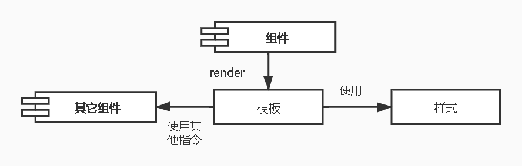
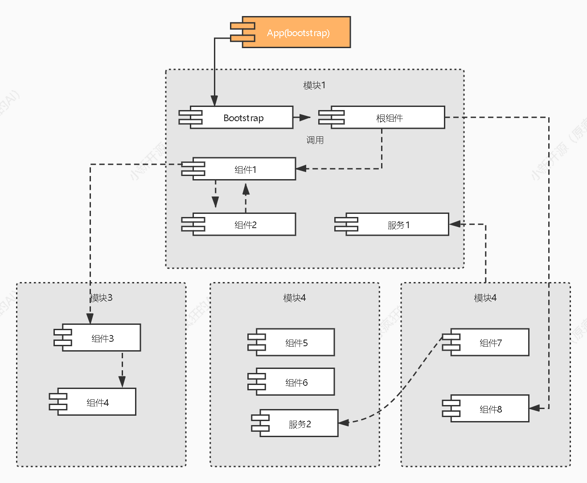

# learn ng8

This project was generated with [Angular CLI](https://github.com/angular/angular-cli) version 8.0.0.

## Development server

Run `ng serve` for a dev server. Navigate to `http://localhost:4200/`. The app will automatically reload if you change
any of the source files.

## Code scaffolding

Run `ng generate component component-name` to generate a new component. You can also
use `ng generate directive|pipe|service|class|guard|interface|enum|module`.

## Build

Run `ng build` to build the project. The build artifacts will be stored in the `dist/` directory. Use the `--prod` flag
for a production build.

## Running unit tests

Run `ng test` to execute the unit tests via [Karma](https://karma-runner.github.io).

## Running end-to-end tests

Run `ng e2e` to execute the end-to-end tests via [Protractor](http://www.protractortest.org/).

## Further help

To get more help on the Angular CLI use `ng help` or go check out
the [Angular CLI README](https://github.com/angular/angular-cli/blob/master/README.md).

## 架构

Angular框架基于四个核心概念：

- 组件。

- 具有数据绑定和指令的模板。

- 模块。

- 服务和依赖注入。

## 组件

Angular 框架体系结构的核心是 Angular Component 。

Angular Component 是每个 Angular 应用程序的构建块。

每个 Angular 应用程序都由一个以上的 Angular Component 组成。

它基本上是一个普通的 JavaScript/Typescript 类,以及一个 HTML 模板和一个关联的名称。

HTML 模板可以从其相应的 JavaScript/Typescript 类访问数据。

组件的 HTML 模板可以使用其选择器的值(名称)包含其他组件。

Angular 组件可能具有关联的可选 CSS 样式,并且HTML模板也可以访问CSS样式。



让我们分析AppComponent组件。

AppComponent代码如下-

```js
// src/app/app.component.ts 
import {Component} from '@angular/core';

@Component({
  selector: 'app-root',
  templateUrl: './app.component.html',
  styleUrls: ['./app.component.css']
})
export class AppComponent {
  title = 'Expense Manager';
}
```

`@Component` 是一个装饰器,用于将普通的 Typescript 类转换为 Angular Component。

`app-root` 是组件的`/`选择器名称,它是使用组件装饰器的选择器元数据指定的。

可以由应用程序根文档 `src/index.html` 使用 `app-root` ,如下所示

```html
<!doctype html>
<html lang="en">
<head>
  <meta charset="utf-8">
  <title></title>
  <base href="/">
  <meta name="viewport" content="width=device-width, initial-scale=1">
  <link rel="icon" type="image/x-icon" href="favicon.ico">
</head>
<body>
<app-root></app-root>
</body>
</html>
```

|组件名|描述|
|------------|------------|
|app.component.html|是与组件关联的HTML模板文档。使用@Component装饰器的templateUrl元数据指定组件模板。|
|app.component.css|是与组件关联的CSS样式文档。组件样式是使用@Component装饰器的styleUrls元数据指定的。|

可以在 HTML 模板中使用 AppComponent 属性(标题),如下所述-

```html
{{ title }}
```

## 模板

模板基本上是 HTML 的超集。

模板包含HTML的所有函数,并提供其他函数以将组件数据绑定到 HTML 并动态生成 HTML DOM 元素。

模板的核心概念可以分为两个项目,它们如下：

### 数据绑定

用于将数据从组件绑定到模板。

```html
{{ title }}
```

这里,`title` 是 `AppComponent` 中的一个属性,它使用 `Interpolation(插值法)` 绑定到模板。

### 指令

用于包含逻辑并允许创建复杂的 HTML DOM 元素。

```angular2html
<p*ngIf="canShow">
This sectiom will be shown only when the*canShow* propery's value in the corresponding component is*true* </p>
<p [showToolTip]='tips'/>
```

在这里,`ngIf` 和 `showToolTip`(仅作为示例)是指令。

`ng` 仅在 `canShow` 为 `true` 时创建段落 `DOM` 元素。

同样,`showToolTip` 是'属性指令”,它将工具提示函数添加到段落元素。

当用户将鼠标悬停在段落上时,将显示一个工具提示。

工具提示的内容来自其相应组件的 `tips` 属性。

## 模块

`Angular Module` 基本上是相关函数的集合。

`Angular Module` 在单个上下文中将多个组件和服务分组。

例如,与动画有关的函数可以分组为单个模块,而 `Angular` 已经提供了与动画有关的函数的模块 `BrowserAnimationModule` 模块。

Angular应用程序可以具有任意数量的模块,但是只能将一个模块设置为根模块,它将引导应用程序,然后在依赖时调用其他模块。

一个模块也可以配置为从其他模块的访问函数。

简而言之,来自任何模块的组件都可以访问来自任何其他模块的组件和服务。

下图描述了模块及其组件之间的交互。



|属性|描述|
|------------|------------|
|`NgModule`| 装饰器用于将普通的 Typescript/JavaScript 类转换为 Angular 模块。
|`declarations`| 选项用于将组件包含到AppModule模块中。
|`bootstrap`| 选项用于设置 AppModule 模块的根组件。
|`provider`| 选项用于包含 AppModule 模块的服务。
|`imports` |选项用于将其他模块导入 AppModule 模块。

app.module.ts

```js
import {BrowserModule} from '@angular/platform-browser';
import {NgModule} from '@angular/core';
import {AppComponent} from './app.component';

@NgModule({
  declarations: [
    AppComponent
  ],
  imports: [
    BrowserModule
  ],
  providers: [],
  bootstrap: [AppComponent]
})
export class AppModule {
}
```

## 服务

服务(Service)是普通的 Typescript/JavaScript 类,提供了非常特定的函数。

服务(Service)将完成一项任务并将做到最好。

服务(Service)的主要目的是可重用性。

可将其分为服务而不是在组件内部编写函数,也可以使其在其他组件中使用。

而且,服务(Service)使开发人员能够组织应用程序的业务逻辑。

基本上,组件使用服务来完成自己的工作。

依赖注入(Dependency Injection)用于在组件中正确初始化服务,以便组件可以在依赖时访问服务而无需任何设置。

## Angular应用程序的工作流程

我们已经学习了 `Angular` 应用程序的核心概念。

让我们看看典型的 `Angular` 应用程序的完整流程。

`src/main.ts` 是 `Angular` 应用程序的入口点。

`src/main.ts` 引导 `AppModule`(`src/app.module.ts`),它是每个 `Angular` 应用程序的根模块。

```js
platformBrowserDynamic().bootstrapModule(AppModule).catch(err => console.error(err));
```

`AppModule` 引导 `AppComponent`(`src/app.component.ts`),它是每个 `Angular` 应用程序的根组件。

```js
@NgModule({
  declarations: [
    AppComponent
  ],
  imports: [
    BrowserModule
  ],
  providers: [],
  bootstrap: [AppComponent]
})
export class AppModule {
}
```

这里

|||
|------------|------------|
|AppModule|通过导入选项加载模块|
|AppModule|使用依赖注入(`DI`)框架加载所有注册的服务。|
|AppComponent|渲染其模板(`src/app.component.html`)并使用相应的样式(`src/app.component.css`)。`AppComponent` 名称,`app-root` 用于将其放置在 `src/index.html` 中。|

```html
<!doctype html>
<html lang="en">
<head>
  <meta charset="utf-8">
  <title>ExpenseManager</title>
  <base href="/">
  <meta name="viewport" content="width=device-width, initial-scale=1">
  <link rel="icon" type="image/x-icon" href="favicon.ico">
</head>
<body>
<app-root></app-root>
</body>
</html>
```

`AppComponent` 可以使用在应用程序中注册的任何其他组件。

```js
@NgModule({
  declarations: [
    AppComponent,
    AnyOtherComponent
  ],
  imports: [
    BrowserModule
  ],
  providers: [],
  bootstrap: [AppComponent]
})
export class AppModule {
}
```

组件使用目标组件的选择器名称通过其模板中的指令使用其他组件。

此外,所有注册服务都可以通过依赖注入( DI )框架访问所有 Angular 组件。

## 组件和模板

正如我们之前所了解的,组件是Angular应用程序的构建块。

Angular Component 的主要工作是生成网页的一部分,称为 `view` 。

每个组件都会有一个关联的模板,并将用于生成视图。

让我们在本章中学习组件和模板的基本概念。

### 添加一个组件

让我们在ExpenseManager应用程序中创建一个新组件。

打开命令提示符,然后转到应用程序。

```shell

cd /path/to/project

```

使用 `ng generate component` 命令创建一个新组件,如下所示-

```shell
ng generate component expense-entry
```

输出：

```text
CREATE src/app/expense-entry/expense-entry.component.html (28 bytes) 
CREATE src/app/expense-entry/expense-entry.component.spec.ts (671 bytes) 
CREATE src/app/expense-entry/expense-entry.component.ts (296 bytes) 
CREATE src/app/expense-entry/expense-entry.component.css (0 bytes) 
UPDATE src/app/app.module.ts (431 bytes)
```

`ExpenseEntryComponent` 在 `src/app/expense-entry` 文件夹下创建。

创建了组件类,模板和样式表。

`AppModule` 已更新了新组件。

将标题属性添加到 `ExpenseEntryComponent`(`src/app/expense-entry/expense-entry.component.ts`)组件。

```js
import {Component, OnInit} from '@angular/core';

@Component({
  selector: 'app-expense-entry',
  templateUrl: './expense-entry.component.html', styleUrls: ['./expense-entry.component.css']
})
export class ExpenseEntryComponent implements OnInit {
  title: string;

  constructor() {
  }

  ngOnInit() {
    this.title = "Expense Entry"
  }
}
```

使用以下内容更新模板src/app/expense-entry/expense-entry.component.html。

```html
<p>{{ title }}</p>
```

打开src/app/app.component.html并包含新创建的组件。

```html
<h1>{{ title }}</h1>
<app-expense-entry></app-expense-entry>
```

在学习更多有关模板的过程中,我们将更新组件的内容。

### 模板

Angular 组件的组成部分是 `Template`。

它用于生成 HTML 内容。

模板是具有附加函数的纯 HTML 。

#### 附加模板

可以使用 `@component ` 装饰器的元数据将模板附加到 Angular 组件。

`Angular` 提供了两个元数据以将模板附加到组件。

##### `templateUrl`

我们已经知道如何使用 `templateUrl` 。

它被认作为模板文件的相对路径。

例如,`AppComponent` 将其模板设置为 app.component.html 。

```js
templateUrl: './app.component.html',
```

##### template

模板可以将HTML字符串放置在组件本身内。

如果模板的内容很少,那么很容易拥有Component类本身,以便于跟踪和维护。

```js
@Component({
  selector: 'app-root',
  templateUrl: `<h1>{{ title }}</h1>`,
  styleUrls: ['./app.component.css']
})
export class AppComponent implements OnInit {
  title = 'Expense Manager';

  constructor(private

  debugService: DebugService
) {
}

ngOnInit()
{
  this.debugService.info("Angular Application starts");
}
}
```

### 附加样式表

Angular 模板可以使用类似于HTML的CSS样式。

模板从两个来源获取样式信息,

a)从其组件

b)从应用程序配置获取。

#### 组件配置

组件装饰器提供了两个选项,即 `styles` 和 `styleUrls` ,以为其模板提供CSS样式信息。

- 样式-`sytles`选项用于将 `CSS` 放置在组件本身内。

```js
styles: ['h1 { color: '#ff0000'; }']
```

- styleUrls-styleUrls用于引用外部CSS样式表。 我们也可以使用多个样式表。

```js
styleUrls: ['./app.component.css', './custom_style.css']
```

### 应用配置

Angular 在项目配置( angular.json )中提供了一个选项来指定CSS样式表。

angular.json 中指定的样式将适用于所有模板。

让我们查看 angular.json,如下所示-

```json
{
  "projects": {
    "expense-manager": {
      "architect": {
        "build": {
          "builder": "@angular-devkit/build-angular:browser",
          "options": {
            "outputPath": "dist/expense-manager",
            "index": "src/index.html",
            "main": "src/main.ts",
            "polyfills": "src/polyfills.ts",
            "tsConfig": "tsconfig.app.json",
            "aot": false,
            "assets": [
              "src/favicon.ico",
              "src/assets"
            ],
            "styles": [
              "src/styles.css"
            ],
            "scripts": []
          }
        }
      }
    }
  },
  "defaultProject": "expense-manager"
}
```

在这里,样式选项将`src/styles.css`设置为全局CSS样式表。

我们可以包含任意数量的CSS样式表,因为它支持多个值。

### 包含 bootstrap

让我们使用样式选项将引导程序包含到我们的ExpenseManager应用程序中,并更改默认模板以使用引导程序组件。

打开命令提示符,然后转到ExpenseManager应用程序。 使用以下命令安装引导程序和JQuery库：

```shell
npm install --save bootstrap@4.5.0 jquery@3.5.1
```

在这里,我们安装了JQuery,因为引导程序将jquery广泛用于高级组件。

选择angular.json并设置引导程序和jQuery库路径。

```json
{
  "projects": {
    "expense-manager": {
      "architect": {
        "build": {
          "builder": "@angular-devkit/build-angular:browser",
          "options": {
            "outputPath": "dist/expense-manager",
            "index": "src/index.html",
            "main": "src/main.ts",
            "polyfills": "src/polyfills.ts",
            "tsConfig": "tsconfig.app.json",
            "aot": false,
            "assets": [
              "src/favicon.ico",
              "src/assets"
            ],
            "styles": [
              "./node_modules/bootstrap/dist/css/bootstrap.css",
              "src/styles.css"
            ],
            "scripts": [
              "./node_modules/jquery/dist/jquery.js",
              "./node_modules/bootstrap/dist/js/bootstrap.js"
            ]
          }
        }
      }
    }
  },
  "defaultProject": "expense-manager"
}
```

在此,`scripts`  选项用于包含 `JavaScript` 库。

通过脚本注册的 `JavaScript` 将可用于应用程序中的所有 `Angular` 组件。

打开 `app.component.html` 并按以下指定更改内容

```html
<!-- Navigation -->
<nav class="navbar navbar-expand-lg navbar-dark bg-dark static-top">
  <div class="container">
    <a class="navbar-brand" href="#">{{ title }}</a>
    <button class="navbar-toggler" type="button" data-toggle="collapse" data-target="#navbarResponsive"
            aria-controls="navbarResponsive" aria-expanded="false" aria-label="Toggle navigation"> 
         <span class="navbar-toggler-icon">
         </span>
    </button>
    <div class="collapse navbar-collapse" id="navbarResponsive">
      <ul class="navbar-nav ml-auto">
        <li class="nav-item active">
          <a class="nav-link" href="#">Home
            <span class="sr-only">(current)
               </span>
          </a>
        </li>
        <li class="nav-item">
          <a class="nav-link" href="#">Report</a>
        </li>
        <li class="nav-item">
          <a class="nav-link" href="#">Add Expense</a>
        </li>
        <li class="nav-item">
          <a class="nav-link" href="#">About</a>
        </li>
      </ul>
    </div>
  </div>
</nav>
<app-expense-entry></app-expense-entry>
```

在这里,使用了自举切换和容器。

打开`src/app/expense-entry/expense-entry.component.html`并将其放在内容下方。

```html
<!-- Page Content -->
<div class="container">
  <div class="row">
    <div class="col-lg-12 text-center" style="padding-top: 20px;">
      <div class="container" style="padding-left: 0px; padding-right: 0px;">
        <div class="row">
          <div class="col-sm" style="text-align: left;"> {{ title }}
          </div>
          <div class="col-sm" style="text-align: right;">
            <button type="button" class="btn btn-primary">Edit</button>
          </div>
        </div>
      </div>
      <div class="container box" style="margin-top: 10px;">
        <div class="row">
          <div class="col-2" style="text-align: right;">
            <strong><em>Item:</em></strong>
          </div>
          <div class="col" style="text-align: left;">
            Pizza
          </div>
        </div>
        <div class="row">
          <div class="col-2" style="text-align: right;">
            <strong><em>Amount:</em></strong>
          </div>
          <div class="col" style="text-align: left;">
            20
          </div>
        </div>
        <div class="row">
          <div class="col-2" style="text-align: right;">
            <strong><em>Category:</em></strong>
          </div>
          <div class="col" style="text-align: left;">
            Food
          </div>
        </div>
        <div class="row">
          <div class="col-2" style="text-align: right;">
            <strong><em>Location:</em></strong>
          </div>
          <div class="col" style="text-align: left;">
            Zomato
          </div>
        </div>
        <div class="row">
          <div class="col-2" style="text-align: right;">
            <strong><em>Spend On:</em></strong>
          </div>
          <div class="col" style="text-align: left;">
            June 20, 2020
          </div>
        </div>
      </div>
    </div>
  </div>
</div>
```

重新启动应用程序。

## 数据绑定

如下所述使用Angular CLI创建测试组件-

```shell
ng generate component test
```

### 单向数据绑定

单向数据绑定是组件及其模板之间的单向交互。

如果您在组件中执行任何更改,则它将反射HTML元素。

它支持以下类型

-字符串插值

通常,字符串插值是格式化或操作字符串的过程。

在 Angular 中,插值用于显示从组件到视图(DOM)的数据。

它由`{{}}`表达式表示,也称为胡须语法。

让我们在component中创建一个简单的字符串属性,然后将数据绑定到视图。

将以下代码添加到test.component.ts文件中,如下所示：

```ts
export class TestComponent implements OnInit {
  appName = "My first app in Angular 8";
}
```

移动到test.component.html文件并添加以下代码-

```html
<h1>{{appName}}</h1>
```

通过替换现有内容,将测试组件添加到您的app.component.html文件中,如下所示：

```html

<app-test></app-test>
```

最后,使用以下命令启动您的应用程序(如果尚未完成)-

```shell
ng serve
```

### 事件绑定

事件是诸如鼠标单击,双击,悬停或任何键盘和鼠标操作之类的操作。

如果用户与应用程序交互并执行某些操作,则将引发事件。

用圆括号`()`或`on-`表示。

我们有不同的方法将事件绑定到DOM元素。

让我们一个一个地简短地了解一下。

#### 组件视图绑定

让我们了解简单的按钮单击甚至处理如何工作。

在test.component.ts文件中添加以下代码,如下所示：

```js
export class TestComponent {
  showData($event: any) {
    console.log("button is clicked!");
    if ($event) {
      console.log($event.target);
      console.log($event.target.value);
    }
  }
}

```

event∗refersthefiredevent⋅Inthisscenario,∗click∗istheevent⋅∗

事件具有有关事件和目标元素的所有信息。

在这里,target 是按钮。

$event.target 属性将具有目标信息。

我们有两种方法可以调用 component 方法进行查看(test.component.html)。

第一个定义如下-

````html
<h2>Event Binding</h2>
<button (click)="showData($event)">Click here</button>
````

另外,您可以使用前缀-使用如下所示的规范形式-

```html

<button on-click="showData()">Click here</button>
```

在这里,我们没有使用`$event`,因为它是可选的。

最后,使用以下命令启动您的应用程序(如果尚未完成)-

```shell
ng serve

```

#### 属性绑定

属性绑定用于将数据从组件的属性绑定到DOM元素。

用`[]`表示。

让我们用一个简单的例子来理解。

在test.component.ts文件中添加以下代码。

```js
export class TestComponent {
  userName: string = "Peter";
}
```

在test.component.html视图中添加以下更改,

```html

<input type="text" [value]="userName">
```

在这里,userName属性绑定到DOM元素标记的属性。

最后,使用以下命令启动您的应用程序(如果尚未完成)-

```shell
ng serve  
```

#### 特性绑定

属性绑定用于将组件中的数据绑定到HTML属性。

语法如下-

```html

<HTMLTag [attr.ATTR]="Component data">
```

如：

```html

<td [attr.colspan]="columnSpan"> ...</td>
```

我们用一个简单的例子来理解。

在 test.component.ts 文件中添加以下代码。

```js
export class TestComponent {
  userName: string = "Peter";
}
```

#### 样式类绑定

类绑定用于将组件中的数据绑定到HTML类属性。

语法如下-

```html

<HTMLTag [class]="component variable holding class name">
```

类绑定提供其他函数。

如果组件数据为布尔值,则仅当该类为`true`时,该类才会绑定。

可以通过字符串(' foo bar”)以及字符串数组提供多个类。

还有更多选择。

例如,

```html
<p [class]="myClasses">
```

让我们用一个简单的例子来理解。

将以下代码添加到test.component.ts文件中,

```js
export class TestComponent {
  myCSSClass = "red";
  applyCSSClass = false;
}
```

在视图test.component.html中添加以下更改。

```html
<p [class]="myCSSClass">This paragraph class comes from*myClass* property </p>
<p [class.blue]="applyCSSClass">This paragraph class does not apply</p>
```

#### 样式绑定

样式绑定用于将组件中的数据绑定到HTML样式属性中。

语法如下-

```html

<HTMLTag [style.STYLE]="component data">
```

如：

```html
<p [style.color]="myParaColor"> ... </p>
```

简单的例子：

在test.component.ts文件中添加以下代码。

```js
myColor = 'brown';
```

在视图test.component.html中添加以下更改

```html
<p [style.color]="myColor">Text color is styled using style binding</p>
```

#### 双向数据绑定

双向数据绑定是双向交互,数据以两种方式流动(从组件到视图以及从视图到组件)。

一个简单的例子是ngModel。

如果对属性(或模型)进行了任何更改,则更改将反映在视图中,反之亦然。

它是属性和事件绑定的组合。

##### NgModel

NgModel是一个独立的指令。

ngModel指令将表单控件绑定到属性,并将属性绑定到表单控件。

ngModel的语法如下-

```html

<HTML [(ngModel)]="model.name"/>
```

如：

```html
<input type="text" [(ngModel)]="model.name"/>
```

我们尝试在测试应用程序中使用 ngModel。

在AppModule中配置FormsModule(src/app/app.module.ts)

```js
import {FormsModule} from '@angular/forms';

@NgModule({
  imports: [
    BrowserModule,
    FormsModule
  ]
})
export class AppModule {
}
```

FormModule需做必要的设置方可启用双向数据绑定。

如下所述更新TestComponent视图(test.component.html)-

```html
<input type="text" [(ngModel)]="userName"/>
<p>Two way binding! Hello {{ userName }}!</p>
```

该属性绑定到表单控件ngModel 指令,如果在文本框中输入任何文本, 它将绑定到该属性。

运行应用程序后,您可以看到以下更改- 现在,尝试将输入值更改为Jack。

键入时,输入下方的文本将更改,最终输出将如下所示-

##### 工作示例

让我们在 ExpenseManager 应用程序中实现本章中学习的所有概念。

打开命令提示符,然后转到项目根文件夹。 
创建 ExpenseEntry 接口(src/app/expense-entry.ts)。 并添加ID,金额,类别,位置,花费和创建时间。

将 ExpenseEntry 导入 ExpenseEntryComponent 。

```ts
import {ExpenseEntry} from '../expense-entry';
```

创建一个 ExpenseEntry 对象, expenseEntry ,如下所示-

```ts
export class ExpenseEntryComponent implements OnInit {
  title: string;
  expenseEntry: ExpenseEntry;

  constructor() {
  }

  ngOnInit() {
    this.title = "Expense Entry";
    this.expenseEntry = {
      id: 1,
      item: "Pizza",
      amount: 21,
      category: "Food",
      location: "Zomato",
      spendOn: new Date(2020, 6, 1, 10, 10, 10), createdOn: new Date(2020, 6, 1, 10, 10, 10),
    };
  }
}
```

按照以下指定的方式使用 ExpenseEntry 对象 src/app/expense-entry/expense-entry.component.html 更新组件模板-

```angular2html
<!-- Page Content -->
<div class="container">
  <div class="row">
    <div class="col-lg-12 text-center" style="padding-top: 20px;">
      <div class="container" style="padding-left: 0px; padding-right: 0px;">
        <div class="row">
          <div class="col-sm" style="text-align: left;">
            {{ title }}
          </div>
          <div class="col-sm" style="text-align: right;">
            <button type="button" class="btn btn-primary">Edit</button>
          </div>
        </div>
      </div>
      <div class="container box" style="margin-top: 10px;">
        <div class="row">
          <div class="col-2" style="text-align: right;">
            <strong><em>Item:</em></strong>
          </div>
          <div class="col" style="text-align: left;">
            {{ expenseEntry.item }}
          </div>
        </div>
        <div class="row">
          <div class="col-2" style="text-align: right;">
            <strong><em>Amount:</em></strong>
          </div>
          <div class="col" style="text-align: left;">
            {{ expenseEntry.amount }}
          </div>
        </div>
        <div class="row">
          <div class="col-2" style="text-align: right;">
            <strong><em>Category:</em></strong>
          </div>
          <div class="col" style="text-align: left;">
            {{ expenseEntry.category }}
          </div>
        </div>
        <div class="row">
          <div class="col-2" style="text-align: right;">
            <strong><em>Location:</em></strong>
          </div>
          <div class="col" style="text-align: left;">
            {{ expenseEntry.location }}
          </div>
        </div>
        <div class="row">
          <div class="col-2" style="text-align: right;">
            <strong><em>Spend On:</em></strong>
          </div>
          <div class="col" style="text-align: left;">
            {{ expenseEntry.spendOn }}
          </div>
        </div>
      </div>
    </div>
  </div>
</div>
```

### 指令

Angular 8指令是与您的应用程序进行交互的DOM元素。

通常,伪指令是 TypeScript 函数。

当此函数执行时,Angular 编译器会在 DOM 元素中对其进行检查。

Angular 指令以`ng-`开头,其中`ng`代表 `Angular` ,并使用`@directive`装饰器扩展`HTML`标签。

指令使逻辑可以包含在 `Angular` 模板中。

Angular 指令可以分为三类,它们如下-

#### 属性指令

用于为现有HTML元素添加新属性以更改其外观和行为。

```html

<HTMLTag [attrDirective]='value'/>
```

如:

```html
<p [showToolTip]='Tips'/>
```

这里,`showToolTip` 引用了一个示例指令,该指令在HTML元素中使用时,当用户将HTML元素悬停时将显示提示。

#### 结构指令

用于在当前 `HTML` 文档中添加或删除 `DOM` 元素。

````html

<HTMLTag [structuralDirective]='value'/>
````

如：

```html

<div*ngIf="isNeeded">
Only render if the*isNeeded* value has true value.
</div>
```

> `ngIf` 是一个内置指令,用于添加或删除当前HTML文档中的HTML元素。

Angular提供了许多内置指令,我们将在后面的章节中学习。

#### 基于组件的指令

组件可以用作指令。

每个组件都有'输入和输出”选项,可以在组件及其父HTML元素之间传递。

```html

<component-selector-name [input-reference]="input-value"> ...</component-selector-name>
```

如：

```html

<list-item [items]="fruits"> ...</list-item>
```

在此,列表项是一个组件,items 是输入项。

在后面的章节中,我们将学习如何创建组件和高级用法。

在进入本主题之前,让我们在 Angular 8 中创建一个示例应用程序(directive-app)来进行学习。

打开命令提示符并使用以下命令创建新的 Angular 应用程序-

```shell
ng generate component test
```

#### DOM概述

让我们简单地看一下 DOM 模型。

DOM 用于定义访问文档的标准。

通常,HTML DOM 模型被构造为对象树。

它是访问 html 元素的标准对象模型。

出于以下原因,我们可以在 Angular 8 中使用 DOM 模型

- 我们可以轻松地使用DOM元素切换文档结构。

- 我们可以轻松添加 html 元素。

- 我们可以轻松地更新元素及其内容。

#### 结构指令

结构化指令结构化指令通过添加或删除元素来更改 `DOM` 的结构。

它由带有三个预定义指令 `NgIf` ,`NgFor` 和 `NgSwitch` 的*符号表示。

让我们简要地一个一个地了解。

##### NgIf 指令

`NgIf` 指令用于根据条件变为true或false来显示或隐藏应用程序中的数据。

我们可以将其添加到模板中的任何标签中。

让我们在指令应用程序应用程序中尝试 `ngIf` 指令。

在 `test.component.html` 中添加以下标记。

```html
<p>test works!</p>
<div*ngIf="true">Display data</div>
```

将测试组件添加到您的app.component.html文件中,如下所示：

```html

<app-test></app-test>
```

如果设置条件ngIf =' false”,则内容将被隐藏。

#### ngIfElse 指令

ngIfElse 与 ngIf 相似,不同之处在于,它还提供在失败情况下呈现内容的选项。

让我们通过样本来了解 ngIfElse 的工作原理。

在 test.component.ts 文件中添加以下代码。

```ts
export class TestComponent implements OnInit {
  isLogIn: boolean = false;
  isLogOut: boolean = true;
}
```

isLogOut 值分配为 true,因此它转到 els e块并呈现 ng-template。

我们将在本章后面学习ng-template。

##### ngFor 指令

`ngFor` 用于重复项列表中的一部分元素。

让我们通过示例来了解 `ngFor` 的工作原理。

将列表添加到 test.component.ts 文件中,如下所示-

```html
<h2>ngFor directive</h2>
<ul>
  <li
    *ngFor="let l of list">
    {{l}}
  </li>
</ul>
```

在test.component.html中添加ngFor指令,如下所示-

```html
<h2>ngFor directive</h2>
<ul>
  <li
    *ngFor="let l of list">
    {{l}}
  </li>
</ul>
```

在这里,`let` 关键字创建一个局部变量,可以在模板中的任何地方引用它。

让我创建一个模板局部变量来获取列表元素。

##### trackBy

有时,对于大型列表,ngFor 性能会很低。

例如,当添加新项目或删除列表中的任何项目时,可能会触发几种 `DOM` 操作。

要遍历大型对象集合,我们使用 `trackBy`。

- 它用于跟踪何时添加或删除元素。

- 它是通过 `trackBy` 方法执行的。

- 它有两个参数 index 和 element 。

- 索引用于唯一标识每个元素。

下面定义了一个简单的示例。

让我们通过示例来了解 `trackBy` 与 `ngFor` 一起工作的方式。

在test.component.ts文件中添加以下代码。

```ts

export class TestComponent {
  studentArr: any[] = [{
    "id": 1,
    "name": "student1"
  },
    {
      "id": 2,
      "name": "student2"
    },
    {
      "id": 3, "name": "student3"
    },
    {
      "id": 4,
      "name": "student4"
    }
  ];

  trackByData(index: number, studentArr: any): number {
    return studentArr.id;
  }
```

我们已经创建了`trackByData()`方法,以基于id的唯一方式访问每个学生元素。

在test.component.html文件中添加以下代码,以在ngFor内定义trackBy方法。

```html

<ul>
  <li *ngFor="let std of studentArr; trackBy: trackByData">
    {{std.name}}
  </li>
</ul>
```

在这里，应用程序将打印学生姓名。

现在，该应用程序正在使用学生ID而不是对象引用来跟踪学生对象。

因此，`DOM` 元素不受影响。

##### NgSwitch指令

NgSWitch 用于检查多个条件，并使 DOM 结构保持简单易懂。

让我们在指令应用程序应用程序中尝试 `ngSwitch` 指令。

在test.component.ts文件中添加以下代码。

```ts
export class TestComponent implements OnInit {  
   logInName = 'admin'; 
}
```
在test.component.html文件中添加以下代码，如下所示：

```html
<h2>ngSwitch directive</h2> 
<ul [ngSwitch]="logInName"> 
   <li *ngSwitchCase="'user'"> 
      <p>User is logged in..</p> 
   </li> 
   <li *ngSwitchCase="'admin'"> 
      <p>admin is logged in</p> 
   </li> 
   <li *ngSwitchDefault> 
      <p>Please choose login name</p> 
   </li> 
</ul>
```
##### 特性指令

属性指令控制 DOM 元素或组件的外观或行为。
其中一些例子是 `NgStyle`，`NgClass` 和 `NgStyle`。
而，`NgModel` 是前一章中解释的双向属性数据绑定。

##### ngStyle

`ngStyle` 指令用于添加动态样式。

下面的示例用于将蓝色应用于段落。

让我们在指令应用程序应用程序中尝试ngStyle指令。

在test.component.html文件中添加以下内容。
