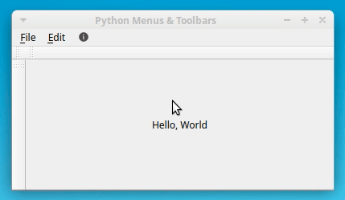
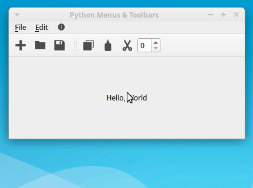
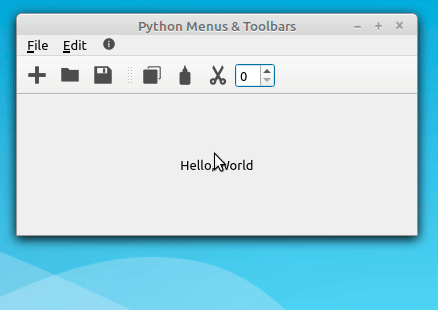
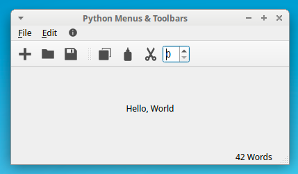
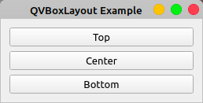
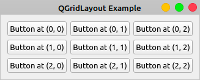
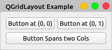
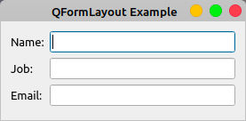
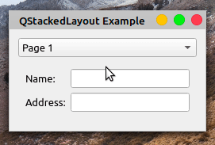
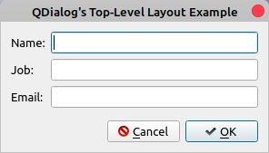

## 第十四部分 案例

实现目标

桌面客户端 简单工具箱

### pyqt5 篇

#### 基础布局

- [hello](./simple-tool-box/src/hello.py)
- [hello-oop](./simple-tool-box/src/hello.py)
- [水平布局](./simple-tool-box/src/h_layout.py)
- [垂直布局](./simple-tool-box/src/v_layout.py)
- [宫格布局](./simple-tool-box/src/g_layout.py)
- [表单布局](./simple-tool-box/src/f_layout.py)

#### 弹框

- [基本弹框](simple-tool-box/src/dialog.py)

#### 创建主弹框

- [一个主窗口](simple-tool-box/src/main_window.py)

> 注意:当您以自己的方法实现不同的 GUI 组件时,您正在使代码更具可读性和可维护性。但是,这不是一个依赖,因此您可以自由地以您最喜欢的方式组织代码。


到目前为止,您已经领略了 PyQt5 系列小部件中一些更重要的字符组件。在接下来的两个部分中,您将领略与 PyQt GUI 应用程序相关的其他重要概念。

#### Applications

在 `PyQt` 中,任何 `QT` 例都被视为 `application`。每个 `PyQt GUI` 应用程序必须有一个 `QApplication` 对象。申请的一些职责包含:

- 初始化
- 事件轮询和事件处理
- 系统维度和应用维度的设置
- 系统全局信息,例如应用目录、窗口长度、等等
- 转换一般的命令行参数
- 定义应用的外观
- 提供本地化能力

##### 事件轮询

GUI 应用程序由事件驱动。这意味着,函数和方法是响应用户操作执行的,如单击按钮、从组合框中选择项目、在文本编辑中输入或更新文本、按键盘上的键等。这些用户操作通常称为事件。

事件通常由事件循环(也称为主循环)处理。事件循环是一个无限循环,其中处理和发送来自用户、窗口系统和任何其他源的所有事件。事件循环等待事件发生,然后调度它执行某些任务。事件循环继续工作,直到应用程序终止。

所有 GUI 应用程序都使用事件循环。事件循环是一种等待事件发生的无限循环。如果发生事件,则循环检查事件是否是终止事件。在这种情况下,循环被终止,应用程序退出。否则,事件将发送到应用程序的事件队列以进行进一步处理,循环将重新开始。

> PyQt 最初开发为针对 Python 2 的目标, 它已经有一个`exec`关键字。在早期版本中,在`.exec_`末尾添加了一个下划线,以帮助避免名称冲突。`Pyqt5` 的目标是 `Python 3`, 它没有`exec`关键字。尽管如此,库还是提供了启动事件循环的两种方法:
>

1. exec_()
2. exec()

要触发响应操作,则依赖将事件与要执行的操作连接起来。在 `PyQt5` 中,您可以使用信号和插槽机制建立该连接。您将在下一节中涵盖这些内容。

#### 信号和插槽

PyQt 小部件充当活动捕捉者。这意味着每个小部件都能捕捉到特定数量的事件,如鼠标点击、按键等。为了响应这些事件,小部件总是发出信号,这是一种宣布其状态变化的信息。信号本身不执行任何操作。

如果您想要触发操作的信号,则依赖将其连接到插槽。这是每当发出连接信号时执行操作的函数或方法。您可以使用任何 Python `callable` (或`回调`) 作为插槽。

如果信号连接到插槽,则每当发出信号时,都会调用插槽。如果信号未连接到任何插槽,则不会发生任何事件,并且会忽略信号。以下是此机制的一些最有用的函数:

- 一个信号可以连接到一个或多个插槽。
- 一个信号也可能连接到另一个信号。
- 一个插槽可能连接到一个或多个信号。

您可以使用以下语法将信号连接到插槽:

```python
widget.signal.connect(slot_function)
```

这将slot_function连接到小部件的信号。每当发出信号时,都会调用`slot_function()`。此代码向您展示如何使用信号和插槽机制:

[插槽与信号](src/signals_slots.py)

注意:每个小部件都有自己的一组预定义信号。您可以在小部件的文档页面上查看它们。

如果您的插槽函数依赖接收额外的参数,则您可以使用 `functools.partial`传递它们。例如,您可以修改问候如下:

```python
def greeting(who):
  """Slot function."""
  if msg.text():
    msg.setText('')
  else:
    msg.setText(f'Hello {who}')
```

此时,你可以自定义参数

```python
btn.clicked.connect(functools.partial(greeting, 'World!'))
```

要使此代码工作,您依赖首先导入 `functools`。调用 `functools.partial()`返回一个对象, 其行为类似于与`greeting() with who='World!'.`,当用户单击按钮时,"Hello
World！" 消息将像以前一样显示在标签中。

现在,您已经完成了对 PyQt5 最重要的概念的理解。有了这些知识和库的文档,您就可以开始开发自己的 `GUI` 应用程序。~~在下一节中~~,您将构建您的第一个函数齐全的 `GUI` 应用程序。

### 使用 `Python` 和 `Pyqt` 创建计算器

我们将使用 MVC 模式来实现这个计算器,简单描述一下 MVC 模式:

- 模型
    - 关心您的应用程序的业务逻辑。它包含核心函数和数据。对于您的计算器,该模型将处理计算。
- 视图
    - 它承载最终用户与应用程序交互依赖的所有小部件。该视图还会接收用户操作和事件。对于您的计算器,视图将是您将在屏幕上看到的窗口。
- 控制器
    - 控制器将模型和视图连接起来,使应用程序工作。用户事件(或请求)发送到控制器,使模型工作。当模型以正确的格式提供请求的结果(或数据)时,控制器将其转发到视图。对于您的计算器,控制器将从 GUI
      接收用户事件,依赖模型执行计算,并随结果更新 GUI。

计算器实现步骤

- 用户在视图 ( `GUI` )上执行操作或请求 (事件)。
- 视图通知控制器有关用户的操作。
- 控制器会收到用户的请求,并查询模型以获得响应。
- 模型处理控制器查询,执行依赖的操作,并返回答案或结果。
- 控制器接收模型的答案并相应地更新视图。
- 用户最终在视图上看到请求的结果。

#### 创建骨架

您将首先为您的应用程序实现一个基本骨架,称为 `pycalc.py`

[pycalc](./simple-tool-box/src/pycalc.py)

#### 完成视图层

让我们通过添加数字的显示屏和按钮来完成 GUI。您还将添加基本数学操作和清除显示屏的按钮。

````python
from PyQt5.QtCore import Qt
from PyQt5.QtWidgets import QGridLayout
from PyQt5.QtWidgets import QLineEdit
from PyQt5.QtWidgets import QPushButton
from PyQt5.QtWidgets import QVBoxLayout
````

您将使用 `QVBox` 布局进行计算器的总体布局。您还将使用 `QGridLayout` 对象来排列按钮。最后,您导入显示屏的 `QLineEdit` 和按钮的 `QPush` 按钮。现在,文件顶部应有八个导入语句。

您将使用 `QVBox` 布局将显示屏放在顶部,按钮放在底部的网格布局中。

实现未实现方法

```python
class PyCalcUi(QMainWindow):
  # Snip
  def _createDisplay(self):
    """Create the display."""
    # Create the display widget
    self.display = QLineEdit()
    # Set some display's properties
    self.display.setFixedHeight(35)
    self.display.setAlignment(Qt.AlignRight)
    self.display.setReadOnly(True)
    # Add the display to the general layout
    self.generalLayout.addWidget(self.display)
```

接下来,您将实现`._createButtons()` 为计算器创建按钮。 您将使用字典将每个按钮的文本和位置保留在网格上。 您还将使用 `QGridLayout` 来安排计算器窗口上的按钮。最终代码将看起来像这样:

```python
class PyCalcUi(QMainWindow):
  # Snip
  def _createButtons(self):
    """Create the buttons."""
    self.buttons = {}
    buttonsLayout = QGridLayout()
    # Button text | position on the QGridLayout
    buttons = {'7': (0, 0),
               '8': (0, 1),
               '9': (0, 2),
               '/': (0, 3),
               'C': (0, 4),
               '4': (1, 0),
               '5': (1, 1),
               '6': (1, 2),
               '*': (1, 3),
               '(': (1, 4),
               '1': (2, 0),
               '2': (2, 1),
               '3': (2, 2),
               '-': (2, 3),
               ')': (2, 4),
               '0': (3, 0),
               '00': (3, 1),
               '.': (3, 2),
               '+': (3, 3),
               '=': (3, 4),
               }
    # Create the buttons and add them to the grid layout
    for btnText, pos in buttons.items():
      self.buttons[btnText] = QPushButton(btnText)
      self.buttons[btnText].setFixedSize(40, 40)
      buttonsLayout.addWidget(self.buttons[btnText], pos[0], pos[1])
    # Add buttonsLayout to the general layout
    self.generalLayout.addLayout(buttonsLayout)
```

现在,计算器的 `GUI`(或视图)可以显示显示器和按钮。 但是仍然无法更新显示屏上显示的信息。 您可以通过添加一些额外的方法来解决这个问题:

- setDisplayText()
    - 设置和更新显示器的文本
- displayText()
    - 获取当前显示器的文本
- clearDisplay()
    - 清除显示器的文本

这些方法将形成 `GUI` 公共界面,并完成您的 `Python` 计算器的视图类。下面是一个可能的实现:

```python
class PyCalcUi(QMainWindow):
  # Snip
  def setDisplayText(self, text):
    """Set display's text."""
    self.display.setText(text)
    self.display.setFocus()

  def displayText(self):
    """Get display's text."""
    return self.display.text()

  def clearDisplay(self):
    """Clear the display."""
    self.setDisplayText('')
```

您已经完成了计算器的 `GUI` 接口。 但是,如果您尝试进行一些计算,那么您就会注意到计算器尚未做任何事情。 那是因为你没有实现模型或控制器。 接下来,您将添加一个基本的控制器类,开始为您的计算器提供生命。

#### 创建基本控制器

在此部分中,您将编写计算器控制器类的代码。此类将视图与模型连接。 您将使用控制器类使计算器执行响应用户事件的操作。您将从以下导入开始:

```python
from functools import partial
```

在 `pycalc.py` 顶部,您导入` partial()`将信号与依赖进行额外参数处理的方法连接起来。

您的控制器类依赖执行三个主要任务:

1. 访问 `GUI` 的公共接口
2. 处理数学表达的创建
3. 使用适当的插槽连接单击的按钮信号

```python
# Create a Controller class to connect the GUI and the model
class PyCalcCtrl:
  """PyCalc Controller class."""

  def __init__(self, view):
    """Controller initializer."""
    self._view = view
    # Connect signals and slots
    self._connectSignals()

  def _buildExpression(self, sub_exp):
    """Build expression."""
    expression = self._view.displayText() + sub_exp
    self._view.setDisplayText(expression)

  def _connectSignals(self):
    """Connect signals and slots."""
    for btnText, btn in self._view.buttons.items():
      if btnText not in {'=', 'C'}:
        btn.clicked.connect(partial(self._buildExpression, btnText))

    self._view.buttons['C'].clicked.connect(self._view.clearDisplay)
```

你做的第一件事就是给 `PyCalcCtrl`  一个 `PyCalcUi` 的例子。 您将使用此实例获得对视图公共界面的完全访问权限。 接下来,您创建 `._buildExpression()` 来处理数学表达的创建。
此方法还根据用户输入更新计算器的显示。

最后,您使用 `._connectSignals()` 将可打印按钮与 `._buildExpression()` 连接起来。 这允许您的用户通过单击计算器的按钮创建数学表达式。 在最后一行中,您将清除按钮 ( `C` )
连接到 `._view.clearDisplay().`。此方法将清除显示屏上的文本。:

```python
# Client code
def main():
  """Main function."""
  # Create an instance of QApplication
  pycalc = QApplication(sys.argv)
  # Show the calculator's GUI
  view = PyCalcUi()
  view.show()
  # Create instances of the model and the controller
  PyCalcCtrl(view=view)
  # Execute calculator's main loop
  sys.exit(pycalc.exec_())
```

此代码创建 `PyCalcCtrl`(视图)实例,该视图作为参数传递。这将初始化控制器并连接信号和插槽,为您的计算器提供一些函数。

正如你所看到的,计算器已经有一些有用的函数！ 现在,您可以通过单击按钮来构建数学表达。 请注意,等号符号 ( `+` ) 尚未起作用。 要解决这个问题,您依赖实现计算器的模型。

#### 实现模型

模型是处理业务逻辑的代码层。 在这种情况下,业务逻辑完全是关于基本的数学计算。您的模型将评估用户引入的数学表达式。由于模型依赖处理错误,您将定义以下全局常量:

```text
ERROR_MSG = 'ERROR'
```

这是用户在引入无效数学表达式时将看到的消息。您的模型将是单个函数:

```python
# Create a Model to handle the calculator's operation
def evaluateExpression(expression):
  """Evaluate an expression."""
  try:
    result = str(eval(expression, {}, {}))
  except Exception:
    result = ERROR_MSG

  return result
```

在这里,您使用 `eval()` 将字符串计算为表达式。如果成功,那么您将返回结果。否则,返回错误消息。请注意,此函数并不完美。它有几个重要的问题:

- `try...except` 块不会捕获任何特定的异常,这不是 `Python` 中的最佳实践。
- 该函数基于 `eval()` 的使用,这可能会导致一些严重的安全问题。一般建议是仅对受信任的输入使用 `eval()`。

您可以自由地重新设计该函数,使其更加可靠和安全。在本教程中,您将按原样使用该函数。

#### 完成控制器

一旦你完成了计算器的模型,你就可以完成控制器。 `PyCalcCtrl` 的最终版本将包含处理计算并确保等号 (`=`) 正常工作的逻辑:

```python
# Create a Controller class to connect the GUI and the model
class PyCalcCtrl:
  """PyCalc's Controller."""

  def __init__(self, model, view):
    """Controller initializer."""
    self._evaluate = model
    self._view = view
    # Connect signals and slots
    self._connectSignals()

  def _calculateResult(self):
    """Evaluate expressions."""
    result = self._evaluate(expression=self._view.displayText())
    self._view.setDisplayText(result)

  def _buildExpression(self, sub_exp):
    """Build expression."""
    if self._view.displayText()==ERROR_MSG:
      self._view.clearDisplay()

    expression = self._view.displayText() + sub_exp
    self._view.setDisplayText(expression)

  def _connectSignals(self):
    """Connect signals and slots."""
    for btnText, btn in self._view.buttons.items():
      if btnText not in {'=', 'C'}:
        btn.clicked.connect(partial(self._buildExpression, btnText))

    self._view.buttons['='].clicked.connect(self._calculateResult)
    self._view.display.returnPressed.connect(self._calculateResult)
    self._view.buttons['C'].clicked.connect(self._view.clearDisplay)
```

首先,向 `init` 函数添加一个新参数。现在该类从模型和视图中接收实例。然后在 `._calculateResult()` 中,您获取显示内容,将其作为数学表达式计算,最后在显示中显示结果。

您还将 `if` 语句添加到 `._buildExpression()` 以检查是否发生错误。如果是这样,那么您清除显示并重新开始一个新的表达式。 最后,在 `._connectSignals()` 中再添加两个连接。
第一个启用等号 (`=`)。第二个确保当用户点击 `Enter`↩ 时,计算器将按预期处理表达式。

要使所有这些代码正常工作,您依赖更新 main():

```python
# Client code
def main():
  """Main function."""
  # Create an instance of `QApplication`
  pycalc = QApplication(sys.argv)
  # Show the calculator's GUI
  view = PyCalcUi()
  view.show()
  # Create instances of the model and the controller
  model = evaluateExpression
  PyCalcCtrl(model=model, view=view)
  # Execute calculator's main loop
  sys.exit(pycalc.exec_())
```

在这里,您的模型包含对 `evaluateExpression()` 的引用。此外, `PyCalcCtrl()` 现在接收两个参数:模型和视图。

### Python 和 PyQt:创建菜单、工具栏和状态栏

在使用 Python 和 PyQt 开发字符用户界面 (GUI) 应用程序时,您将使用的一些最有用和最通用的字符元素是菜单、工具栏和状态栏。

菜单和工具栏可以使您的应用程序看起来精美而专业,为用户提供一组可访问的选项,而状态栏允许您显示有关应用程序状态的相关信息。

在本教程中,您将学习:

• 菜单、工具栏和状态栏是什么

• 如何以编程方式创建菜单、工具栏和状态栏

• 如何使用 `PyQt` 操作填充 `Python` 菜单和工具栏

• 如何使用状态栏显示状态信息

此外,您还将学习一些编程最佳实践,在使用 `Python` 和 `PyQt` 创建菜单、工具栏和状态栏时可以应用这些最佳实践。

#### 在**PyQt** 中构建**Python** 菜单栏、菜单和工具栏

菜单栏是 `GUI` 应用程序主窗口中保存菜单的区域。

菜单是选项的下拉列表,可让您方便地访问应用程序的选项。例如,如果您正在创建文本编辑器,则菜单栏中可能有以下一些菜单:

◦ 新建用于创建新文档

◦ 打开以打开现有文档

◦ 打开最近打开以打开最近使用的文档

◦ 保存以保存文档

◦ 退出以退出退出应用程序•

提供以下一些菜单选项的"编辑"菜单:

◦ 复制用于复制某些文本

◦ 粘贴用于粘贴某些文本

◦ 剪切以剪切某些文本

• 提供某些"帮助"菜单,提供一些以下菜单选项:

◦ 用于启动到用户手册的帮助内容和用于启动"关于"对话框的帮助内容◦

您还可以将其中一些选项添加到工具栏。工具栏是一组按钮,其中包含有意义的图标,可快速访问应用程序中最常用的选项。在文本编辑器示例中,可以将"新建"、"打开"、"保存"、"复制"和"粘贴"等选项添加到工具栏。

> 在本教程中,您将开发一个实现上述所有菜单和选项的示例应用程序。可以使用此示例应用程序作为创建文本编辑器项目的起点。


在本节中,您将学习如何使用 Python 和 PyQt 向 GUI 应用程序添加菜单栏、菜单和工具栏的基础知识。

在继续之前,您将创建一个示例 PyQt 应用程序,您将在本教程中使用该应用程序。

在每个部分中,你都将向此示例应用程序添加新的特性和函数。

该应用程序将是一个主窗口样式的应用程序。

这意味着它将具有菜单栏,工具栏,状态栏和中央小部件。

打开您喜欢的代码编辑器或 IDE,然后创建一个名为 `sample_app.py` 的 `Python` 文件。然后向其中添加以下代码:

```python
import sys

from PyQt5.QtCore import Qt
from PyQt5.QtWidgets import QApplication, QLabel, QMainWindow


class Window(QMainWindow):
  """Main Window."""

  def __init__(self, parent=None):
    """Initializer."""
    super().__init__(parent)
    self.setWindowTitle("Python Menus & Toolbars")
    self.resize(400, 200)
    self.centralWidget = QLabel("Hello, World")
    self.centralWidget.setAlignment(Qt.AlignHCenter | Qt.AlignVCenter)
    self.setCentralWidget(self.centralWidget)


if __name__=="__main__":
  app = QApplication(sys.argv)
  win = Window()
  win.show()
  sys.exit(app.exec_())
```

现在,sample_app.py包含创建示例 PyQt 应用程序依赖的所有代码。

在本例中,`Window` 继承自 `QMainWindow`。

因此,您正在构建一个主窗口样式的应用程序。

> 注意:不幸的是,`PyQt5` 的官方文档有一些不完整的部分。 要解决此问题,您可以查看 `PyQt4` 文档或原始 `Qt` 文档。

在类初始值设定项 `.__init__()` 中,首先使用 `super()` 调用父类的初始值设定项。然后使用 `.setWindowTitle()` 设置窗口的标题,并使用 `.resize()` 调整窗口长度。

窗口的中心小部件是一个 `QLabel` 对象,您将使用它来显示消息以响应某些用户操作。这些消息将显示在窗口的中心。为此,请在 `QLabel` 对象上调用 `.setAlignment()`,并带有几个对齐标志。

就是这样！您已经使用 `Python` 和 `PyQt` 创建了一个主窗口样式的应用程序。你将将此示例应用程序用于本教程中所有即将推出的示例。

#### 创建菜单栏

在 `PyQt` 主窗口样式应用程序中,`QMainWindow` 默认提供一个空的 `QMenuBar` 对象。要访问此菜单栏,您依赖在 `QMainWindow` 对象上调用 `.menuBar()`。此方法将返回一个空菜单栏。
此菜单栏的父级将是您的主窗口对象。现在返回到示例应用程序,并在 `Window` 的定义中添加以下方法:

```python
class Window(QMainWindow):
  # Snip...
  def _createMenuBar(self):
    menuBar = self.menuBar()
```

这是在 `PyQt` 中创建菜单栏的首选方法。在这里,`menuBar` 变量将包含一个空菜单栏,该菜单栏将是主窗口的菜单栏。

> `PyQt` 编程中的一种常见做法是,对在定义方法之外不使用或不依赖的对象使用局部变量。Python 垃圾回收所有超出范围的对象,因此您可能会认为,一旦`._createMenuBar()` 返回,上面示例中的菜单栏将消失。
> 事实是,PyQt 保留了对本地对象的引用,例如使用其所有权或父子关系的菜单栏。换句话说,由于 `menuBar` 由主窗口对象拥有,因此 `Python` 将无法对其进行垃圾回收。
>
>

向 `PyQt` 应用程序添加菜单栏的另一种方法是创建一个 `QMenuBar` 对象,然后使用 `.setMenuBar()` 将其设置为主窗口的菜单栏。考虑到这一点,您还可以通过以下方式编写`._createMenuBar()`:

```python
from PyQt5.QtWidgets import QMenuBar


# Snip...

class Window(QMainWindow):
  # Snip...
  def _createMenuBar(self):
    menuBar = QMenuBar(self)
    self.setMenuBar(menuBar)
```

在上面的示例中,`menuBar` 保存一个父对象设置为 `self` 的 `QMenuBar` 对象,这是应用程序的主窗口。拥有菜单栏对象后,可以使用 `.setMenuBar()` 将其添加到主窗口中。
最后,请注意,要使此示例正常工作,首先依赖从 `GUI` 应用程序 `PyQt5.QWidgets` 导入 `QMenuBar`,菜单栏将显示在不同的位置,具体取决于底层操作系统:

• Windows:在应用程序主窗口顶部的标题栏下

• macOS:在屏幕顶部

• Linux:位于主窗口顶部或屏幕顶部,具体取决于您的桌面环境

为应用程序创建菜单栏的最后一步是从主窗口的初始值设定项 `.__init__()` 调用 `._createMenuBar()`:

```python
class Window(QMainWindow):
  """Main Window."""

  def __init__(self, parent=None):
    # Snip...
    self._createMenuBar()
```

如果使用这些新更改运行示例应用程序,则不会在应用程序的主窗口中看到菜单栏。这是因为您的菜单栏仍然是空的。若要查看应用程序主窗口中的菜单栏,依赖创建一些菜单。这就是您接下来要学习的内容。

#### 将菜单添加到菜单栏

菜单菜单是菜单选项的下拉列表,您可以通过单击它们或按键盘快捷键来触发这些菜单选项。

在 PyQt 中,至少有三种方法可以将菜单添加到菜单栏对象。

`QMenuBar.addMenu(menu)` 将 QMenu 对象(菜单)追加到菜单栏对象。它返回与此菜单关联的操作。

`QMenuBar.addMenu(title)` 创建一个新的 QMenu 对象,并将其以字符串(title)作为其标题追加到菜单栏。 菜单栏获取菜单的所有权,该方法返回新的 `QMenu` 对象。

`QMenuBar.addMenu(icon, title)` 创建一个新的QMenu对象,并将其带有图标和标题附加到菜单栏对象。 菜单栏获取菜单的所有权,该方法返回新的 QMenu 对象。

如果使用第一个选项,则依赖先创建自定义 `QMenu` 对象。为此,可以使用以下构造函数之一:

- QMenu(parent)
- QMenu(title, parent)

在这两种情况下,父级都是将拥有 `QMenu` 对象所有权的 `QWidget`。您通常会将 `parent` 设置为要在其中使用菜单的窗口。

在第二个构造函数中,`title` 将包含一个字符串,其中包含描述菜单选项的文本。下面介绍了如何将"文件"、"编辑"和"帮助"菜单添加到示例应用程序的菜单栏中:

```python
from PyQt5.QtWidgets import QMenu


# Snip...

class Window(QMainWindow):
  # Snip...
  def _createMenuBar(self):
    menuBar = self.menuBar()
    # Creating menus using a QMenu object
    fileMenu = QMenu("&File", self)
    menuBar.addMenu(fileMenu)
    # Creating menus using a title
    editMenu = menuBar.addMenu("&Edit")
    helpMenu = menuBar.addMenu("&Help")
```

首先,从 `PyQt5.QtWidgets` 导入 `QMenu`。然后在 `._createMenuBar()` 中,使用 `.addMenu()` 的前两个变体将三个菜单添加到菜单栏中。
第三种变体依赖图标对象,但您尚未学习如何创建和使用图标。 您将在 `PyQt` 中使用图标和资源部分中了解如何使用图标。

应用程序的菜单栏具有菜单"文件"、"编辑"和"帮助"。单击这些菜单时,它们不会显示菜单选项的下拉列表。这是因为您尚未添加菜单选项。您将在"使用操作填充菜单"部分中了解如何向菜单添加菜单选项。最后,请注意,每个菜单标题中包含的 `& `
符号字符 (`&`) 会在菜单栏显示中创建带下划线的字母。 定义菜单和工具栏选项的键盘快捷键部分对此进行了更详细的讨论。


#### 创建工具栏

工具栏是一个可移动的面板,用于保存按钮和其他小部件,以提供对 `GUI` 应用程序最常用选项的快速访问。 工具栏按钮可以显示图标和/或文本,以表示它们执行的任务。
`PyQt` 中工具栏的基类是 `QToolBar`。 此类将允许您为 `GUI` 应用程序创建自定义工具栏。 将工具栏添加到主窗口样式应用程序时,默认位置位于窗口顶部。但是,您可以将工具栏放置在以下四个工具栏区域中的任何一个中:

|工具栏区域    |主窗口中的位置|
|-----|-----|
|Qt.LeftToolBarArea    |Left side|
|Qt.RightToolBarArea    |Right side|
|Qt.TopToolBarArea    |Top|
|Qt.BottomToolBarArea|    Bottom|


工具栏区域在 `PyQt` 中定义为常量。
如果您依赖使用它们,则必须从 `PyQt5.QtCore` 导入 `Qt`,然后像在 Qt.LeftToolBarArea 中一样使用完全限定的名称
。在 PyQt: 

有三种方法可以将工具栏添加到主窗口应用程序中。

- `QMainWindow.addToolBar(title)` 创建一个新的空 `QToolBar` 对象,并将其窗口标题设置为 title。
此方法将工具栏插入到顶部工具栏区域,并返回新创建的工具栏。
- `QMainWindow.addToolBar(toolbar)`将 QToolBar 对象(工具栏)插入到顶部工具栏区域。
- `QMainWindow.addToolBar(area, toolbar)`将 QToolBar 对象(工具栏)插入到指定的工具栏区域(区域)中。如果主窗口已具有工具栏,则工具栏将放在最后一个现有工具栏之后。如果主窗口中已存在工具栏,则只会将其移动到区域。


如果使用最后两个选项之一,则依赖自己创建工具栏。为此,可以使用以下构造函数之一:

QToolBar(parent)

QToolBar(title, parent)

在这两种情况下,`parent` 都表示将拥有工具栏所有权的 `QWidget` 对象。您通常会将工具栏所有权设置为要在其中使用工具栏的窗口。在第二个构造函数中,`title` 将是一个带有工具栏窗口标题的字符串。

`PyQt` 使用此窗口标题来构建一个默认的上下文菜单,该菜单允许您隐藏和显示工具栏。现在,您可以返回到示例应用程序,并将以下方法添加到 `Window`:

```python
from PyQt5.QtWidgets import QToolBar
# Snip...

class Window(QMainWindow):
    # Snip...
    def _createToolBars(self):
        # Using a title
        fileToolBar = self.addToolBar("File")
        # Using a QToolBar object
        editToolBar = QToolBar("Edit", self)
        self.addToolBar(editToolBar)
        # Using`C`QToolBar object and a toolbar area
        helpToolBar = QToolBar("Help", self)
        self.addToolBar(Qt.LeftToolBarArea, helpToolBar)
```

首先,从 `PyQt5.QtWidgets` 导入 `QToolBar`。然后,在 .`_createToolBars()` 中,首先使用带有标题的 `.addToolBar()` 创建"文件"工具栏。接下来,创建一个标题为"编辑"的 `QToolBar` 对象,并使用 .addToolBar() 将其添加到工具栏,而不传递工具栏区域。在这种情况下,"编辑"工具栏放置在顶部工具栏区域。

最后,使用 `Qt.LeftToolBarArea` 创建"帮助"工具栏并将其放置在左侧工具栏区域中。完成此工作的最后一步是从 Window:Python 的初始值设定项调用 ._createToolBar

```python
class Window(QMainWindow):
    """Main Window."""
    def __init__(self, parent=None):
        # Snip...
        self._createToolBars()
```

在 Window 的初始值设定项中调用 ._createToolBars() 将创建三个工具栏并将它们添加到主窗口中。以下是应用程序现在的外观:


现在,您在菜单栏正下方有两个工具栏,在窗口左侧有一个工具栏。每个工具栏都有一条双虚线。当您将鼠标移到虚线上时,指针将变为一手牌。如果单击并按住虚线,则可以将工具栏移动到窗口上的任何其他位置或工具栏区域。

到目前为止,应用程序窗口上有三个工具栏。这些工具栏仍为空 - 您依赖添加一些工具栏按钮才能使其正常工作。为此,您可以使用 `PyQt` 操作,它们是 `QAction` 的实例。您将在后面的部分中了解如何在 `PyQt` 中创建操作。现在,您将学习如何在 `PyQt` 应用程序中使用图标和其他资源。

### 在 PyQt 中使用图标和资源

`Qt` 库包含 `Qt` 资源系统,这是一种将二叉文件(如图标、图像、翻译文件和其他资源)添加到应用程序中的便捷方式。
若要使用资源系统,依赖在资源收集文件或 `.qrc `文件中列出资源。
`.qrc` 文件是一个 `XML` 文件,其中包含文件系统中每个资源的位置或路径。假设您的示例应用程序具有一个资源目录,其中包含要在应用程序的 `GUI` 中使用的图标。您有"新建"、"打开"等选项的图标。您可以创建一个包含每个图标路径的 `.qrc` 文件:

```xml
<!DOCTYPE RCC><RCC version="1.0">
<qresource>
    <file alias="file-new.svg">resources/file-new.svg</file>
    <file alias="file-open.svg">resources/file-open.svg</file>
    <file alias="file-save.svg">resources/file-save.svg</file>
    <file alias="file-exit.svg">resources/file-exit.svg</file>
    <file alias="edit-copy.svg">resources/edit-copy.svg</file>
    <file alias="edit-cut.svg">resources/edit-cut.svg</file>
    <file alias="edit-paste.svg">resources/edit-paste.svg</file>
    <file alias="help-content.svg">resources/help-content.svg</file>
</qresource>
</RCC>
```

`alias` 是一个可选属性,用于定义一个简短的备用名称,您可以在代码中使用该名称来访问每个资源。
获得应用程序的资源后,可以运行针对 `.qrc` 文件的命令行工具 `pyrcc5`。`pyrcc5` 随附于 `PyQt`,一旦安装了 `PyQt`,它必须在您的 `Python` 环境中完全正常运行。`pyrcc5` 读取 `.qrc` 文件并生成一个 `Python` 模块,其中包含所有资源的二叉代码:

```shell
pyrcc5 -o qrc_resources.py resources.qrc
```

此命令将读取 `resources.qrc` 并生成包含每个资源的二叉代码的`qrc_resources.py`。您可以通过导入`qrc_resources`在Python代码中使用这些资源。

> 注意:如果在运行 `pyrcc5` 时出现问题,请确保您使用的是正确的 `Python` 环境。如果您在 `Python` 虚拟环境中安装 `PyQt` ,那么您将无法从该环境外部使用 `pyrcc5` 。

下面是 `qrc_resources.py` 中与您的资源相对应的代码片段。qrc:

```python
# -*- coding: utf-8 -*-

# Resource object code
#
# Created by: The Resource Compiler for PyQt5 (Qt v5.9.5)
#
# WARNING! All changes made in this file will be lost!

from PyQt5 import QtCore

qt_resource_data = b"\
\x00\x00\x03\xb1\
\x3c\
\x73\x76\x67\x20\x78\x6d\x6c\x6e\x73\x3d\x22\x68\x74\x74\x70\x3a\
...
```

`qrc_resources.py` 就位后,可以将其导入到应用程序中,并通过键入冒号(:)来引用每个资源然后是它的别名或路径。例如,要访问 `file-new.svg` 及其别名,可以使用访问字符串":file-new.svg"。

如果您没有别名,则可以使用访问字符串":resources/file-new.svg"通过其路径访问它。
如果您有别名,但由于某种原因,您希望通过路径访问给定资源,则可能必须从访问字符串中删除冒号才能使其正常工作。要在操作中使用图标,首先依赖导入资源模块:Python

```python
import qrc_resources
```

导入包含资源的模块后,可以在应用程序的 `GUI` 中使用这些资源。

> 注意:Linters、编辑器和 IDE 可能会将上述 import 语句标记为未使用,因为您的代码不会显式使用它。某些 IDE 可能会走得更远,并自动删除该行。在这些情况下,必须重写 linter、编辑器或 IDE 的建议,并将该导入保留在代码中。否则,应用程序将无法显示资源。要使用资源系统创建图标,`您依赖实例化QIcon`,将别名或路径传递给类构造函数:Python

```python
newIcon = QIcon(":file-new.svg")
```

在此示例中,您将使用资源模块中的 file file-new.svg 创建一个 `QIcon` 对象。这提供了一种在整个 `GUI` 应用程序中使用图标和资源的便捷方式。现在返回到示例应用程序并更新._createMenuBar():P ython 的最后一行

```python
from PyQt5.QtGui import QIcon

import qrc_resources
# Snip...

class Window(QMainWindow):
    # Snip...
    def _createMenuBar(self):
        menuBar = self.menuBar()
        # Using a QMenu object
        fileMenu = QMenu("&File", self)
        menuBar.addMenu(fileMenu)
        # Using a title
        editMenu = menuBar.addMenu("&Edit")
        # Using an icon and a title
        helpMenu = menuBar.addMenu(QIcon(":help-content.svg"), "&Help")
```

要使此代码正常工作,首先依赖从 `PyQt5.QtGui` 导入 `QIcon`。您还依赖导入 `qrc_resources`。在最后突出显示的行中,使用资源模块中的帮助内容.svg向 helpMenu 添加一个图标。如果使用此更新运行示例应用程序,则将得到以下输出:


应用程序的主窗口现在在其"帮助"菜单上显示一个图标。单击该图标时,菜单将显示文本"帮助"。在菜单栏中使用图标不是一种常见的做法,但 `PyQt` 允许你这样做。


### 在 `PyQtPyQt` 中为 `Python` 创建操作 菜单和工具栏 

操作是表示应用程序中给定命令、操作或操作的对象。当您依赖为不同的 `GUI` 组件(如菜单选项、工具栏按钮和键盘快捷键)提供相同的函数时,它们非常有用。您可以通过实例化 `QAction` 来创建操作。创建操作后,依赖将其添加到小部件中才能在实践中使用它。您还依赖将操作连接到某些函数。

换句话说,您依赖将它们连接到要在触发操作时运行的函数或方法。这将允许您的应用程序执行操作以响应 GUI 中的用户操作。
动作是相当多才多艺的。它们允许您在菜单选项、工具栏按钮和键盘快捷键之间重复使用并保持同步相同的函数。这在整个应用程序中提供了一致的行为。例如,用户可能希望应用程序在单击"打开..."时执行相同的操作。菜单选项,单击"打开工具栏"按钮,或按键盘上的 ⌃Ctrl+O。

`QAction` 提供了一个抽象,允许您跟踪以下元素:

• 菜单上的文本选项

• 工具栏按钮上的文本

• 工具栏上的帮助提示(工具提示)

• 这是什么帮助提示

• 状态栏上的帮助提示(状态提示)

• 与选项关联的键盘快捷键

• 与菜单和工具栏选项关联的图标

• 操作的启用或禁用状态

• 操作处于打开或关闭状态

创建操作, 您依赖实例化 `QAction`。至少有三种一般方法可以做到这一点:


1.QAction(parent)

2.QAction(text,parent)

3.QAction(icon, text, parent)

在所有三种情况下,父项都表示拥有操作所有权的对象。
此参数可以是任何 `QObject`。最佳做法是将操作创建为要在其中使用它们的窗口的子级。

在第二个和第三个构造函数中,文本保存操作将显示在菜单选项或工具栏按钮上的文本。操作文本在菜单选项和工具栏按钮上的显示方式不同。例如,文本和打开...显示为打开...,并作为在工具栏按钮中打开。

在第三个构造函数中,`icon` 是保存操作图标的 `QIcon` 对象。此图标将显示在菜单选项的文本左侧。图标在工具栏按钮中的位置取决于工具栏的 `.toolButtonStyle` 属性,该属性可以采用下列值之一:


|样式 | 按钮显示                                                 |
|----|------------------------------------------------------|
|Qt.ToolButtonIconOnly	| 只有图标                                                 |
|Qt.ToolButtonTextOnly	| 只有文本                                                 |
|Qt.ToolButtonTextBesideIcon	| 图标旁边的文本                                |
|Qt.ToolButtonTextUnderIcon	| 图标下的文本                                 |
|Qt.ToolButtonFollowStyle	| 遵循底层平台的一般风格|

您还可以使用各自的 setter 方法 .setText() 和 .setIcon() 来设置操作的文本和图标。
> 注意:有关 `QAction` 属性的完整列表,您可以查看文档。


下面介绍了如何使用 `QAction` 的不同构造函数为示例应用程序创建一些操作:

```python
from PyQt5.QtWidgets import QAction
# Snip...

class Window(QMainWindow):
    # Snip...
    def _createActions(self):
        # Creating action using the first constructor
        self.newAction = QAction(self)
        self.newAction.setText("&New")
        # Creating actions using the second constructor
        self.openAction = QAction("&Open...", self)
        self.saveAction = QAction("&Save", self)
        self.exitAction = QAction("&Exit", self)
        self.copyAction = QAction("&Copy", self)
        self.pasteAction = QAction("&Paste", self)
        self.cutAction = QAction("C&ut", self)
        self.helpContentAction = QAction("&Help Content", self)
        self.aboutAction = QAction("&About", self)
```

在 ._createActions() 中,为示例应用程序创建一些操作。这些操作将允许您向应用程序的菜单和工具栏添加选项。请注意,您正在将操作创建为实例属性,因此您可以使用 self 从外部访问它们 ._createActions()。这样,您就可以在菜单和工具栏上使用这些操作。

>注意:在 ._createActions() 中,您不使用 QAction 的第三个构造函数,因为如果您还看不到操作,则使用图标是没有意义的。您将了解如何向操作添加图标,请参阅使用操作填充工具栏部分。

下一步是调用._createActions()作为Window:Python的初始值设定项

```python
class Window(QMainWindow):
    """Main Window."""
    def __init__(self, parent=None):
        # Snip...
        self._createActions()
        self._createMenuBar()
        self._createToolBars()
```

如果现在运行应用程序,则不会在 GUI 上看到任何更改。这是因为在将操作添加到菜单或工具栏之前,不会显示这些操作。请注意,在调用 ._createMenuBar() 和 ._createToolBars() 之前,请先调用 ._createActions(),因为您将在菜单和工具栏上使用这些操作。如果将操作添加到菜单中,则该操作将成为菜单选项。如果将操作添加到工具栏,则该操作将成为工具栏按钮。这是接下来几个部分的主题。

### 在 PyQt 中将选项添加到 Python 菜单

如果要将选项列表添加到 PyQt 中的给定菜单,则依赖使用操作。到目前为止,您已经学习了如何使用 QAction 的不同构造函数创建操作。操作是创建菜单的关键组件 PyQt.In 本节中,您将学习如何使用操作来填充菜单选项。使用操作填充菜单若要使用菜单选项填充菜单,您将使用操作。在菜单中,操作表示为至少具有描述性文本(如"新建"、"打开"、"保存"等)的水平选项。菜单选项还可以在其左侧显示一个图标,在其右侧显示快捷键序列,例如 ⌃Ctrl+S。您可以使用 .addAction() 向 QMenu 对象添加操作。此方法有多种变体。它们中的大多数被认为可以在百忙中创建操作。但是,在本教程中,您将使用 QMenu 从 QWidget 继承的 .addAction() 变体。以下是此变体的有符号:

```python
QWidget.addAction(action)
```

参数操作表示要添加到给定 `QWidget` 对象的 `QAction` 对象。
使用 `.addAction()` 的这种变体,您可以事先创建操作,然后根据依赖将它们添加到菜单中。

> 注意:`QWidget` 还提供 `.addActions()`。此方法获取操作列表,并将其追加到当前小组件对象。

使用此工具,您可以开始向示例应用程序的菜单添加操作。为此,您依赖更新 `._createMenuBar()` P ython

```python
class Window(QMainWindow):
    # Snip...
    def _createMenuBar(self):
        menuBar = self.menuBar()
        # File menu
        fileMenu = QMenu("&File", self)
        menuBar.addMenu(fileMenu)
        fileMenu.addAction(self.newAction)
        fileMenu.addAction(self.openAction)
        fileMenu.addAction(self.saveAction)
        fileMenu.addAction(self.exitAction)
        # Edit menu
        editMenu = menuBar.addMenu("&Edit")
        editMenu.addAction(self.copyAction)
        editMenu.addAction(self.pasteAction)
        editMenu.addAction(self.cutAction)
        # Help menu
        helpMenu = menuBar.addMenu(QIcon(":help-content.svg"), "&Help")
        helpMenu.addAction(self.helpContentAction)
        helpMenu.addAction(self.aboutAction)
```

通过此更新._createMenuBar(),您可以向示例应用程序的三个菜单添加许多选项。现在"文件"菜单有四个选项:

- 1。用于创建新文件的新增函数

- 2。打开。。。用于打开现有文件

- 3。保存以保存对文件所做的更改

4。退出以关闭应用程序"编辑"菜单有三个选项:

  - 1。复制内容以应付到系统剪贴板

  - 2。粘贴以粘贴系统剪贴板中的内容

  - 3。剪切以将内容剪切到系统剪贴板

"帮助"菜单有两个选项:
- 1。用于启动应用程序帮助手册的帮助内容

- 2。关于显示"关于"对话框选项在菜单中从上到下的显示顺序与在代码中添加选项的顺序相对应。

如果运行该应用程序,则会在屏幕上看到以下窗口:




如果单击菜单,则应用程序将显示一个下拉列表,其中包含您之前看到的选项。

### 创建 `Python` 子菜单

有时您依赖在 GUI 应用程序中使用子菜单。子菜单是一个嵌套菜单,当您将光标移到给定的菜单选项上时,它会显示出来。若要向应用程序添加子菜单,依赖在容器菜单对象上调用 .addMenu()。假设您依赖在示例应用程序的"编辑"菜单中添加一个子菜单。您的子菜单将包含用于查找和替换内容的选项,因此您将其称为"查找和替换"。此子菜单将有两个选项:

1。找到。。。用于查找某些内容

2。取代。。。用于查找旧内容并将其替换为新内容

以下是将此子菜单添加到示例应用程序的方法:

```python
class Window(QMainWindow):
    # Snip...
    def _createMenuBar(self):
        # Snip...
        editMenu.addAction(self.cutAction)
        # Find and Replace submenu in the Edit menu
        findMenu = editMenu.addMenu("Find and Replace")
        findMenu.addAction("Find...")
        findMenu.addAction("Replace...")
        # Snip...
```

在第一个突出显示的行中,使用 editMenu 上的 .addMenu() 将文本为"查找和替换"的 QMenu 对象添加到"编辑"菜单中。下一步是使用操作填充子菜单,就像到目前为止所做的那样。如果再次运行示例应用程序,则会在"编辑"菜单下看到一个新菜单选项:


"编辑"菜单现在有一个名为"查找和替换"的新条目。当您将鼠标悬停在此新菜单选项上时,将出现一个子菜单,为您提供两个新选项"查找..."和替换....就是这样！您已经创建了一个子菜单。

### 在 PyQt Toolbars中添加选项

使用Python和PyQt构建GUI应用程序时非常有用的组件。您可以使用工具栏向用户展示一种快速访问应用程序中最常用选项的方法。您还可以将微件框和组合框等小部件添加到工具栏,以允许用户直接修改应用程序 GUI.In 以下几个部分中的某些属性和变量,您将学习如何使用操作向工具栏添加选项或按钮,以及如何使用 .addWidget() 将小部件添加到工具栏。


使用操作填充工具栏若要向工具栏添加选项或按钮,依赖调用 .addAction()。在本节中,您将依赖于 `QToolBar` 从 `QWidget` 继承的 .addAction() 变体。因此,您将调用 .addAction(),并将操作作为参数。这将允许您在菜单和工具栏之间共享操作。创建工具栏时,您通常会遇到决定向其添加哪些选项的问题。通常,您只依赖将最常用的操作添加到工具栏。如果返回到示例应用程序,则会记得您添加了三个工具栏:

- 1。文件
- 2.编辑

3.帮助在"文件"工具栏中,可以添加如下选项:
- • 新建
- • 打开
- • 保存

在"编辑"工具栏中,可以添加以下选项:
- • 复制
- • 粘贴
- • 剪切

通常,如果要将按钮添加到工具栏,请先选择要在每个按钮上使用的图标。这不是强制性的,但这是最佳实践。选择图标后,您依赖将它们添加到其相应的操作中。下面介绍了如何向示例应用程序的操作添加图标:

```python
class Window(QMainWindow):
    # Snip...
    def _createActions(self):
        # File actions
        self.newAction = QAction(self)
        self.newAction.setText("&New")
        self.newAction.setIcon(QIcon(":file-new.svg"))
        self.openAction = QAction(QIcon(":file-open.svg"), "&Open...", self)
        self.saveAction = QAction(QIcon(":file-save.svg"), "&Save", self)
        self.exitAction = QAction("&Exit", self)
        # Edit actions
        self.copyAction = QAction(QIcon(":edit-copy.svg"), "&Copy", self)
        self.pasteAction = QAction(QIcon(":edit-paste.svg"), "&Paste", self)
        self.cutAction = QAction(QIcon(":edit-cut.svg"), "C&ut", self)
        # Snip...
```

要向操作添加图标,请更新突出显示的行。对于 `newAction`,请使用 .setIcon()。在其余操作中,使用带有图标、标题和父对象的构造函数作为参数。一旦您选择的操作具有图标,您可以通过在工具栏对象:Python 上调用 .addAction() 将这些操作添加到其相应的工具栏

```python
class Window(QMainWindow):
    # Snip...
    def _createToolBars(self):
        # File toolbar
        fileToolBar = self.addToolBar("File")
        fileToolBar.addAction(self.newAction)
        fileToolBar.addAction(self.openAction)
        fileToolBar.addAction(self.saveAction)
        # Edit toolbar
        editToolBar = QToolBar("Edit", self)
        self.addToolBar(editToolBar)
        editToolBar.addAction(self.copyAction)
        editToolBar.addAction(self.pasteAction)
        editToolBar.addAction(self.cutAction)
```

通过此更新 ._createToolBars(),您可以将"新建"、"打开"和"保存"选项的按钮添加到"文件"工具栏。您还可以将"复制"、"粘贴"和"剪切"选项的按钮添加到"编辑"工具栏。

如果现在运行示例应用程序,则屏幕上将显示以下窗口:


示例应用程序现在显示两个工具栏,每个工具栏有几个按钮。您的用户可以单击这些按钮以快速访问应用程序最常用的选项。注意:当您第一次在创建工具栏部分中写回._createToolBars()时,您创建了一个帮助工具栏。此工具栏旨在展示如何使用 .addToolBar() 的不同变体添加工具栏。在上面的 ._createToolBars() 更新中,您删除了"帮助"工具栏,只是为了使示例保持简短明了。请注意,由于您在菜单和工具栏之间共享相同的操作,因此菜单选项还将在其左侧显示图标,这在生产力和资源使用方面是一个很大的胜利。这是使用 PyQt 操作通过 Python 创建菜单和工具栏的优势之一。

### 组织菜单和工具栏选项

为了提高 GUI 应用程序中的清晰度并改善用户体验,可以使用分隔符来组织菜单选项和工具栏按钮。分隔符呈现为分隔或分隔菜单选项的水平线,或呈现为分隔工具栏按钮的垂直线。若要向菜单、子菜单或工具栏对象插入或添加分隔符,可以对这些对象中的任何一个调用 .addSeparator()。例如,可以使用分隔符将"文件"菜单上的"退出"选项与其余选项分开,以明确"退出"与菜单上的其他选项在逻辑上不相关。您还可以使用分隔符将"编辑"菜单上的"查找和替换"选项与遵循相同规则的其余选项分开。转到示例应用程序并更新._createMenuBar(),如下面的代码所示:

```python
class Window(QMainWindow):
    # Snip...
    def _createMenuBar(self):
        # File menu
        # Snip...
        fileMenu.addAction(self.saveAction)
        # Adding a separator
        fileMenu.addSeparator()
        fileMenu.addAction(self.exitAction)
        # Edit menu
        # Snip...
        editMenu.addAction(self.cutAction)
        # Adding a separator
        editMenu.addSeparator()
        # Find and Replace submenu in the Edit menu
        findMenu = editMenu.addMenu("Find and Replace")
        # Snip...
```

在第一行突出显示的行中,在"文件"菜单中的"保存"和"退出"选项之间添加分隔符。在第二行突出显示的行中,添加一个分隔符,用于将"查找和替换"选项与"编辑"菜单中的其余选项分开。以下是这些新增函数的工作原理:


"文件"菜单现在显示一条水平线,将"编辑"选项与菜单中的其他选项分隔开来。"编辑"菜单还在选项下拉列表的末尾显示一个分隔符。分离器的连贯使用可以巧妙地提高菜单和工具栏的清晰度,使您的GUI应用程序更加用户友好。作为练习,您可以转到 ._createToolBars() 的定义,并添加一个分隔符,将 QSpinBox 对象与工具栏上的其他选项分开。

### 在 `PyQt` 中构建上下文或弹出式菜单

上下文菜单(也称为弹出菜单)是一种特殊类型的菜单,用于响应某些用户操作(如右键单击给定的小部件或窗口)。而显示。这些菜单提供了一小部分选项,这些选项在您正在使用的操作系统或应用程序的给定上下文中可用。例如,如果右键单击 Windows 计算机的桌面,则将得到一个菜单,其中包含与操作系统的特定上下文或空间相对应的选项。如果右键单击文本编辑器的工作区,则将获得一个完全不同的上下文菜单,该菜单将取决于您正在使用的编辑器。在 PyQt 中,您有几个用于创建上下文菜单的选项。在本教程中,您将了解其中两个选项:

- 将特定小部件上的 `contextMenuPolicy` 属性设置为 `Qt.ActionsContextMenu`
- 2。通过 contextMenuEvent() 处理应用程序窗口上的上下文菜单事件

第一个选项是两者中最常见且用户友好的,因此您将首先了解它。

 第二个选项稍微复杂一些,依赖于处理用户事件。在 GUI 编程中,事件是应用程序上的任何用户操作,如单击按钮或菜单、从组合框中选择项、输入或更新文本字段中的文本、按键盘上的某个键等。
 
#### 通过上下文菜单策略创建上下文菜单

从 QWidget 派生的所有 PyQt 字符组件或小部件都继承了一个名为 contextMenuPolicy 的属性。此属性控制小组件显示上下文菜单的方式。此属性最常用的值之一是 Qt.ActionsContextMenu。这将使小组件将其内部操作列表显示为上下文菜单。要使小组件根据其内部操作显示上下文菜单,您依赖运行两个步骤:

- 使用 QWidget.addAction(). 向小部件添加一些操作。

- 使用 .setContextMenuPolicy() 在 widget 上将 contextMenuPolicy 设置为 Qt.ActionsContextMenu。

```python
class Window(QMainWindow):
    # Snip...
    def _createContextMenu(self):
        # Setting contextMenuPolicy
        self.centralWidget.setContextMenuPolicy(Qt.ActionsContextMenu)
        # Populating the widget with actions
        self.centralWidget.addAction(self.newAction)
        self.centralWidget.addAction(self.openAction)
        self.centralWidget.addAction(self.saveAction)
        self.centralWidget.addAction(self.copyAction)
        self.centralWidget.addAction(self.pasteAction)
        self.centralWidget.addAction(self.cutAction)
```

在 ._createContextMenu()方法里,您首先使用 setter 方法 .setContextMenuPolicy() 将 contextMenuPolicy 设置为 Qt.ActionsContextMenu。然后,像往常一样使用 .addAction() 向小组件添加操作。最后一步是从 Window 的初始值设定项调用 ._createContextMenu():

```python
class Window(QMainWindow):
    """Main Window."""
    def __init__(self, parent=None):
        # Snip...
        self._createToolBars()
        self._createContextMenu()
```

如果您在添加这些内容后运行示例应用程序,则当您右键单击该应用程序的中心小部件时,您将看到该应用程序的中央小组件显示一个上下文菜单:



现在,您的示例应用程序具有一个上下文菜单,每当您右键单击应用程序的中央小部件时,都会弹出该菜单。中央微件会拉伸以占据窗口中的所有可用空间,因此您不仅限于右键单击标签文本以查看上下文菜单。最后,由于您在整个应用程序中使用相同的操作,因此上下文菜单上的选项将显示相同的图标集。

#### 通过事件处理创建上下文菜单

在 PyQt 中创建上下文菜单的另一种方法是处理应用程序主窗口的上下文菜单事件。为此,您依赖运行以下步骤:

- 重写 QMainWindow 对象上的事件处理程序方法 .contextMenuEvent()。

- 创建一个 QMenu 对象,将小部件(上下文小部件)作为其父级。

- 使用操作填充菜单对象。

- 使用 QMenu.exec() 启动菜单对象,并将事件的 .globalPos() 作为参数。

这种管理上下文菜单的方式有点复杂。但是,它使您可以很好地控制调用上下文菜单时发生的情况。例如,您可以根据应用程序的状态等启用或禁用菜单选项。

> 注意:在本节中进一步讨论之前,您依赖禁用在上一节中编写的代码。为此,只需转到 Window 的初始值设定项,然后注释掉调用 `self._createContextMenu().` 的行。
> 
下面介绍了如何重新实现示例应用程序的上下文菜单,并重写主窗口对象上的事件处理程序方法:

```python
class Window(QMainWindow):
    # Snip...
    def contextMenuEvent(self, event):
        # Creating a menu object with the central widget as parent
        menu = QMenu(self.centralWidget)
        # Populating the menu with actions
        menu.addAction(self.newAction)
        menu.addAction(self.openAction)
        menu.addAction(self.saveAction)
        menu.addAction(self.copyAction)
        menu.addAction(self.pasteAction)
        menu.addAction(self.cutAction)
        # Launching the menu
        menu.exec(event.globalPos())
```

在 contextMenuEvent() 中,首先创建一个 QMenu 对象(菜单),其中 centralWidget 作为其父小部件。接下来,使用 .addAction 使用操作填充菜单。最后,在 QMenu 对象上调用 .exec() 以在屏幕上显示它。.contextMenuEvent() 的第二个参数表示该方法捕获的事件。在这种情况下,事件将是右键单击应用程序的中央小部件。在对 .exec() 的调用中,使用 event.globalPos() 作为参数。此方法返回用户单击 PyQt 窗口或小部件时鼠标指针的全局位置。鼠标位置将告诉 .exec() 在窗口中的位置显示上下文菜单。如果使用这些新更改运行示例应用程序,则将获得与上一节中相同的结果。

#### 组织上下文菜单选项

与在菜单和工具栏中一样,在上下文菜单中,您不能使用 .addSeparator() 添加分隔符,也不能根据菜单选项之间的关系在视觉上分隔菜单选项。在组织上下文菜单时,您依赖创建一个分隔符操作:

```python
separator = QAction(parent)
separator.setSeparator(True)
```

对操作对象的 .setSeparator(True) 调用会将该操作转换为分隔符。完成分隔符操作后,依赖使用 QMenu.addAction() 将其插入上下文菜单中的正确位置。

如果回顾示例应用程序,则可能依赖 直观地将"文件"菜单中的选项与"编辑"菜单中的选项分开。为此,您可以更新 .contextMenuEvent()

```python
class Window(QMainWindow):
    # Snip...
    def contextMenuEvent(self, event):
        # Snip...
        menu.addAction(self.saveAction)
        # Creating a separator action
        separator = QAction(self)
        separator.setSeparator(True)
        # Adding the separator to the menu
        menu.addAction(separator)
        menu.addAction(self.copyAction)
        # Snip...
```

在前两行突出显示的行中,创建分隔符操作。在第三行突出显示的行中,使用 .addAction() 将分隔符操作添加到菜单中。这将在"文件"选项和"编辑"选项之间添加一条水平线。以下是添加此内容后上下文菜单的外观:


现在,您的上下文菜单包含一条水平线,该水平线在视觉上将来自"文件"的选项与来自"编辑"的选项分开。这样,您就提高了菜单的视觉质量,并提供了更好的用户体验。

### 连接菜单和工具栏中的信号和插槽

在 `PyQt` 中,您可以使用信号和插槽为 `GUI` 应用程序提供函数。`PyQt` 小部件每次发生鼠标单击、按键或窗口调整长度时都会发出信号。
插槽是一个Python可调用的,您可以连接到小部件的信号以执行一些操作以响应用户事件。如果连接了信号和插槽,则每次发出信号时都会自动调用插槽。如果给定的信号未连接到插槽,则在发出信号时不会发生任何事情。要使菜单选项和工具栏按钮在用户单击时启动某些操作,您依赖将基础操作的信号与一些自定义或内置插槽连接起来。`QAction` 对象可以发出各种信号。但是,菜单和工具栏中最常用的信号是 .triggered()。每次用户单击菜单选项或工具栏按钮时都会发出此信号。要将 .triggered() 与插槽连接,可以使用以下语法:


```python
action = QAction("Action Text", parent)
# Connect action's triggered() with a slot
action.triggered.connect(slot)
```

在此示例中,槽是 `Python` 可调用的。换句话说,`slot` 可以是函数、方法、类或实现 `.__call__()` 的类的实例。示例应用程序中已有一组操作。现在,您依赖对每次用户单击菜单选项或工具栏按钮时调用的插槽进行编码。转到 Window 的定义并添加以下方法:Python

```python
class Window(QMainWindow):
    # Snip...
    def newFile(self):
        # Logic for creating a new file goes here...
        self.centralWidget.setText("<b>File > New</b> clicked")

    def openFile(self):
        # Logic for opening an existing file goes here...
        self.centralWidget.setText("<b>File > Open...</b> clicked")

    def saveFile(self):
        # Logic for saving a file goes here...
        self.centralWidget.setText("<b>File > Save</b> clicked")

    def copyContent(self):
        # Logic for copying content goes here...
        self.centralWidget.setText("<b>Edit > Copy</b> clicked")

    def pasteContent(self):
        # Logic for pasting content goes here...
        self.centralWidget.setText("<b>Edit > Paste</b> clicked")

    def cutContent(self):
        # Logic for cutting content goes here...
        self.centralWidget.setText("<b>Edit > Cut</b> clicked")

    def helpContent(self):
        # Logic for launching help goes here...
        self.centralWidget.setText("<b>Help > Help Content...</b> clicked")

    def about(self):
        # Logic for showing an about dialog content goes here...
        self.centralWidget.setText("<b>Help > About...</b> clicked")
```

这些方法将扮演示例应用程序的`槽`的角色。每次用户单击相应的菜单选项或工具栏按钮时,都会调用它们。一旦有了提供该函数的插槽,您依赖将它们与操作的.triggered()信号连接起来。这样,应用程序将执行操作以响应用户事件。若要建立这些连接,请转到示例应用程序,并将以下方法添加到 Window:

```python
class Window(QMainWindow):
    # Snip...
    def _connectActions(self):
        # Connect File actions
        self.newAction.triggered.connect(self.newFile)
        self.openAction.triggered.connect(self.openFile)
        self.saveAction.triggered.connect(self.saveFile)
        self.exitAction.triggered.connect(self.close)
        # Connect Edit actions
        self.copyAction.triggered.connect(self.copyContent)
        self.pasteAction.triggered.connect(self.pasteContent)
        self.cutAction.triggered.connect(self.cutContent)
        # Connect Help actions
        self.helpContentAction.triggered.connect(self.helpContent)
        self.aboutAction.triggered.connect(self.about)
```

此方法会将所有操作的 `.triggered()` 信号与其各自的插槽或回调连接起来。通过此更新,您的示例应用程序将在您设置为中心小组件的 QLabel 对象上显示一条消息,告诉您单击了哪个菜单选项或工具栏按钮。在 exitAction 的情况下,将其`triggered()`信号与内置插槽 `QMainWindow.close()` 连接。这样,如果选择"文件"→"退出",则应用程序将关闭。最后,转到 Window 的初始值设定项,并添加对 ._connectActions() 的调用:

```python
class Window(QMainWindow):
    """Main Window."""
    def __init__(self, parent=None):
        # Snip...
        # self._createContextMenu()
        self._connectActions()
```

通过此最终更新,您可以再次运行该应用程序。以下是所有这些更改的工作原理:



如果单击菜单选项、工具栏按钮或上下文菜单选项,则应用程序窗口中心的标签将显示一条消息,指示已执行的操作。此函数在学习上下文之外不是很有用,但它可以让您了解如何在用户与 GUI 交互时使应用程序执行实际操作。最后,当您选择"文件"→"退出"时,应用程序将关闭,因为 exitAction 的 .triggered() 信号连接到内置插槽 QMainWindow.close()。作为练习,您可以尝试为"查找..."创建自定义槽。并替换..."查找和替换"子菜单中的选项,然后将其 .triggered() 信号连接到这些插槽以使其生效。您还可以尝试使用在本节中编码的插槽,并尝试使用它们执行新操作。

### 动态填充 `Python` 菜单

为应用程序创建菜单时,有时依赖使用在创建应用程序 GUI 时未知的选项填充这些菜单。例如,文本编辑器中的"打开最近打开的"菜单显示最近打开的文档的列表。在创建应用程序的 `GUI` 时,您无法填充此菜单,因为每个用户都将打开不同的文档,并且无法提前知道此信息。在这种情况下,您依赖动态填充菜单以响应用户操作或应用程序的状态。`QMenu` 有一个名为 `.aboutToShow()` 的信号,你可以连接到自定义插槽,在菜单对象显示在屏幕上之前动态填充它。若要继续开发示例应用程序,假设您依赖在"文件"下创建"打开最近打开的"子菜单,并使用最近打开的文件或文档动态填充它。为此,您依赖运行以下步骤:


- 在"文件"下创建"打开最近使用"子菜单。
- 编写一个自定义槽,用于动态生成用于填充菜单的操作。
- 将菜单的 `.aboutToShow() `信号与自定义插槽连接。

```python
class Window(QMainWindow):
    # Snip...
    def _createMenuBar(self):
        # Snip...
        fileMenu.addAction(self.openAction)
        # Adding an Open Recent submenu
        self.openRecentMenu = fileMenu.addMenu("Open Recent")
        fileMenu.addAction(self.saveAction)
        # Snip...
```

在突出显示的行中,在"文件"菜单下添加一个标题为"打开最近打开"的子菜单。此子菜单尚没有菜单选项。您依赖动态创建操作来填充它。为此,您可以编写一个方法,以动态创建操作并将其添加到子菜单中。下面是一个示例,显示了您可以使用的一般逻辑:Python

```python
from functools import partial
# Snip...

class Window(QMainWindow):
    # Snip...
    def populateOpenRecent(self):
        # Step 1. Remove the old options from the menu
        self.openRecentMenu.clear()
        # Step 2. Dynamically create the actions
        actions = []
        filenames = [f"File-{n}" for n in range(5)]
        for filename in filenames:
            action = QAction(filename, self)
            action.triggered.connect(partial(self.openRecentFile, filename))
            actions.append(action)
        # Step 3. Add the actions to the menu
        self.openRecentMenu.addActions(actions)
```

在 `.populateOpenRecent() `中,首先使用 .clear() 从菜单中删除旧选项(如果有)。然后添加用于动态创建和连接操作的逻辑。最后,使用 .addActions() 将操作添加到菜单中。在 for 循环中,使用 functools.partial() 将 .triggered() 信号与 .openRecentFile() 连接起来,因为您希望将文件名作为参数传递给 `.openRecentFile()`。在将信号与依赖额外参数的插槽连接时,这是一种非常有用的技术。要使其正常工作,您依赖从 functools 导入 partial()。

> 注意:此示例的第二步中的逻辑不会真正加载最近打开的文件的列表。它只是创建一个包含五个假设文件的列表,其唯一目的是展示实现此技术的方法。

下一步是将 .openRecentMenu 的 .aboutToShow() 信号连接到 .populateOpenRecent()。为此,请在 ._connectActions() 的末尾添加以下行:

```python
class Window(QMainWindow):
    # Snip...
    def _connectActions(self):
        # Snip...
        self.aboutAction.triggered.connect(self.about)
        # Connect Open Recent to dynamically populate it
        self.openRecentMenu.aboutToShow.connect(self.populateOpenRecent)
```

在突出显示的行中,将 .aboutToShow 信号与 .populateOpenRecent() 连接。这可以确保您的菜单在显示之前立即填充。现在你依赖编写.openRecentFile()。这是您的应用程序在用户单击任何动态创建的操作时将调用的方法:Python

```python
class Window(QMainWindow):
    # Snip...
    def openRecentFile(self, filename):
        # Logic for opening a recent file goes here...
        self.centralWidget.setText(f"<b>{filename}</b> opened")
```

下面是动态创建的子菜单在实践中的工作原理:


当鼠标指针悬停在"打开最近打开"菜单上时,菜单会发出 .aboutToShow() 信号。这会导致调用 .populateOpenRecent(),这将创建并连接操作。如果单击文件名,则会看到中央标签相应地更改以显示消息。

### 定义菜单和工具栏选项的键盘快捷键

键盘快捷键是 GUI 应用程序中的一项重要函数。键盘快捷键是一种组合键,您可以在键盘中按下它以快速访问应用程序中的一些最常用选项。以下是键盘快捷键的一些示例:

• ⌃Ctrl+C 将某些内容复制到剪贴板。

• ⌃Ctrl+V 粘贴剪贴板中的内容。

• ⌃Ctrl+Z 撤消最后一个操作。

• ⌃Ctrl+O 打开文件。

• ⌃Ctrl+S 保存文件。

在下面的部分中,您将学习如何向应用程序添加键盘快捷方式,以提高用户的工作效率和体验。

在下面的部分中,您将学习如何向应用程序添加键盘快捷方式,以提高用户的工作效率和体验。

#### 使用键序列

到目前为止,您已经了解到 `QAction` 是一个用于填充菜单和工具栏的多函数类。`QAction` 还提供了一种用户友好的方式来定义菜单选项和工具栏按钮的键盘快捷键。

`QAction` 实现了 .setShortcut()。此方法以 `QKeySequence` 对象作为参数,并返回键盘快捷键。

`QKeySequence` 提供了几个构造函数。在本教程中,您将了解其中的两个:

- QKeySequence(ks,format)将基于字符串的键序列(ks)和格式(format)作为参数,并创建一个 QKeySequence 对象。

- QKeySequence(key) 将 StandardKey 常量作为参数,并创建一个与底层平台上的键序列匹配的 QKeySequence 对象。

第一个构造函数识别以下字符串:

"Ctrl"
"Shift"
"Alt"
"Meta"


通过将这些字符串与字母、标点符号、数字、命名键(向上、向下、主页)和函数键("Ctrl+S"、"Ctrl+5"、"Alt+Home"、"Alt+F4")组合在一起,可以创建基于字符串的键序列。在逗号分隔的列表中,最多可以传递四个基于字符串的键序列。

> 注意:有关不同平台上的标准快捷方式的完整参考,请参阅 QKeySequence 文档的"标准快捷方式"部分。

如果您正在开发多平台应用程序并希望坚持使用每个平台的标准键盘快捷键,则第二个构造函数非常方便。例如,QKeySequence.Copy 将返回平台的标准键盘快捷方式,用于将对象复制到剪贴板。

> 注意:有关 PyQt 提供的标准密钥的完整参考,请参阅 QKeySequence.StandardKey 文档。

通过有关如何在 `PyQt` 中为操作定义键盘快捷键的一般背景知识,您可以返回到示例应用程序并添加一些快捷键。为此,您依赖更新._createActions():

```python
from PyQt5.QtGui import QKeySequence
# Snip...

class Window(QMainWindow):
    # Snip...
    def _createActions(self):
        # File actions
        # Snip...
        # Using string-based key sequences
        self.newAction.setShortcut("Ctrl+N")
        self.openAction.setShortcut("Ctrl+O")
        self.saveAction.setShortcut("Ctrl+S")
        # Edit actions
        # Snip...
        # Using standard keys
        self.copyAction.setShortcut(QKeySequence.Copy)
        self.pasteAction.setShortcut(QKeySequence.Paste)
        self.cutAction.setShortcut(QKeySequence.Cut)
        # Snip...
```

首先依赖导入QKeySequence。在 ._createActions() 中,突出显示的前三行使用基于字符串的键序列创建键盘快捷键。这是向操作添加键盘快捷键的快速方法。在突出显示的第二三行中,您可以使用 QKeySequence 提供标准键盘快捷键。如果运行包含这些附加项的示例应用程序,则菜单将如下所示:


您的菜单选项现在在其右侧显示键盘快捷键。如果按这些组合键中的任何一个,则将执行相应的操作。

#### 使用键盘快捷键

还有另一种替代方法,可用于将键盘快捷键或键盘快捷键添加到应用程序的菜单选项中。您可能已经注意到,当您为菜单或菜单选项设置文本时,通常会在文本中插入 `&` 符号 (`&`)。您可以这样做,以便在菜单或菜单选项的文本中显示时,紧跟在 `&` 符号后面的字母将带有下划线。例如,如果在"文件"菜单("&File")的标题中的字母 F 之前放置了一个 & 符号,则在显示菜单标题时 F 将带有下划线。

注: 如果依赖在菜单的文本上显示与号符号,则依赖使用双 & 符号 (&) 来转义此符号的默认函数。

对于菜单栏,使用 `&` 符号允许您通过按 `Alt` 键和菜单标题中带下划线的字母来调用任何菜单。启动菜单后,您可以通过按选项文本中带下划线的字母来访问任何菜单选项。例如,在"文件"中,可以通过按字母 E.

> 注意 来访问"退出"选项:当您使用 `&` 符号提供键盘快捷键时,请记住,在同一菜单下不能有两个共享相同访问字母的选项。如果将 `C` 设置为"复制"选项的访问号,则无法将 `C` 设置为"剪切"选项的访问号。
> 换句话说,在给定的菜单下,访问字母必须是唯一的。此函数将允许您为喜欢使用键盘使用应用程序的用户提供快速键盘快捷键。

此技术对于不提供显式键盘快捷键的选项特别有用。

#### 创建菜单和工具栏:

最佳实践和提示使用 Python 和 PyQt 创建菜单和工具栏时,应遵循一些通常被认为是 GUI 编程最佳实践的标准。下面是一个快速列表:

- 按照普遍接受的顺序排列菜单。例如,如果您有一个"文件"菜单,那么它应该是从左到右的第一个菜单。如果您有一个"编辑"菜单,那么它应该是第二个。帮助应该是最右边的菜单,依此类推。

- 使用您正在开发的应用程序类型的常用选项填充菜单。例如,在文本编辑器中,"文件"菜单通常包含"新建"、"打开"、"保存"和"退出"等选项。编辑菜单通常包含"复制"、"粘贴"、"剪切"、"撤消"等选项。

- 对常用选项使用标准键盘快捷键。例如,使用 `⌃Ctrl+C` 进行复制,使用 `⌃Ctrl+V` 进行粘贴,使用 `⌃Ctrl+X` 进行剪切,依此类推。
- 使用分隔符分隔不相关的选项。这些视觉提示将使应用程序更易于切换。
- 将省略号 (...) 添加到启动其他对话框的选项的标题中。例如,使用另存为...而不是另存为,关于 ... 而不是 `About`,依此类推。
- 在菜单选项中使用与号 (`&`) 以提供方便的键盘快捷键。例如,"&Open"而不是"Open","&Exit"而不是"Exit"。

如果遵循这些准则,则 `GUI` 应用程序将为用户提供熟悉且引人入胜的体验。


#### 在 PyQt 状态栏中构建 Python 状态栏

一个水平面板,通常放置在 `GUI` 应用程序中主窗口的底部。其主要目的是显示有关应用程序当前状态的信息。状态栏还可以分为几个部分,以显示每个部分的不同信息。

根据 `Qt` 文档,有三种类型的状态指示器:

- 临时指示器在短时间内几乎占据了整个状态栏,以显示工具提示文本、菜单项和其他时间敏感的信息。
- 普通指示器占据状态栏的一部分,并显示用户可能希望定期引用的信息,如字处理器中的字数统计。这些可能被临时指标短暂隐藏。
- 永久指示器始终显示在状态栏中,即使激活了临时指示器也是如此。它们用于显示有关应用程序当前模式的重要信息,例如按下大写锁定键的时间。

您可以使用以下选项之一将状态栏添加到主窗口样式应用程序中:

• 在 QMainWindow 对象上调用 .statusBar()。.statusBar() 为主窗口创建并返回一个空状态栏。

• 创建一个 QStatusBar 对象,然后在主窗口上调用 .setStatusBar()并将状态栏对象作为参数。这样,.setStatusBar() 会将状态栏对象设置为主窗口的状态栏。在这里,您有两种替代实现,用于向示例应用程序添加状态栏:

```python
# 1. Using .statusBar()
def _createStatusBar(self):
    self.statusbar = self.statusBar()

# 2. Using .setStatusBar()
def _createStatusBar(self):
    self.statusbar = QStatusBar()
    self.setStatusBar(self.statusbar)
```

这两种实现产生相同的结果。但是,大多数情况下,您将使用第一个实现来创建状态栏。请注意,要使第二个实现正常工作,您依赖从 `PyQt5.QtWidgets`.将上述实现之一添加到应用程序的窗口中,然后在类初始值设定项中调用 `._createStatusBar()` 。通过这些添加,当您再次运行应用程序时,您将看到一个如下窗口:


现在,应用程序的主窗口底部有一个状态栏。状态栏几乎不可见,但如果您仔细观察,您会注意到窗口右下角有一个小虚线三角形。

#### 显示临时状态消息

状态栏的主要用途是向应用程序的用户显示状态信息。要在状态栏中显示临时状态消息,您依赖使用 QStatusBar.showMessage()。此方法采用以下两个参数:

- 消息将状态指示器消息保存为字符串。
- 超时保存消息将在状态栏上显示的毫秒数。

如果超时为 0(这是其默认值),则消息将保留在状态栏上,直到您在状态栏上调用 .clearMessage() 或 .showMessage()。如果状态栏上有一条活动消息,并且您使用新消息调用 .showMessage(),则新消息将遮盖或替换旧消息。转到示例应用程序,并将以下行添加到._createStatusBar():P ython

```python
class Window(QMainWindow):
    # Snip...
    def _createStatusBar(self):
        self.statusbar = self.statusBar()
        # Adding a temporary message
        self.statusbar.showMessage("Ready", 3000)
```

._createStatusBar() 中的最后一行将使应用程序在应用程序的状态栏上显示 3000 毫秒的就绪消息:


运行应用程序时,状态栏将显示消息"就绪"。`3000` 毫秒后,消息将消失,状态栏将清除并准备好显示新的状态消息。

#### 在状态栏中显示永久消息

您还可以在应用程序的状态栏上显示永久消息。永久消息使用户随时了解应用程序的某种常规状态。例如,在文本编辑器中,您可能希望显示一条永久消息,其中包含有关当前打开的文件的文本编码的信息。

要将永久消息添加到状态栏,请使用 QLabel 对象来保存消息。然后,通过调用 .addPermanentWidget() 将标签添加到状态栏。此方法将给定的小组件永久添加到当前状态栏中。小组件的父级设置为状态栏。

.addPermanentWidget() 采用以下两个参数:

1。小部件包含要添加到状态栏中的小部件对象。此角色上一些常用的小部件是 QLabel、QToolButton 和 QProgressBar.

2。拉伸用于计算小部件在状态栏增大和缩小时的合适长度。它默认为 0,这意味着小部件将占用最小数量的空间。

请记住,永久小部件不会被临时消息遮挡或替换。.addPermanentWidget() 将小部件定位在状态栏的右侧。

> 注意:您可以使用 .addPermanentWidget() 不仅可以在状态栏上显示永久消息,还可以向用户显示进度条,以监视给定操作的持续时间。您还可以在状态栏上提供按钮,以允许用户更改属性,例如文本编辑器上的文件编码。当您在状态栏上使用这些类型的小部件时,请尝试坚持使用您正在开发的应用程序类型最常用的小部件。这样,您的用户就会感到宾至如归。
> 

假设您要将示例应用程序转换为文本编辑器,并且要向状态栏添加一条消息,以显示有关当前文件字数统计的信息。为此,您可以创建一个名为 .getWordCount() 的方法,然后使用 .addPermanentWidget() 和 QLabel 对象:Python 添加永久消息。


```python
class Window(QMainWindow):
    # Snip...
    def getWordCount(self):
        # Logic for computing the word count goes here...
        return 42
```

此方法添加用于计算当前打开的文档中的字数计数的逻辑。现在,您可以将此信息显示为永久消息:Python

```python
class Window(QMainWindow):
    # Snip...
    def _createStatusBar(self):
        self.statusbar = self.statusBar()
        # Adding a temporary message
        self.statusbar.showMessage("Ready", 3000)
        # Adding a permanent message
        self.wcLabel = QLabel(f"{self.getWordCount()} Words")
        self.statusbar.addPermanentWidget(self.wcLabel)
```

在最后两行中,首先创建一个 QLabel 对象 (wcLabel) 来保存有关字数统计的消息。若要创建消息,请使用 f 字符串,在其中插入对 .getWordCount() 的调用以获取字数统计信息。然后使用 .addPermanentWidget() 将标签添加到状态栏。在这种情况下,您将 QLabel 对象创建为实例属性,因为依赖根据用户对当前文件所做的更改来更新字数统计。如果您使用此更新运行应用程序,则您将在状态栏的右侧看到字数统计消息:



状态栏显示一条消息,通知用户假设的当前文件中的字数统计。在状态栏中向用户显示永久信息或其他选项的函数非常有用,可以帮助您大大改善应用程序的用户体验。

#### 向操作添加帮助提示

在创建 `GUI` 应用程序时,向用户提供有关应用程序界面上特定函数的帮助提示非常重要。帮助提示是简短的消息,可向用户提供有关应用程序提供的某些选项的快速指南。`PyQt` 操作允许您定义以下类型的帮助提示:

•状态提示是当用户将鼠标指针悬停在菜单选项或工具栏按钮上时应用程序在状态栏上显示的帮助提示。默认情况下,状态提示包含一个空字符串。

• 工具提示是帮助提示,当用户将鼠标指针悬停在工具栏按钮或小组件上时,应用程序会将其显示为浮动消息。默认情况下,工具提示包含标识手头操作的文本。

> 注意:PyQt 还提供了"这是什么"帮助提示,您可以在小部件和操作中使用该提示,以显示小部件或操作提供的函数的更丰富的描述。但是,本主题超出了本教程的范围。

若要了解帮助提示的工作原理,可以向示例应用程序添加一些状态提示和工具提示。转到 ._createActions() 并添加以下代码行:Python

```python
class Window(QMainWindow):
    # Snip...
    def _createActions(self):
        # File actions
        # Snip...
        self.saveAction.setShortcut("Ctrl+S")
        # Adding help tips
        newTip = "Create a new file"
        self.newAction.setStatusTip(newTip)
        self.newAction.setToolTip(newTip)
        # Edit actions
        self.copyAction = QAction(QIcon(":edit-copy.svg"), "&Copy", self)
        # Snip...
```

突出显示的三行将消息"创建新文件"设置为"新建"选项的状态和工具提示。如果现在运行该应用程序,则会看到"新建"选项向用户显示简短但描述性的帮助提示:


单击"文件"菜单并将鼠标指针保持在"新建"上时,可以看到状态栏左侧显示的帮助提示消息。另一方面,如果将鼠标指针移到"新建"工具栏按钮上,则可以在状态栏上看到该消息,也可以将其作为鼠标指针旁边的小浮动框。通常,向 Python 菜单和工具栏添加帮助提示被认为是一种最佳做法。它将使您的 GUI 应用程序更易于用户切换和学习。作为最后一项练习,您可以继续向示例应用程序的其余操作添加帮助提示,并查看完成后的外观。

### 结论

菜单、工具栏和状态栏是大多数 GUI 应用程序的常见且重要的字符组件。您可以使用它们为用户提供访问应用程序选项和函数的快速方法。它们还使您的应用程序看起来精美而专业,并为您的用户提供出色的体验。在本教程中,您学习了如何: 

• 以编程方式创建菜单、工具栏和状态栏

• 使用 PyQt 操作填充菜单和工具栏

• 使用状态栏提供状态信息

顺便说一句,您已经学习了一些在 `GUI` 应用程序中添加和使用菜单、工具栏和状态栏时值得考虑的最佳编程实践。

### PyQt 布局:创建外观专业的 GUI 应用程序

PyQt的布局管理器提供了一种用户友好且高效的方式,可以在GUI上排列字符组件或小部件。正确布置小部件将使您的GUI应用程序看起来精美而专业。学习高效和有效地做到这一点是你使用Python和PyQt启动和运行GUI应用程序开发的基本技能。

在本教程中,您将学习:

• 使用 PyQt 的布局管理器有什么好处• 如何使用 PyQt 的布局管理器以编程方式在 GUI 上布置小部件

• 如何为您的 GUI 应用程序选择正确的布局管理器

• 如何在基于窗口和基于对话框的主应用程序中布置小部件有了这些知识和技能集,您将能够使用 Python 和 PyQt 创建具有专业外观的 GUI 应用程序。

为了更好地了解如何使用布局管理器,以前关于如何创建PyQt GUI应用程序以及如何使用PyQt小部件的一些知识将会有所帮助。

#### 在 GUI 上布置字符元素

创建字符用户界面 (GUI) 应用程序时,一个常见的问题是如何在窗体和窗口上连贯地布置字符组件(按钮、菜单、工具栏、标签等)

。此过程称为 GUI 布局,是创建 GUI 应用程序的重要步骤。过去,如果要在窗口中布置字符组件或小部件,则应遵循以下方法之一:

- 确定并手动设置窗口中每个微件的静态长度和位置。

- 动态计算和设置每个微件的长度和位置。

第一种方法相当直接,但它至少具有以下缺点:

• 您的窗口将不可调整长度,这可能会导致在不同屏幕分辨率上显示它们时出现问题。

• 您的标签可能不支持正确本地化,因为给定文本的长度在语言之间会发生变化。

• 您的小部件将在不同的平台上以不同的方式显示,这使得编写外观良好的多平台应用程序变得困难。

第二种方法更灵活。但是,它也有缺点:

• 您必须进行大量手动计算以确定每个小部件的正确长度和位置。

• 您必须执行一些额外的计算才能正确响应窗口长度调整。


即使您仍然可以使用这两种方法中的任何一种来布置 `GUI`,但大多数情况下,您希望使用由大多数现代 `GUI` 框架或工具包实现的第三种更方便的方法:布局管理器。


> 注: 在某些 `GUI` 框架(如 `Tkinter`)中,布局管理器也称为几何字符管理器。

布局管理器可根据您的特定需求自动在 `GUI` 上排列小部件。它们避免了第一种方法的兼容性缺点以及第二种方法的烦人和复杂的计算。在以下各节中,您将了解 `PyQt` 的内置布局管理器,以及如何使用它们来有效地布置 `GUI` 应用程序的字符组件。

#### 获得 `PyQt` 布局库


在 `PyQt` 中,小部件是用作 `GUI` 应用程序的构建块的字符组件。当您在窗口上放置一堆小部件以创建GUI时,您依赖给它们一些顺序。您依赖在窗口中设置微件的长度和位置,并且还依赖定义用户调整基础窗口长度时它们的行为。

> 注意:不幸的是,`PyQt5` 的官方文档有一些不完整的部分。要解决此问题,您可以查看 `PyQt4` 文档、`Qt for Python` 文档或原始 `Qt` 文档。在本教程中,您会发现大多数链接都会将您带到原始Qt文档,在大多数情况下,这是更好的信息来源。

要在 `PyQt` 中的窗口或窗体上排列小部件,可以使用以下技术:


• 在小部件上使用 .resize() 和 .move() 来提供绝对长度和位置。

• 重新实现 .resizeEvent() 并动态计算小部件的长度和位置。

• 使用布局管理器,让他们为您完成所有计算和艰苦工作。

这些技术通常对应于您在上一节中看到的用于布置 GUI 的三种不同方法。同样,动态计算长度和位置可能是一个好方法,但大多数时候,您最好使用布局管理器。

在 PyQt 中,布局管理器是提供依赖函数的类,用于自动管理布局中微件的长度、位置和调整长度行为。

使用布局管理器,您可以在任何父构件或容器微件中自动排列子微件。使用布局管理器将确保您充分利用 GUI 上的可用空间,并确保应用程序在用户调整窗口长度时保持可用。

布局管理器用作微件和其他布局的容器。要将微件添加到布局管理器,请在手头的布局上调用 .addWidget()。要将布局添加到另一个布局,请在手头的布局上调用 .addLayout()。

您将在嵌套布局以构建复杂 GUI 部分中更深入地了解嵌套布局。将所有必需的小部件添加到布局管理器后,可以使用 .setLayout() 在给定小部件上设置布局管理器。您可以在 QWidget 的任何子类(包含窗口或窗体)上设置布局管理器。

> 注意:QMainWindow 是一个 PyQt 类,可用于创建主窗口样式的应用程序。此类具有自己的内置布局管理器。因此,如果您使用的是 QMainWindow,那么通常不依赖在主窗口对象上设置布局管理器。

布局中的所有微件都将自动设置为安装布局的小部件的子级,而不是布局本身的子级。

这是因为小部件只能有其他小部件,而不是布局,作为它们的父级。`PyQt` 的布局管理器提供了一些很酷的函数,在创建美观的 `GUI` 应用程序时,使您的生活变得更加轻松:

•无需任何计算即可处理小部件的长度和位置

•在用户调整基础窗口长度时处理小部件的长度调整和重新定位

•调整标签长度以更好地支持国际化

•为多平台应用程序提供本机窗口布局


从长远来看,使用布局管理器还将大大提高您的工作效率,并提高代码的可维护性。`PyQt` 提供了四个通用布局管理器类:

- `QHBoxLayout` 将小部件排列在水平框中。

- `QVBoxLayout` 将小部件排列在垂直框中。

- `QGridLayout` 在网格中排列小部件。

- `QFormLayout` 将小部件排列在两列中。

在接下来的几节中,您将学习如何使用这些常规用途布局管理器的基础知识。


#### 使用通用布局管理器

使用 `PyQt` 创建 `GUI` 应用程序时,您通常会使用在上一节末尾看到的四种常规用途布局中的一种或多种来在窗口和窗体上布置小部件。在接下来的几节中,您将学习如何借助一些示例创建和使用四个通用布局管理器。


##### 构建水平布局:

`QHBoxLayoutBox` 布局管理器会占用从父布局或小部件中获得的空间,将其划分为多个框或单元格,并使布局中的每个小部件填充一个框。

`QHBoxLayout` 是 `PyQt` 中两个可用的盒子布局之一。此布局管理器允许您水平排列微件,一个挨着另一个。微件将从左到右添加到布局中。这意味着您在代码中首先添加的小部件将是布局中最左边的小部件。要将微件添加到 QHBoxLayout 对象,请在布局对象上调用 `.addWidget(widget, stretch, alignment) `。此方法采用一个必需参数和两个可选参数:

- `widget` 是一个必需的参数,用于保存要添加到布局中的特定窗口小部件。
- `stretch` 是一个可选参数,它包含一个整数,表示要应用于小部件的拉伸因子。具有较高拉伸因子的微件在窗口长度调整时会增长更多。它默认为 0,这意味着小组件未分配拉伸因子。
- `alignment` 是保存水平和垂直标志的可选参数。您可以组合这些标志以在其包含单元格内生成小部件的依赖对齐方式。它默认为 0,这意味着小组件将填充整个单元格。

下面是一个小应用程序,演示如何使用 `QHBoxLayout` 创建水平布局。在此示例中,您将使用 `QPushButton` 对象,根据您将小部件添加到代码中的顺序,更好地可视化每个小部件在布局中的放置位置:Python 1

```python
import sys

from PyQt5.QtWidgets import (
    QApplication,
    QHBoxLayout,
    QPushButton,
    QWidget,
)

class Window(QWidget):
    def __init__(self):
        super().__init__()
        self.setWindowTitle("QHBoxLayout Example")
        # Create a QHBoxLayout instance
        layout = QHBoxLayout()
        # Add widgets to the layout
        layout.addWidget(QPushButton("Left-Most"))
        layout.addWidget(QPushButton("Center"), 1)
        layout.addWidget(QPushButton("Right-Most"), 2)
        # Set the layout on the application's window
        self.setLayout(layout)
        print(self.children())

if __name__=="__main__":
    app = QApplication(sys.argv)
    window = Window()
    window.show()
    sys.exit(app.exec_())
```

在第 15 行,创建一个名为 `layout` 的 `QHBoxLayout` 对象。在第 17 行到第 19 行,使用 `.addWidget()` 向布局中添加三个按钮。请注意,将 1 和 2 分别传递给"居中"和"最右"按钮中的拉伸参数。在第 21 行,使用 .setLayout() 将布局设置为窗口的顶级布局。


如果您运行此应用程序,那么您将在屏幕上看到以下窗口:


此窗口包含三个以水平方式排列的按钮。请注意,"最左"按钮对应于您在代码中添加的第一个按钮。因此,按钮的显示顺序(从左到右)与在代码中添加按钮的顺序相同(从上到下)。"居中"和"最右"按钮具有不同的拉伸系数,因此当您调整窗口长度时,它们会根据这些因素的比例展开。此外,布局中的所有按钮和布局本身都设置为 Window 的子级。这是由布局对象自动完成的,布局对象在每个小部件上内部调用 .setParent()。第 22 行对 print() 的调用会在终端上打印 Window 的子级列表,作为此行为的证据。

##### 构建垂直布局:QVBoxLayout

QVBoxLayout垂直排列小部件,一个在另一个下方。您可以使用此类创建垂直布局,并从上到下排列微件。由于 QVBoxLayout 是另一个框布局,其 .addWidget() 方法的工作方式与 QHBoxLayout 中的相同。这是一个 PyQt 应用程序,它展示了如何创建和使用 QVBoxLayout 对象来创建 GUI 中小部件的垂直排列:Python 

```python
import sys

from PyQt5.QtWidgets import (
    QApplication,
    QPushButton,
    QVBoxLayout,
    QWidget,
)

class Window(QWidget):
    def __init__(self):
        super().__init__()
        self.setWindowTitle("QVBoxLayout Example")
        self.resize(270, 110)
        # Create a QVBoxLayout instance
        layout = QVBoxLayout()
        # Add widgets to the layout
        layout.addWidget(QPushButton("Top"))
        layout.addWidget(QPushButton("Center"))
        layout.addWidget(QPushButton("Bottom"))
        # Set the layout on the application's window
        self.setLayout(layout)

if __name__=="__main__":
    app = QApplication(sys.argv)
    window = Window()
    window.show()
    sys.exit(app.exec_())
```

在第 16 行,创建 `QVBoxLayout` 的实例。在第 18 行到第 20 行上,向布局中添加三个按钮。最后,将布局设置为窗口的顶级布局。如果运行此应用程序,则将出现以下窗口:



窗口以垂直排列方式显示三个按钮,一个在另一个按钮的下方。这些按钮的显示顺序(从上到下)与在代码中添加按钮的顺序相同(从上到下)。

##### 在网格中排列小部件:QGridLayout

您可以使用 `QGridLayout` 在行和列的网格中排列小部件。每个微件在网格中都有一个相对位置。要定义构件的位置或网格中的单元格,请使用表单的一对坐标(行、列)。这些坐标应为从零开始的整数。QGridLayout 占用其父级的可用空间,将其划分为行和列,并将每个小部件放入其自己的单元格或框中。QGridLayout会自动计算出最终布局将有多少行和列,具体取决于小部件的数量及其坐标。如果您不将小部件添加到给定单元格,则 QGridLayout 会将该单元格留空。要将微件添加到网格布局,请在布局上调用 .addWidget()。此方法有两种不同的重载实现:

- `addWidget(widget, row, column, alignment)`将小部件添加到单元格中(行,列)

- `addWidget(widget, fromRow, fromColumn, rowSpan, columnSpan, alignment)` 将 `widget` 添加到单元格中,跨越多行、多列或两者兼而有之。


第一个实现采用以下参数:

- `widget` 是一个必需的参数,其中包含您依赖添加到布局中的特定小部件。

- `row` 是一个必需的参数,它包含一个整数,该整数表示网格中某行的坐标。

- `column` 是一个必需的参数,它包含一个整数,该整数表示网格中列的坐标。

- `alignment` 是一个可选参数,用于将小部件的对齐方式保存在其包含单元格内。它默认为 0,这意味着小组件将填充整个单元格。以下是如何使用 `QGridLayout` 创建小部件网格的示例:Python 

在第 15 行,创建 `QGridLayout` 对象。然后,在第 17 行到第 25 行,使用 .addWidget() 将小部件添加到布局中。要查看网格布局如何在没有指定微件的情况下管理单元格,请注释掉其中一行或多行,然后再次运行应用程序。如果从命令行运行此代码,则将出现如下窗口:



`QGridLayout` 对象中的每个小部件都占用由您在 .addWidget() 中提供的坐标对定义的单元格。每个按钮上的文本都反映了这些坐标。坐标从零开始,因此第一个单元格位于 (0, 0)。在 .addWidget() 的第二个实现中,参数小部件和对齐方式保持不变,并且您有四个额外的参数允许您将小部件放置在几行或几列之间:


- `fromRow` 采用一个整数,表示小部件将在其中开始的行。

- `fromColumn` 采用一个整数,表示小部件将在其中开始的列。

- `rowSpan` 采用一个整数,表示小部件将在网格中占用的行数。

- `columnSpan` 采用一个整数,该整数表示小部件将在网格中占据的列数。

````python
import sys

from PyQt5.QtWidgets import (
    QApplication,
    QGridLayout,
    QPushButton,
    QWidget,
)

class Window(QWidget):
    def __init__(self):
        super().__init__()
        self.setWindowTitle("QGridLayout Example")
        # Create a QGridLayout instance
        layout = QGridLayout()
        # Add widgets to the layout
        layout.addWidget(QPushButton("Button at (0, 0)"), 0, 0)
        layout.addWidget(QPushButton("Button at (0, 1)"), 0, 1)
        layout.addWidget(QPushButton("Button Spans two Cols"), 1, 0, 1, 2)
        # Set the layout on the application's window
        self.setLayout(layout)

if __name__=="__main__":
    app = QApplication(sys.argv)
    window = Window()
    window.show()
    sys.exit(app.exec_())
````

在第 19 行,使用 .addWidget() 的第二个实现来添加一个在网格中占据两列的按钮。该按钮从第二行 (fromRow=1) 和第一列 (fromColumn=0) 开始。最后,该按钮占用一行(rowSpan=1)和两列(columnSpan=2)。

以下是运行此应用程序时将在屏幕上看到的窗口:



在这种布局中,您可以使小部件占用多个单元格,就像使用"按钮跨越两个 Cols"按钮一样。

##### 快速创建表单:QFormLayout

如果您不断创建表单来执行诸如将数据输入数据库之类的操作,那么 QFormLayout 适合您。此类以两列布局排列微件。第一列通常显示描述预期输入的标签,第二列通常包含允许用户输入或编辑数据的输入小部件,`如QLineEdit`,`QComboBox` 或 `QSpinBox` 。若要将构件添加到窗体布局,请使用 .addRow()。此方法有多种变体,但大多数情况下,您将从以下两个选项中进行选择:


- `.addRow(label, field)`将新行添加到表单布局的底部。该行应包含 QLabel 对象(标签)和输入小部件(字段)。

- `.addRow(labelText, field)` 会自动创建并添加一个新的 `QLabel` 对象,并将 `labelText` 作为其文本。字段包含输入微件。

下面是一个使用 `QFormLayout` 对象来排列小部件的示例应用程序:Python 1

```python
import sys

from PyQt5.QtWidgets import (
    QApplication,
    QFormLayout,
    QLabel,
    QLineEdit,
    QWidget,
)

class Window(QWidget):
    def __init__(self):
        super().__init__()
        self.setWindowTitle("QFormLayout Example")
        self.resize(270, 110)
        # Create a QFormLayout instance
        layout = QFormLayout()
        # Add widgets to the layout
        layout.addRow("Name:", QLineEdit())
        layout.addRow("Job:", QLineEdit())
        emailLabel = QLabel("Email:")
        layout.addRow(emailLabel, QLineEdit())
        # Set the layout on the application's window
        self.setLayout(layout)

if __name__=="__main__":
    app = QApplication(sys.argv)
    window = Window()
    window.show()
    sys.exit(app.exec_())
```


在第 17 行,创建一个 `QFormLayout` 对象。然后,在第 19 到 22 行上,向布局中添加一些行。请注意,在第 19 行和第 20 行,使用方法的第二个变体,在第 22 行,使用第一个变体,将 `QLabel` 对象作为第一个参数传递给 .addRow()。如果运行此代码,则会在屏幕上看到以下窗口:



使用 `QFormLayout`,您可以按两列排列方式组织小部件。第一列包含依赖用户提供某些信息的标签。第二列显示允许用户输入或编辑该信息的小组件。

##### 嵌套布局以构建复杂的 GUI

您可以使用嵌套布局来创建复杂的 `GUI`,这些 `GUI` 很难使用通用 `PyQt` 的布局管理器之一进行创建。为此,您依赖在外部布局上调用 .addLayout()。这样,内部布局就成为外部布局的子级。假设您依赖创建一个对话框,在表单布局中显示标签和行编辑,并且在这些构件下方,您希望在垂直布局中放置多个复选框。下面是对话框应呈现的外观的模型:


蓝色矩形表示您的外部布局。绿色矩形是将保存标签和线条编辑的表单布局。红色矩形是用于保存选项复选框的垂直布局。绿色布局和红色布局都嵌套到蓝色布局中,这是垂直布局。下面是如何使用 PyQt:Python 1 构建此布局的示例

```python
import sys

from PyQt5.QtWidgets import (
    QApplication,
    QCheckBox,
    QFormLayout,
    QLineEdit,
    QVBoxLayout,
    QWidget,
)

class Window(QWidget):
    def __init__(self):
        super().__init__()
        self.setWindowTitle("Nested Layouts Example")
        # Create an outer layout
        outerLayout = QVBoxLayout()
        # Create a form layout for the label and line edit
        topLayout = QFormLayout()
        # Add a label and a line edit to the form layout
        topLayout.addRow("Some Text:", QLineEdit())
        # Create a layout for the checkboxes
        optionsLayout = QVBoxLayout()
        # Add some checkboxes to the layout
        optionsLayout.addWidget(QCheckBox("Option one"))
        optionsLayout.addWidget(QCheckBox("Option two"))
        optionsLayout.addWidget(QCheckBox("Option three"))
        # Nest the inner layouts into the outer layout
        outerLayout.addLayout(topLayout)
        outerLayout.addLayout(optionsLayout)
        # Set the window's main layout
        self.setLayout(outerLayout)

if __name__=="__main__":
    app = QApplication(sys.argv)
    window = Window()
    window.show()
    sys.exit(app.exec_())
```

以下是您在此代码中执行的操作:

• 在第 17 行,创建外部或顶层布局,您将将其用作父布局和窗口的主布局。在这种情况下,您可以使用 `QVBoxLayout`,因为您希望小部件在窗体上垂直排列。在模型中,这是蓝色布局。

• 在第 19 行,创建一个表单布局来保存标签和行编辑。

• 在第 21 行,将依赖的微件添加到布局中。这等效于绿色布局。

• 在第 23 行,创建垂直布局以按住复选框。• 在第 25 到 27 行,添加依赖的复选框。这是您的红色布局。

• 在第 29 行和第 30 行上,您将 `topLayout` 和 `optionsLayout` 嵌套在 `outerLayout` 下。就是这样！如果运行该应用程序,您将看到一个如下所示的窗口:


在此应用程序中,将两个不同的布局嵌套在外部布局下,以便为窗口创建常规布局。在窗口顶部,使用水平布局来放置标签和线条编辑。然后,使用垂直布局在其下方放置一些复选框。

##### 使用多页布局和微件

到目前为止,您已经了解了如何使用传统或通用布局管理器在应用程序的窗口中排列小部件。这些布局管理器将在单页布局上排列微件。换句话说,您的 GUI 将始终向用户显示同一组小部件。有时,您依赖创建一个布局,以显示一组不同的小部件,以响应 GUI 上的某些用户操作。例如,如果要为给定应用程序创建首选项对话框,则可能依赖向用户显示基于选项卡或多页的布局,其中每个选项卡或页面都包含一组不同的密切相关的选项。

每次用户单击选项卡或页面时,应用程序都会显示一组不同的小部件。PyQt提供了一个名为 `QStackedLayout` 的 内置布局和一些方便的小部件,如 `QTabWidget` ,允许您创建这种多页布局。接下来的几节将引导您完成其中一些工具。

###### 创建 `WidgetsQStackedLayout`

堆栈提供了一个布局管理器,允许您将小部件排列在堆栈上,一个在另一个堆栈之上。在这种布局中,在给定时间只有一个小部件可见。要使用微件填充堆叠布局,您依赖在布局对象上调用 .addWidget()。这会将每个微件添加到布局内部微件列表的末尾。您还可以分别使用 .insertWidget(index) 或 .removeWidget(widget) 在小部件列表中的给定位置插入或删除小部件。小部件列表中的每个小组件都显示为一个独立的页面。如果要在页面上显示多个小部件,请为每个页面使用 `QWidget` 对象,并为页面小部件设置适当的小部件布局。如果您依赖获取布局中的小部件(页面)总数,则可以调用 .count()。使用 `QStackedLayout` 对象时要记住的一个重要点是,您依赖显式提供一种在页面之间切换的机制。否则,您的布局将始终向用户显示相同的页面。若要在页面之间切换,依赖在布局对象上调用 .setCurrentIndex()。以下示例演示如何使用带有组合框的堆叠布局在页面之间切换:

```python
import sys

from PyQt5.QtWidgets import (
    QApplication,
    QComboBox,
    QFormLayout,
    QLineEdit,
    QStackedLayout,
    QVBoxLayout,
    QWidget,
)

class Window(QWidget):
    def __init__(self):
        super().__init__()
        self.setWindowTitle("QStackedLayout Example")
        # Create a top-level layout
        layout = QVBoxLayout()
        self.setLayout(layout)
        # Create and connect the combo box to switch between pages
        self.pageCombo = QComboBox()
        self.pageCombo.addItems(["Page 1", "Page 2"])
        self.pageCombo.activated.connect(self.switchPage)
        # Create the stacked layout
        self.stackedLayout = QStackedLayout()
        # Create the first page
        self.page1 = QWidget()
        self.page1Layout = QFormLayout()
        self.page1Layout.addRow("Name:", QLineEdit())
        self.page1Layout.addRow("Address:", QLineEdit())
        self.page1.setLayout(self.page1Layout)
        self.stackedLayout.addWidget(self.page1)
        # Create the second page
        self.page2 = QWidget()
        self.page2Layout = QFormLayout()
        self.page2Layout.addRow("Job:", QLineEdit())
        self.page2Layout.addRow("Department:", QLineEdit())
        self.page2.setLayout(self.page2Layout)
        self.stackedLayout.addWidget(self.page2)
        # Add the combo box and the stacked layout to the top-level layout
        layout.addWidget(self.pageCombo)
        layout.addLayout(self.stackedLayout)

    def switchPage(self):
        self.stackedLayout.setCurrentIndex(self.pageCombo.currentIndex())

if __name__=="__main__":
    app = QApplication(sys.argv)
    window = Window()
    window.show()
    sys.exit(app.exec_())
```


在第 21 行到第 23 行,创建一个 `QComboBox` 对象,该对象将允许您在布局中的页面之间切换。然后,将两个选项添加到列表中的组合框中,并将其连接到 .switchPage(),后者用于处理页面切换。在 .switchPage() 中,在布局对象上调用 .setCurrentIndex(),将组合框的当前索引作为参数传递。这样,当用户更改组合框中的选项时,堆叠布局上的页面将相应地更改。在第 25 行中,创建 `QStackedLayout` 对象。在第 27 到 32 行,将第一页添加到布局中,在第 34 到 39 行,将第二页添加到布局中。每个页面都由一个 `QWidget` 对象表示,该对象以方便的布局包含多个小部件。使所有内容正常工作的最后一步是将组合框和布局添加到应用程序的主布局中。以下是应用程序现在的行为方式:



在这种情况下,应用程序的布局中有两个页面。每个页面都由一个 `QWidget` 对象表示。在窗口顶部的组合框中选择新页面时,布局将更改为显示所选页面。注意:`PyQt` 提供了一个名为 `QStackedWidget` 的便捷类,`它建立在QStackedLayout` 之上。还可以使用此类创建多页布局。此类提供了一组小部件,其中一次只能看到一个小部件。就像堆叠布局一样,`QStackedWidget` 不提供在页面之间切换的固有机制。除了堆叠布局和堆叠小部件,您还可以使用 `QTabWidget` 创建多页用户界面。您将在下一节中了解如何操作。

###### 使用 PyQt 的选项卡小部件

在 `PyQt` 中创建多页排列的另一种流行方法是使用名为 `QTabWidget` 的类。此类提供选项卡栏和页面区域。您可以使用选项卡栏在页面和页面区域之间切换,以显示与所选选项卡关联的页面。默认情况下,选项卡栏位于页面区域的顶部。但是,您可以使用 .setTabPosition() 和以下四个可能的选项卡位置之一来更改此行为:

|Tab Position	| Tab Bar Location     |
|----|----------------------|
|QTabWidget.North	| Top of the pages     |
|QTabWidget.South| 	Bottom of the pages |
|QTabWidget.West	| Left of the pages    |
|QTabWidget.East	| Right of the pages   |


要将选项卡添加到选项卡构件,请使用 .addTab()。此方法有两种变体或重载实现:

1。`.addTab(page, label)`

2.`.addTab(page, icon, label)`在这两种情况下,该方法都会添加一个新选项卡,并将标签作为选项卡的标题。

`page` 依赖是表示与手头选项卡关联的页面的小部件。在该方法的第二个变体中,icon 必须是 `QIcon` 对象。如果将图标传递给 .addTab(),则该图标将显示在选项卡标题的左侧。

创建选项卡小部件时的常见做法是为每个页面使用 `QWidget` 对象。这样,您就可以使用包含依赖微件的布局向页面添加额外的微件。

大多数情况下,您将使用选项卡小部件为 GUI 应用程序创建对话框。这种布局允许您在相对较小的空间中向用户显示多个选项。

您还可以利用选项卡系统根据某些分类标准来组织选项。下面是一个示例应用程序,它显示了如何创建和使用 `QTabWidget` 对象的基础知识:

```python
import sys

from PyQt5.QtWidgets import (
    QApplication,
    QCheckBox,
    QTabWidget,
    QVBoxLayout,
    QWidget,
)

class Window(QWidget):
    def __init__(self):
        super().__init__()
        self.setWindowTitle("QTabWidget Example")
        self.resize(270, 110)
        # Create a top-level layout
        layout = QVBoxLayout()
        self.setLayout(layout)
        # Create the tab widget with two tabs
        tabs = QTabWidget()
        tabs.addTab(self.generalTabUI(), "General")
        tabs.addTab(self.networkTabUI(), "Network")
        layout.addWidget(tabs)

    def generalTabUI(self):
        """Create the General page UI."""
        generalTab = QWidget()
        layout = QVBoxLayout()
        layout.addWidget(QCheckBox("General Option 1"))
        layout.addWidget(QCheckBox("General Option 2"))
        generalTab.setLayout(layout)
        return generalTab

    def networkTabUI(self):
        """Create the Network page UI."""
        networkTab = QWidget()
        layout = QVBoxLayout()
        layout.addWidget(QCheckBox("Network Option 1"))
        layout.addWidget(QCheckBox("Network Option 2"))
        networkTab.setLayout(layout)
        return networkTab

if __name__=="__main__":
    app = QApplication(sys.argv)
    window = Window()
    window.show()
    sys.exit(app.exec_())
```


就是这样！您有一个函数齐全的基于选项卡的 `GUI`。请注意,要在页面之间切换,您只需单击相应的选项卡即可。

##### 布置应用程序的主窗口

如果您使用 `PyQt` 创建 `GUI` 应用程序,则大多数情况下,您将使用 `QMainWindow` 在其上创建 `GUI`。此类允许您创建主窗口样式的应用程序。`QMainWindow` 附带自己的预定义布局。此布局将允许您将以下字符组件添加到主窗口: 

- • 窗口顶部的菜单栏
- • 窗口四边任一个或多个工具栏
- • 窗口底部的状态栏
- • 窗口四边任一方的一个或多个停靠小部件(但不占用工具栏区域)
- • 位于窗口最中心的中央微件窗口对于大多数应用程序,所有这些字符组件都是可选的,除了中心小部件,这是使应用程序工作所必需的。

> 注意:如果您使用 QMainWindow 创建 GUI 应用程序,则必须具有一个中央小部件,即使它只是一个占位符。

一些应用程序使用独特且函数齐全的小部件作为其中心小部件。例如,如果您正在编写文本编辑器,则可能会使用 `QTextEdit` 对象作为编辑器的中心小部件。其他类型的 `GUI` 应用程序可能依赖更精细的中央小部件。在这种情况下,您可以使用 `QWidget` 对象作为中心小部件,然后创建一个布局,其中包含应用程序 `GUI` 依赖的特定小部件排列。最后一步是将该布局设置为中心小部件的布局。大多数情况下,`QMainWindow` 提供的布局足以创建任何类型的 `GUI` 应用程序。此布局将有效地管理窗口小部件的行为,因此您不必担心这一点。

##### 设置应用程序对话框的布局

`GUI` 应用程序通常使用主窗口和一个或多个对话框构建。对话框是允许您与用户通信的小窗口。`PyQt` 提供 `QDialog` 来处理对话框的创建。与 `QMainWindow` 不同,`QDialog` 没有预定义或默认的顶级布局。这是因为对话框可以非常多样化,并且包含各种小部件排列和组合。将所有微件放置在对话框的 `GUI` 上后,依赖在该对话框上设置顶级布局。为此,您必须在对话框对象上调用 .setLayout(),就像使用任何其他小部件一样。下面是一个对话框样式的应用程序,演示如何将顶级布局设置为 `QDialog` 对象:Python 1

```python
import sys

from PyQt5.QtWidgets import (
    QApplication,
    QDialog,
    QDialogButtonBox,
    QFormLayout,
    QLineEdit,
    QVBoxLayout,
)

class Dialog(QDialog):
    def __init__(self):
        super().__init__()
        self.setWindowTitle("QDialog's Top-Level Layout Example")
        dlgLayout = QVBoxLayout()
        # Create a form layout and add widgets
        formLayout = QFormLayout()
        formLayout.addRow("Name:", QLineEdit())
        formLayout.addRow("Job:", QLineEdit())
        formLayout.addRow("Email:", QLineEdit())
        # Add a button box
        btnBox = QDialogButtonBox()
        btnBox.setStandardButtons(
            QDialogButtonBox.Ok | QDialogButtonBox.Cancel
        )
        # Set the layout on the dialog
        dlgLayout.addLayout(formLayout)
        dlgLayout.addWidget(btnBox)
        self.setLayout(dlgLayout)

if __name__=="__main__":
    app = QApplication(sys.argv)
    dlg = Dialog()
    dlg.show()
    sys.exit(app.exec_())
```

在这种情况下,应用程序的窗口继承自 `QDialog`,因此您有一个对话框样式的应用程序。在第 16 行,创建将用作对话框顶层布局的布局。在第 18 行到第 21 行上,创建表单布局以排列表单中的某些小部件。在第 24 行,添加 `QDialogButtonBox` 对象。您经常使用 `QDialogButtonBox` 来处理对话框中的按钮。在此示例中,您将使用两个按钮,一个"确定"按钮和一个"取消"按钮。这些按钮没有任何函数,它们只是为了使对话框更逼真。准备好所有微件和布局后,可以将它们添加到顶级布局中。这就是你在第28行和第29行所做的。最后一步(在第 30 行)是使用 .setLayout() 将顶级布局设置为对话框的布局。如果您运行此应用程序,那么您将在屏幕上看到以下窗口:



最佳做法是为所有对话框设置顶级布局。这可确保当用户调整基础窗口长度时,对话框的 GUI 将协调一致地运行。否则,您的对话框在用户眼中可能会显得杂乱无章和未经修饰。

##### 在 PyQt 布局中管理空间

在使用PyQt的布局管理器在窗口或表单上排列小部件时,管理空间(空白空间,小部件之间的空间等)是一个常见问题。能够管理这个空间是一项重要的技能。在内部,布局使用以下一些微件属性来管理窗口上的可用空间:•

- `.sizeHint()` 包含小部件的建议长度

- •` .minimumSizeHint()` 包含小部件在保持可用状态时可以具有的最小长度

- • `.sizePolicy()` 在布局中保存小部件的默认行为


布局使用这些属性自动定位微件并调整其长度,并根据可用空间为每个微件分配给定的空间量。这可确保小部件的排列一致并保持可用。在接下来的三节中,您将了解不同类型的布局如何管理 `PyQt` 中的空间。


##### 管理框布局中的空间

在小部件之间分配可用空间时,框布局做得很好。但是,有时它们的默认行为是不够的,您依赖手动处理可用空间。为了在这种情况下帮助你,PyQt提供了QSpacerItem。此类允许您向框布局中添加空格(或空框)。通常,您不依赖直接使用QSpacerItem。相反,您可以在框布局对象上调用以下一些方法:

- • `.addSpacing(i)` 将固定长度 i 的不可拉伸空间(或空框)添加到布局中。i 必须是表示以像素为单位的空间长度的整数。

- • `.addStretch(i)` 将最小长度为 0 且拉伸因子 i 的可拉伸空间添加到框布局中。i 必须是整数。

- • `.insertSpacing(index, size)` 在位置索引处插入一个不可拉伸的空间,其长度为长度时。如果索引为负,则在框布局的末尾添加空格。

- •` insertStretch(index, stretch)`在位置索引处插入一个可拉伸的空间,最小长度为 0,拉伸的拉伸系数为拉伸系数。如果索引为负数,则在框布局的末尾添加空格。

当用户调整基础窗口长度时,可拉伸垫片将展开或收缩以填充空白空间。无论底层窗口的长度如何变化,不可拉伸的垫片都将保持不变。返回到如何使用垂直布局并再次运行该应用程序的示例。如果向下拉窗口边框,则会注意到按钮之间显示的空间越大,向下拉越远:


发生这种情况是因为布局通过自动展开其框来处理新的可用空间。您可以通过将可伸缩的 `QSpacerItem` 对象添加到布局的末尾来更改此行为。在示例的代码中,更新 `Window` 的初始值设定项,如下所示:Python

```python
class Window(QWidget):
    def __init__(self):
        super().__init__()
        self.setWindowTitle("QVBoxLayout Example")
        self.resize(270, 110)
        # Create a QVBoxLayout instance
        layout = QVBoxLayout()
        # Add widgets to the layout
        layout.addWidget(QPushButton("Top"))
        layout.addWidget(QPushButton("Center"))
        layout.addWidget(QPushButton("Bottom"))
        layout.addStretch()
        # Set the layout on the application's window
        self.setLayout(layout)
```

在突出显示的行中,通过在布局上调用 .addStretch() 将可拉伸的 `QSpacerItem` 对象添加到布局的末尾。如果再次运行该应用程序,则会出现以下行为:


##### 管理网格和窗体布局中的空间

网格和窗体布局以不同的方式处理可用空间。在这些类型的布局中,您只能处理微件之间的垂直和水平空间。这些布局提供了三种管理这些空间的方法:
- `setSpacing(spacing)`  将小部件之间的垂直和水平间距设置为间距。

- `setVerticalSpacing(spacing)` 仅将布局中小部件之间的垂直间距设置为 `sspaceing` 。

- `setHorizontalSpacing(spacing)` 仅将布局中小部件之间的水平间距设置为间距。

在所有情况下,间距都是表示像素的整数。现在回到如何创建表单布局并更新窗口初始值设定项的示例,如下所示:Python

```python
class Window(QWidget):
    def __init__(self):
        super().__init__()
        self.setWindowTitle("QFormLayout Example")
        self.resize(270, 110)
        # Create a QHBoxLayout instance
        layout = QFormLayout()
        # Add widgets to the layout
        layout.setVerticalSpacing(30)
        layout.addRow("Name:", QLineEdit())
        layout.addRow("Job:", QLineEdit())
        emailLabel = QLabel("Email:")
        layout.addRow(emailLabel, QLineEdit())
        # Set the layout on the application's window
        self.setLayout(layout)
```

现在，小部件行之间有更多的空间。您还可以尝试通过添加一些垂直或水平空间来修改如何使用网格布局的示例，以查看所有这些间距机制的工作原理。