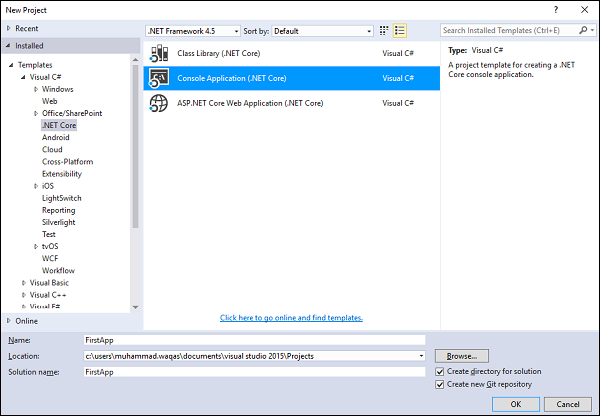
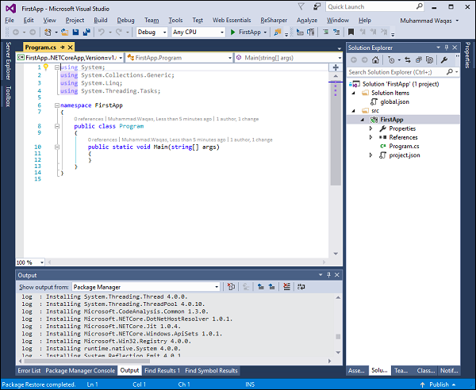
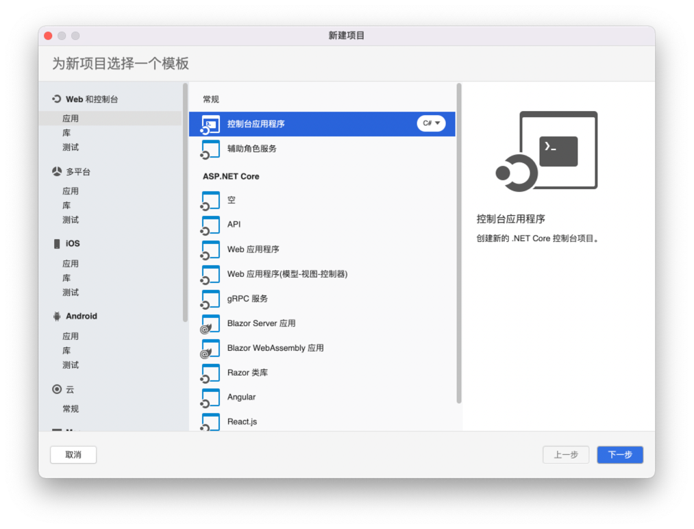
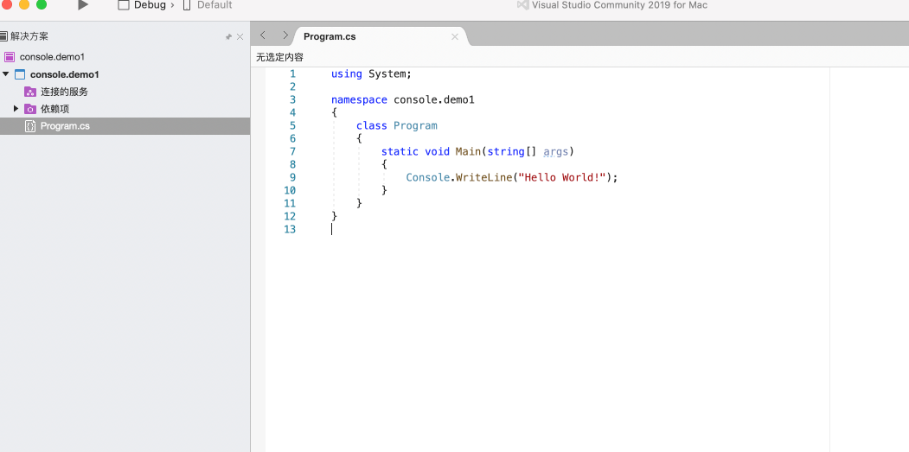
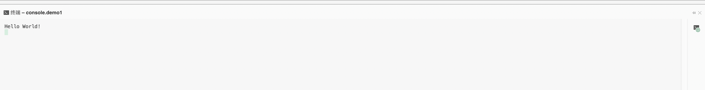

## .netCore

> NET Core 是微软维护的最新通用开发平台。

它适用于不同的平台，并且经过重新设计，使得 .NET 快速、灵活和现代。
这恰好是微软的主要贡献之一。
开发人员现在可以使用开源的 .NET 构建 Android、iOS、Linux、Mac 和 Windows 应用程序。
在本教程中，我们将介绍 .NET Core 和一些新的创新，包括 
.NET Framework 更新、.NET Standard 标准库、和通用 Windows 平台更新等。

- `.NET Core` 的特点

  - 开源

    - .NET Core 是一个开源实现，使用 MIT 和 Apache 2 许可证。
    - .NET Core 是一个 .NET Foundation 项目，你可在 GitHub 上获得。

  - 跨平台

      - 这里就不细说了

- 模块化

  - .NET Core 是通过 NuGet 以较小的程序集包发布的。
  - .NET Framework 是一个包含大部分核心功能的大型程序集。
  - .NET Core 以较小的以功能为中心的程序包的形式提供。
  - 这种模块化方法使开发人员能够优化他们的应用程序中仅包含他们需要的那些 NuGet 包。
  较小的应用程序表面积的好处包括更严格的安全性、更少的服务、改进的性能以及在按使用量付费的模式中降低成本。

下面是简介一下平台包含的主要部分：

- `.NET Runtime` - 它提供类型系统、程序集加载、垃圾收集器、本机互操作和其他基本服务。
- `Fundamental Libraries` - 一组框架库，提供原始数据类型、应用程序组合类型和基本实用程序。
- SDK 和编译器 -一组 可在 (`.NET Core SDK`.'dotnet' 应用程序主机中获得基本开发人员体验 )的SDK 工具和语言编译器，
- `dotnet` 应用主机 - 用于启动 .NET Core 应用程序。它选择运行时并托管运行时，提供程序集加载策略并启动应用程序。同一主机也用于以几乎相同的方式启动 SDK 工具。

### 安装环境

windows 可以安装 vs2015 以上的 IDE ， mac 最好选择使用 vs2022

### 抓紧开始吧

一开始的时候最好选择创建一个命令行工具

- windows 是这样的

- mac 是这样的

### 数型

dot NET Core 支持标准数值整数和浮点基元。
它还支持以下类型：

- `System.Numerics.BigInteger`，它是一个没有上限或下限的整数类型。
- `System.Numerics.Complex` 是一种表示复数的类型。
一组启用单指令多数据 (`SIMD`) 的向量 `System.Numerics` 命名空间中的类型。

> os： 没办法，微软的整型定义的类型非常多，凑活看

#### 整型

dot NET Core 支持长度从 1 字节到 8 字节的不同范围的有符号和无符号整数。
所有整数都是值类型。

下表表示整数类型及其大小；

| 类型	     | 有符号/ 无符号	 | 数据大小 (字节)	                     | 最小值    | 	最大值                       |
|---------|-----------|--------------------------------|--------|----------------------------|
| Byte	   | 无符号	 | 1	                             | 0	     | 255                        |
| Int16	  | 有符号	| 2	                             | −32,768	                                             | 32,767                     |
| Int32	  | 有符号	| 4	                             | −2,147,483,648| 	2,147,483,647             |                      
| Int64	  | 有符号	| 8	                             | −9,223,372,036,854,775,808| 	9,223,372,036,854,775,807 |
| SByte	  | 有符号| 	1	                            | -128	| 127                        |                 
| UInt16	 | 无符号	 | 2	|0	| 65,535                     |            
| UInt32	 | 无符号	 | 4	|0	| 4,294,967,295              |           
| UInt64	 | 无符号	 | 8	|0	| 18,446,744,073,709,551,615 |

每个整数类型都支持一组标准的算术、比较、相等、显式转换和隐式转换运算符。您还可以使用 `System.BitConverter` 类处理整数值中的各个位。

#### 浮点类型.

dot NET Core 包括三种基本浮点类型，如下表所示。

| 类型	  | 大小 (字节)                                     | 	最小值	                                    | 最大值 |
|------|-----|-----------------------------------------|------------------------------------------|
| 双精度	 | 8	  | −1.79769313486232e308	                  | 1.79769313486232e308                     |
| 单精度	 | 4	  | −3.402823e38	                           | 3.402823e38                              |
| 小数	  | 16	 | −79,228,162,514,264,337,593,5 43,950,335 | 	79,228,162,514,264,337,593,543,9 50,335 

#### 大整数 

System.Numerics.BigInteger 是一种不可变类型，表示一个任意大的整数，其值理论上没有上限或下限。BigInteger 类型的方法与其他整数类型的方法非常相似。

#### 复数 

System.Numerics.Complex 类型表示复数，即具有实数部分和虚数部分的数，它支持一组标准的算术、比较、相等、显式转换和隐式转换运算符，以及数学、代数法和三角法。

#### SIMD 

`Numerics` 命名空间包括一组用于 `.NET Core` 的支持 `SIMD` 的矢量类型。
`SIMD` 允许一些操作在硬件级别并行化，从而极大地提高对矢量执行计算的数学、科学和图形应用程序的性能。
`.NET Core` 中支持 `SIMD` 的向量类型包括以下内容 -

- System.Numerics.Vector2、System.Numerics.Vector3 和 System.Numerics.Vector4 类型，它们是 单精度 类型的 2、3 和 4 维向量。
- Vector <T> 结构允许您创建任意类型的向量原始数字类型。
原始数值类型包括 System 命名空间中的所有数值类型，除了 Decimal.Two 矩阵类型
- System.Numerics.Matrix3×2，它表示一个 3×2 矩阵； System.Numerics.Matrix4×4，代表一个 4×4 矩阵。
- System.Numerics.Plane 类型，代表一个三维平面， System.Numerics.Quaternion（四元数） 类型，代表一个向量，用于编码三维物理旋转。

