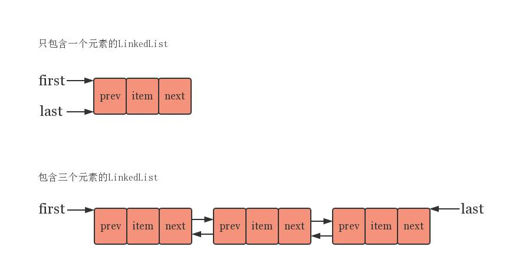
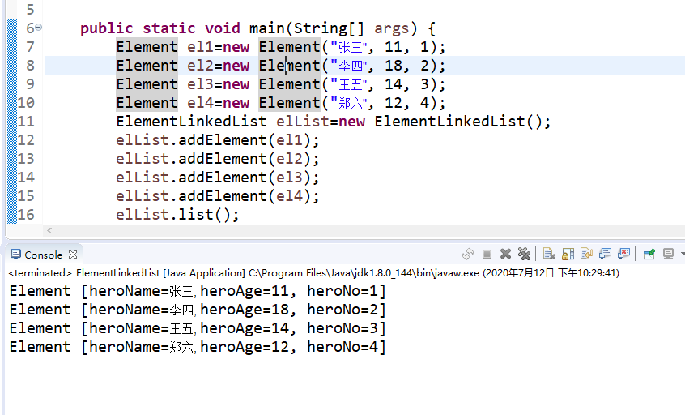
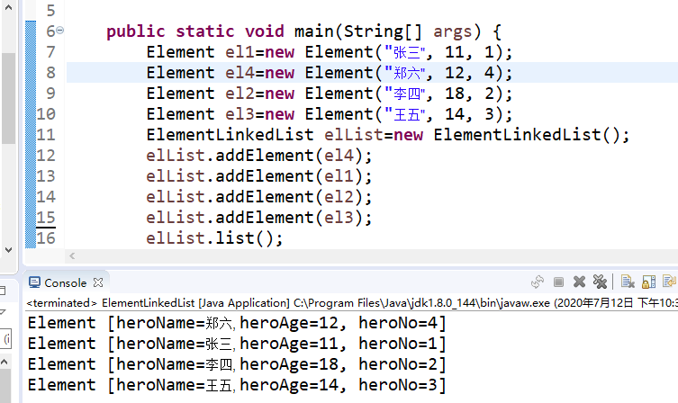
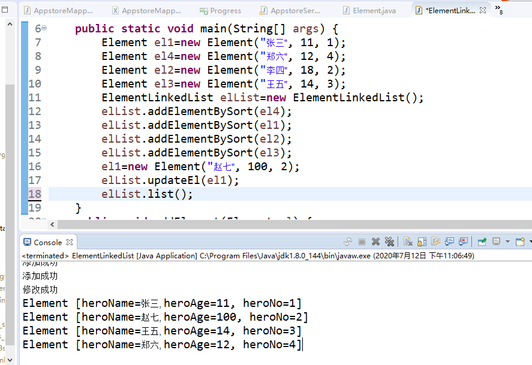
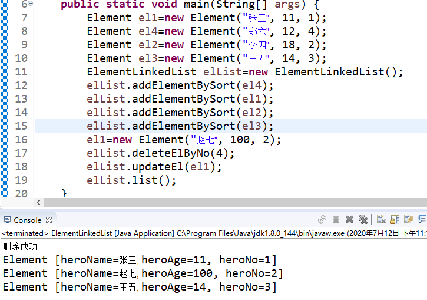

# java 算法与数据结构

### 一、简单压缩算法(稀疏数组)

​	小时候我们都有用过掌上游戏机来玩游戏，其中就有五子棋一类的。但是中途会存在没有下完，又不能一时半会分出胜负，这个时候就需要对游戏现状进行存档。以前的电子设备内存硬盘都不是很大，这个时候就需要考虑对数据进行压缩。那么如何进行有效的数据压缩呢？

​	有人就想到了稀疏数组这样一种数据结构。稀疏数组的图形就相当于一个表格，第一行记录一个二维数组的’长宽‘和这个二维数组的有效数个数(即非零个数)。之后记录的就是xy坐标值和有效数值。


​	通过上图我们就可以有效的看出稀疏数组和原数组的关系。

如何通过代码实现呢？代码入下

[代码实现](./code/SparseArray.md)

[引用](./code/ArrayMap.java)

通过上面的代码可以使原来的大数组去掉无效数组后变成一个小数组，这样就可以通过程序加长时间来减少存储。但是这样做也有很多不好的地方，那就是如果这个大数组全部都是有效数组，这样的话反而会加大存储量。

注意：稀疏数组第一行必须要算出原数组的有效数据的个数。不然就达不到减少存储空间的作用。如果不明白，可以通过自行敲代码来理解。

### 二、链表

#### 	1、链表数据结构

​		LinkedList数据结构如下图所示

​		LinkedList集合中的各个元素在内存中的位置不一定是连续的，它的每一个元素中都有一个指针指向下一个节点，这样的数据结构就可以加大在集合中插入数据和删除数据的效率。和ArrayList的不同之处就是，其元素的内存地址都是连续的，这就导致了插入元素和删除元素的效率大打折扣。而LinkedList在存储中不连续，这就可以更加充分的利用内存空间。(在现代科技生活中，基本不用考虑这个，因为内存已经够大了，不像90年代内存很小)。

#### 	2、简单实现单向链表

##### 		a、首先我们需要一个基本元素类。

```java
public class Element{
	   public String heroName;
	   public int heroAge;
	   public int heroNo;
	   public Element nextNode;
	   public Element(String name,int age,int no) {
		   this.heroName=name;
		   this.heroAge=age;
		   this.heroNo=no;
	   }
	@Override
	public String toString() {
		return "Element [heroName=" + heroName + ", heroAge=" + heroAge + ", heroNo=" + heroNo + "]";
	}
	   
}

```

##### 		b、创建集合类

```java

public class ElementLinkedList {
	Element head =new Element("", 0, 0);
}
```

​		head这个成员对象并没有什么实际作用，只是用于遍历集合时的切入点	

##### 		c、添加元素方法

```java
public void addElement(Element el) {
		//head是不能动的，所以需要一个temp来记录临时变量
		Element temp=head;
		//需要找到链表的尾部
		while(true) {
			if(temp.nextNode==null) {
				temp.nextNode=el;
				break;
			}
			temp=temp.nextNode;
		}
}
```

##### 		d、打印所有元素

```java
public void list() {
		if(head.nextNode==null) {
			System.out.println("链表为空");
		}else {
			Element temp=head.nextNode;
			while(true) {
				System.out.println(temp.toString());
				if(temp.nextNode==null) {
					break;
				}
				temp=temp.nextNode;
			}
		}
}
```

##### 		e、测试用例

```java
public static void main(String[] args) {
		Element el1=new Element("张三", 11, 1);
		Element el2=new Element("李四", 18, 2);
		Element el3=new Element("王五", 14, 3);
		Element el4=new Element("郑六", 12, 4);
		ElementLinkedList elList=new ElementLinkedList();
		elList.addElement(el1);
		elList.addElement(el2);
		elList.addElement(el3);
		elList.addElement(el4);
		elList.list();
}
```

​	输出结果



​	但是上述添加元素方法并不可以做到根据no排序，如下图所示



​	这样就需要对添加方法做出调整

##### 		f、有排序功能的添加方法

```java

	public void addElementBySort(Element el) {
		//head是不能动的，所以需要一个temp来记录临时变量
		Element temp=head;
		boolean flag=false; //判断这个编号是否存在
		while(true) {
			if(temp.nextNode==null) {
				break;
			}
			if(temp.nextNode.heroNo>el.heroNo) { //这时候就已经找到适合添加的位置
				break;
			}else if(temp.nextNode.heroNo==el.heroNo) {
				flag=true;
				break;
			}
			temp=temp.nextNode;
		}
		if(flag) {
			System.out.printf("该%d编号已经存在",el.heroNo);
		}else {
			el.nextNode=temp.nextNode;
			temp.nextNode=el;
			System.out.println("添加成功");
		}
	}
```

​	输出接口如下图

​	

##### 		g、修改元素

```java
public void updateEl(Element el) {
		Element temp=head;
		boolean flag=false;
		while(true) {
			if(temp.nextNode==null) {
				break;
			}
			if(temp.heroNo==el.heroNo) {
				flag=true;
				break;
			}
			temp=temp.nextNode;
		}
		if(!flag) {
			System.out.printf("你所修改英雄的编号%d不存在",el.heroNo);
		}else {
			temp.heroName=el.heroName;
			temp.heroAge=el.heroAge;
			System.out.println("修改成功");
		}
	}
```

​		运行结果如下图



​		h、删除元素

```java
	public void deleteElByNo(int no) {
		Element temp=head;
		boolean flag=false;
		
		while(true) {
			if(temp.nextNode==null) {
				break;
			}
			if(temp.nextNode.heroNo==no) {
				flag=true;
				break;
			}
			temp=temp.nextNode;
		}
		if(flag) {
			temp.nextNode=temp.nextNode.nextNode;
			System.out.println("删除成功");
		}else {
			System.out.println("你所删除的元素不存在");
		}
	}
```

​	运行结果如下图

​	