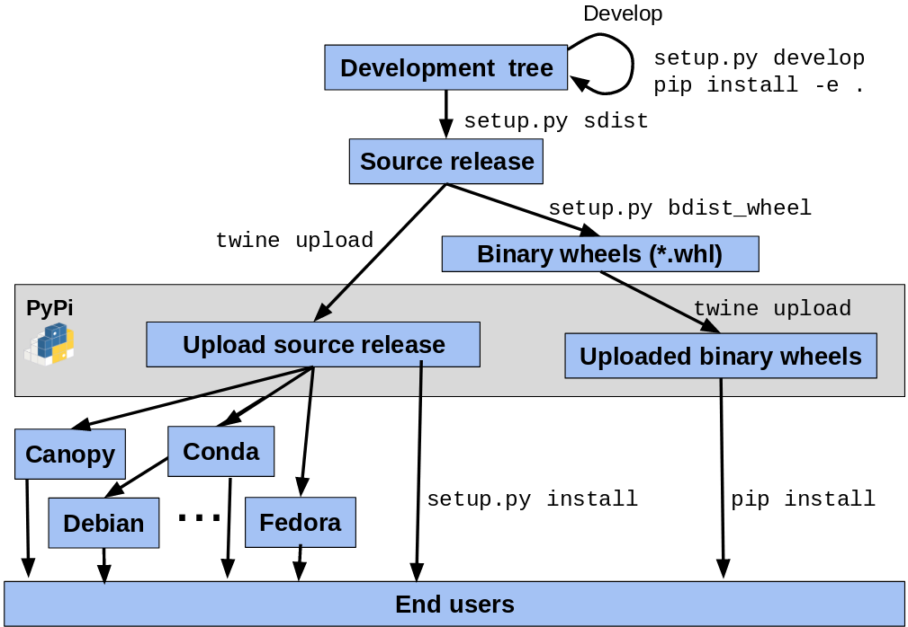

## 构建并上传到 PyPi

### 包装术语 101

#### 介绍

本节回顾关键的 Python 打包概念和定义。

##### PyPI

PyPI 是 Python 社区的默认包索引。它向所有 Python 开发人员开放，以使用和分发他们的发行版。
包索引有两个实例：

- PyPI：托管在 https://pypi.org/
- TestPyPI的Python包索引：Python
  包索引（PyPI）的一个独立实例，允许您尝试分发工具和处理，而不必担心影响实际索引。TestPyPI托管在 https://test.pypi.org

引用

https://packaging.python.org/glossary/#term-python-package-index-pypi

##### pip

PyPA 推荐的用于安装 Python 包的工具。 一个多面的工具：

- 它是一个集成前端，它接受一组包需求（例如需求.txt文件），并尝试更新工作环境以满足这些要求。这可能需要定位、构建和安装发行版的组合

- 它是一个构建前端，可以采用任意源代码树或源代码发行版并从中构建轮子。

引用

http://pip.readthedocs.io/

##### PyPA

Python Packaging Authority （PyPA） 是一个工作组，负责维护 Python 打包中的许多相关项目 https://www.pypa.io。
相关网站 https://www.pypa.io 引用了 PyPA 目标、规范和路线图以及 Python 打包用户指南，这是一系列教程和参考资料，可帮助您使用现代工具分发和安装
Python 包。

##### 源码分发

- 同义词：`sdist`、源代码发布
- 提供元数据+源文件
- 需要安装
    - 通过像 `pip` 这样的工具
    - 或用于生成构建分布

##### 构建发行版

- 同义词： `bdist`

- 提供元数据 + 预构建文件

- 只需要移动（通常按 `pip`）到目标系统上的正确位置

引用 https://packaging.python.org/glossary/#term-built-distribution

##### Python 发行版：纯 vs 非纯

- 纯
    - 不特定于 CPU 架构
    - 无 ABI（应用程序二进制接口）
- 非纯
    - ABI
    - 特定于平台

引用

- https://packaging.python.org/glossary/#term-module

##### 二进制分发

- 是一个内置分布
- 是不纯的
- 使用特定于平台的编译扩展

引用 https://packaging.python.org/glossary/#term-binary-distribution

##### 轮子

- 内置分布
- 扩展名为 .whl 的 ZIP 格式存档
    - {distribution}-{version}(-{build tag})?-{python tag}-{abi tag}-{platform tag}.whl
- 由 PEP 427 描述

引用 https://packaging.python.org/glossary/#term-wheel

Wheels 与 Conda 包

| Wheels                 | Conda 包                        |
|------------------------|--------------------------------|
| 受雇于pip，由 `PyPA` 祝福     | `Anaconda` 生态系统基础              |
| 用于任何 `python` 安装       | 由 `conda python` 安装使用          |
| 主要特定于 `Python` 生态系统    | 通用（任何生态系统）                     |
| 指定 `python` 兼容性范围的良好机制 | 对多个 `python` 版本的原始支持（`noarch`） |
| 依赖静态链接或其他系统包管理器来提供核心库  | 可以将核心系统级共享库捆绑为包， 并解析依赖关系       |

##### 虚拟环境

一个独立的 `Python` 环境，允许安装包以供特定应用程序使用，而不是在系统范围内安装。 阅读[创建虚拟环境了解更多信息](https://packaging.python.org/tutorials/installing-packages/#creating-and-using-virtual-environments)

##### Python 包生命周期



#### 教程

##### 介绍

本节讨论如何构建 `python` 包（或发行版）并将它们发布在中央存储库中以简化它们的安装。最后，我们以练习结束，我们在练习中发布带有测试 `Python` 包索引的包。

##### 创建一个环境

在开发或构建您的发行版之前，我们强烈建议创建一个专用环境。 conda 和 pip 都支持这一点。

##### 构建源分发

通过利用 `setup.py` 脚本，`setuptools` 可以构建源分发（构建和安装包所需的所有文件的 `tar` 存档）：

```shell
$ python setup.py sdist

$ ls -1 dist
SomePackage-1.0.tar.gz
```

造一个轮子

```shell
$ pip wheel . -w dist

$ ls -1 dist
SomePackage-1.0-py2.py3-none-any.whl
```

相当于

```shell
$ python setup.py bdist_wheel
```
##### 安装一个轮子

从 PyPI 安装包

```shell
$ pip install SomePackage
[...]
Successfully installed SomePackage
```
从 TestPyPI 安装一个包：

```shell
$ pip install -i https://test.pypi.org/simple SomePackage
[...]
Successfully installed SomePackage
```

安装包文件：

````shell
$ pip install SomePackage-1.0-py2.py3-none-any.whl
[...]
Successfully installed SomePackage
````
有关详细信息，请参阅 [pip 文档中的快速入门指南](https://pip.pypa.io/en/stable/quickstart/)。

##### 安装源代码分发

```shell
$ pip install SomePackage-1.0.tar.gz
    [...]
Successfully installed SomePackage
```

它透明地构建相关的轮子并安装它。

#### 发布到 PyPI

[twine](https://twine.readthedocs.io/) 实用程序用于在 PyPI 上发布 Python 包。 它可以作为 conda 和 pypi 包使用。 阅读使用 [TestPiPY](https://packaging.python.org/guides/using-testpypi/) 了解更多信息

##### 练习

练习 1：准备环境 在本教程的上下文中，因为参与者已经安装了 `miniconda`，我们将创建一个 `conda` 环境并使用 `conda install SomePackage` 安装包。

```shell
# 创建并激活名为“hello-pypi”的专用环境
conda create -n hello-pypi -y -c conda-forge
conda activate hello-pypi

# install pip, wheel and twine
conda install -y twine wheel pip
```
在 TestPyPI 上[创建一个帐户](https://test.pypi.org/account/register/)

练习2

构建源代码分发和 wheel

[下载](https://github.com/python-packaging-tutorial/hello-pypi/archive/master.zip)（或使用 git [签出](https://github.com/python-packaging-tutorial/hello-pypi)）我们的 hello-pypi 示例项目的源代码：

```shell
conda install -y wget
wget https://github.com/python-packaging-tutorial/hello-pypi/archive/master.zip
```

解压源码

```shell
conda install -y unzip
unzip master.zip
cd hello-pypi-master

```

修改包名使其唯一 然后，构建源分发：
然后，构建源分发：

```shell
$ python setup.py sdist

```
最终 构建一个轮子


```shell
$ pip wheel . -w dist
```
确保已在 `dist` 子目录中生成工件。

练习3

在 `PyPI` 上发布工件

```shell
twine upload --repository-url https://test.pypi.org/legacy/ dist/*
```

附加练习 4：发布自动化身份验证的工件

- 删除 `hello-pypi-master` 目录并再次提取存档。
- 更新包的名称并重建源分发和轮子。
- 使用以下内容在您的主目录中创建文件 `.pypirc`：

```ini
[distutils]
index-servers=
    pypi
    testpypi

[testpypi]
repository: https://test.pypi.org/legacy/
username: your testpypi username
password: your testpypi password

[pypi]
username: your testpypi username
password: your testpypi password
```
在 TestPyPI 上发布包：

```shell
$ twine upload --repository testpypi dist/*
```

省略 `-repository testpypi` 参数允许上传到常规 PyPI 服务器。


附加练习 5：设置持续集成

请参阅与 hello-pypi 示例关联的分支 [master-with-ci](https://github.com/python-packaging-tutorial/hello-pypi/tree/master-with-ci) 分支。


#### 源码

我在哪里可以解决这个问题？

这是一个非常好的指南：

Python打包用户指南：

https://packaging.python.org/

和更详细的教程：

http://python-packaging.readthedocs.io/en/latest/

遵循其中一个
这里有一个示例项目：

https://github.com/pypa/sampleproject

（这具有您可能需要的所有复杂性...

你可以用它作为你自己的包的模板。

这是一个固执己见的更新 - 更花哨一点，但一些好主意：

https://blog.ionelmc.ro/2014/05/25/python-packaging/

与其手动完成，不如使用漂亮的“千篇一律”项目：


https://cookiecutter.readthedocs.io/en/latest/


并且有一些模板可以与之一起使用 https://github.com/audreyr/cookiecutter-pypackage。 上面固执己见的博客文章：

https://github.com/ionelmc/cookiecutter-pylibrary

两者都是很好的起点。
 
