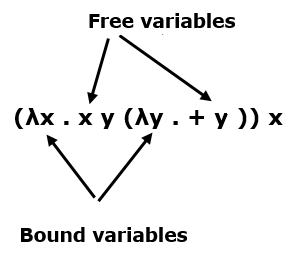

`Lambda` 演算 是由阿朗佐·丘奇在 20 世纪 30 年代开发的一个框架，用于研究函数计算。
- 函数创建 − 丘奇引入了符号 `λx.E` 表示一个函数，其中“x”是形式参数，“E”是函数体。这些函数可以没有名称和单个参数。
- 函数应用程序 − 丘奇使用符号 `E1.E2` 表示函数 `E1` 对实际参数 `E2` 的应用。所有函数都在单个参数上。


### `Lambda` 演算 的语法

`Lamdba` 演算包括三种不同类型的表达式，即

- E :: = x （变量）
- | E1 E2（函数应用）
- λx.E （函数创建）

### 计算 `Lambda` 演算

纯 lambda 演算 没有内置函数。让我们计算以下表达式 −

```prolog
(+ (* 5 6) (* 8 3)) 
```
在这里，我们不能以“+”开头，因为它只对数字进行操作。有两个可约化表达式：(* 5 6) 和 (* 8 3)。

我们可以先减少任何一个。例如 -

```prolog
(+ (* 5 6) (* 8 3)) 
(+ 30 (* 8 3)) 
(+ 30 24) 
= 54
```
### β-归约规则

我们需要一个归约规则来处理 λs

```prolog
(λx . * 2 x) 4 
(* 2 4) 
= 8
```

当有多个术语时，我们可以按如下方式处理它们 -

```prolog
(λx . (λx . + (− x 1)) x 3) 9 
```
内部 x 属于内部 λ，外部 x 属于外部 x。

```prolog
(λx . + (− x 1)) 9 3 
+ (− 9 1) 3 
+ 8 3 
= 11
```

### 自由变量和绑定变量


在表达式中，变量的每次出现要么是“自由的”（到 λ），要么是“绑定的”（到 λ）。 `(λx . E)y` 的 `β-` 减少用 `y` 替换 E 中自由出现的每个 x。例如 -




### 阿尔法 规约
阿尔法 规约 简非常简单，可以在不改变 lambda 表达式的含义的情况下完成。

```prolog
λx . (λx . x) (+ 1 x) ↔ α λx . (λy . y) (+ 1 x) 
```
例如

```prolog
(λx . (λx . + (− x 1)) x 3) 9 
(λx . (λy . + (− y 1)) x 3) 9 
(λy . + (− y 1)) 9 3 
+ (− 9 1) 3 
+ 8 3 
11 
```

### 丘奇-罗瑟定理

丘奇-罗瑟定理指出：

- 如果 E1 ↔ E2，则存在一个 E 使得 E1 → E 和 E2 → E。“任何方式的归约最终都会产生相同的结果。”

- 如果 E1 → E2，并且 E2 是正态形式，则 E1 到 E2 存在正阶规约。“正态阶规约总是会产生一个正态形式，如果存在的话。

