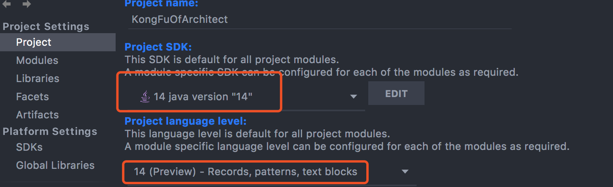

## 廖雪峰java教程笔记

### 前言

之前的一版java教程笔记可能不够实用，对于初学者或者高手而言，重新复习或者体会新的知识，能让自己的内心更加充实。

下面一段时间，我将不定期更新重新学习过程中遇到的问题，以及从其中得到的感悟。

如果您有兴趣，可以通过邮箱方式联系在下，阁下的贡献也是提升自己的好方法，不是吗？

## idea 配置JAVA版本

# 快速入门

## JAVA 程序基础

- [基本结构](BasicStruct.java)
- [变量](VariableAndDataType.java)
  - [整型例子](IntDemo.java)
  - [浮点型例子](IntDemo.java)
  - [布尔型例子](BooleanDemo.java)
  - [字符例子](CharDemo.java)
  - [常量例子](ConstDemo.java)
  - [var关键字例子](VarDemo.java)
  - [变量作用域例子](VariableScope.java)
- [整数运算-四则运算](IntegerArithmeticDemo1.java)
  - [整数运算-溢出](IntegerArithmeticDemo2.java)
  - [整数运算-自增自减](IntegerArithmeticDemo3.java)
  - [整数运算-移位运算左移](IntegerArithmeticDemo4.java)
  - [整数运算-移位运算右移](IntegerArithmeticDemo5.java)
  - [整数运算-移位运算右移-负数](IntegerArithmeticDemo6.java)
  - [整数运算-移位运算右移-无符号](IntegerArithmeticDemo7.java)
- [浮点数运算](FloatingPointArithmeticDemo1.java)
  - [浮点运算-比较大小](FloatingPointArithmeticDemo2.java)
  - [浮点运算-类型提升](FloatingPointArithmeticDemo3.java)
  - [浮点运算-溢出](FloatingPointArithmeticDemo4.java)
  - [浮点运算-强制转换](FloatingPointArithmeticDemo5.java)
  - [浮点运算-四舍五入](FloatingPointArithmeticDemo6.java)
 - [布尔运算](BooleanArithmeticDemo1.java)
   - [布尔运算-三元运算符](BooleanArithmeticDemo2.java)
 - [字符和字符串](CharAndStringDemo1.java) 
   - [字符和字符串-字符类型](CharAndStringDemo2.java) 
   - [字符和字符串-字符串类型](CharAndStringDemo3.java) 
   - [字符和字符串-字符串连接](CharAndStringDemo4.java) 
   - [字符和字符串-多行字符串](CharAndStringDemo5.java) 
   - [字符和字符串-字符串不可变特性](CharAndStringDemo6.java) 
   - [字符和字符串-空值null](CharAndStringDemo7.java) 
 - [数组类型](ArrayArithmeticDemo1.java)  
   - [字符串数组](ArrayArithmeticDemo2.java)
   - [字符串数组引用示例](ArrayArithmeticDemo3.java)
   
## 流程控制

- [输入和输出](StdinAndStdoutDemo1.java)
  - [输入和输出-格式化输出](StdinAndStdoutDemo2.java)
  - [输入和输出-输入](StdinAndStdoutDemo3.java)
  
- [if判断](IfJudgmentDemo1.java) 
  - [else](IfJudgmentDemo2.java) 
  - [if ... else if ...](IfJudgmentDemo3.java) 
  - [if条件顺序](IfJudgmentDemo4.java) 
  - [判断引用相等](IfJudgmentDemo5.java) 
  
- [switch 多重选择](SwitchCaseDemo1.java)  
  - [switch 多重选择- 多个case执行同一句块](SwitchCaseDemo2.java)  
  - [语句赋值](SwitchCaseDemo3.java)  
  - [yield](SwitchCaseDemo4.java)  
  
- [while循环](WhileLoopDemo1.java)  
- [do...while循环](DoWhileLoopDemo1.java)  
- [for循环](ForLoopDemo1.java)  
  - [for循环-数组求和](ForLoopDemo2.java)  
  - [for循环-访问指定索引](ForLoopDemo3.java)  
  - [for循环-灵活使用](ForLoopDemo4.java)  
  - [for循环- for each](ForLoopDemo5.java)  
  - [for循环- break , continue](ForLoopDemo6.java)  
  - [for循环- continue](ForLoopDemo7.java)  
  
## 数组操作

- [遍历数组](ForEachArrayDemo1.java)  
  - [遍历数组- 打印数组内容](ForEachArrayDemo2.java)  
  - [遍历数组- 数组排序](ForEachArrayDemo3.java)  
  - [遍历数组- 自带排序-升序](ForEachArrayDemo4.java)  
  - [遍历数组- 自带排序-降序](ForEachArrayDemo5.java)  
  - [遍历数组- 自带排序-降序-使用Comparator](ForEachArrayDemo6.java)
  
- [多维数组](MultidimensionalArraysDemo1.java)    
  - [多维数组-获取二维数组个项](MultidimensionalArraysDemo2.java)    
  - [多维数组-打印二维数组](MultidimensionalArraysDemo3.java)    
  - [多维数组-三维数组](MultidimensionalArraysDemo4.java)  
  - [多维数组-练习](MultidimensionalArraysDemo5.java)  
  
- [命令行参数](CommandLineDemo1.java)  
  - [命令行参数-命令行传参](CommandLineDemo2.java)  
  

# 面向对象编程

## 面向对象基础
- [类](ClassBasicDemo1.java)
  - [练习](ClassBasicDemo2.java)
- [方法](ClassMethodDemo1.java)
  - [方法-this变量](ClassMethodDemo2.java)
  - [方法-参数](ClassMethodDemo3.java)
  - [方法-可变参数](ClassMethodDemo4.java)
  - [方法-传递引用参数](ClassMethodDemo5.java)
- [构造方法](ConstructMethodDemo1.java)
  - [构造方法-初始化和构造函数初始化](ConstructMethodDemo2.java)
  - [多构造方法](ConstructMethodDemo3.java)
- [方法重载](MethodReloadDemo1.java)
- [继承](ExtendDemo1.java)
  - [继承-protected](ExtendDemo2.java)
  - [继承-向上转型](ExtendDemo3.java)
  - [继承-向下转型](ExtendDemo4.java)
  - [继承-instanceof](ExtendDemo5.java)
  - [继承-避免强转-java 14 新特性](ExtendDemo6.java)
  - [继承-区分继承和组合](ExtendDemo7.java)
- [多态](PolymorphismDemo1.java)
  - [多态-使用案例-计算税费](PolymorphismDemo2.java)
  - [多态-覆写Object方法](PolymorphismDemo3.java)
  - [多态-调用super](PolymorphismDemo4.java)
  - [多态-final](PolymorphismDemo5.java)
- [抽象类](AbstractClassDemo1.java)
  - [抽象类-规范作用](AbstractClassDemo2.java)
  - [抽象类-面向抽象编程](AbstractClassDemo3.java)
  - [抽象类-使用案例-计算税费](AbstractClassDemo4.java)
- [接口](IntefaceDemo1.java)
  - [接口-术语](IntefaceDemo2.java)
  - [接口-接口继承](IntefaceDemo3.java)
  - [接口-继承关系](IntefaceDemo4.java)
  - [接口-default方法](IntefaceDemo5.java)
- [静态字段和静态方法](StaticFieldAndMethodDemo1.java)
  - [静态方法](StaticFieldAndMethodDemo2.java)
  - [接口的静态字段](StaticFieldAndMethodDemo3.java)
- [包](PackageDemo1.java)
  - [包-包作用域](PackageDemo2.java)
  - [包-import](PackageDemo3.md)
  - [包-错误示范](PackageDemo4.java)
  - [包-最佳实践](PackageDemo5.md)
- [作用域](ScopeDemo1.java)
  - [作用域-嵌套类](ScopeDemo2.java)
  - [作用域-包](ScopeDemo3.java)
  - [作用域-局部变量](ScopeDemo4.java)
  - [作用域-final](ScopeDemo5.java)
- [classpath 和 jar](ClassPathAndJar.md)
  - [classpath  ](ClassPathAndJar.md)
  - [jar包](ClassPathAndJar2.md)
- [模块](MoudleDemo1.java)
  - [模块-实验](MoudleDemo1.md)
  - [模块-运行](MoudleDemo2.md)
  - [模块-打包JRE](MoudleDemo3.md)
  - [模块-访问权限](MoudleDemo4.md)

## Java核心类
- [字符串和编码](StringAndEncodeDemo1.java)
  - [字符串比较](StringAndEncodeDemo2.java)
  - [搜索子串、提取子串](StringAndEncodeDemo3.java)
  - [替换字符串](StringAndEncodeDemo4.java)
  - [分割字符串](StringAndEncodeDemo5.java)
  - [拼接字符串](StringAndEncodeDemo6.java)
  - [类型转换](StringAndEncodeDemo7.java)
  - [转换为 char[] ](StringAndEncodeDemo8.java)
  - [Score ](StringAndEncodeDemo9.java)
  - [UTF-8 编码 ](StringAndEncodeDemo10.java)
- [StringBuilder](StringBuilderDemo1.java)
  - [一个可以不断增加的计数器](StringBuilderDemo2.java)
- [StringJoiner](StringJoinerDemo1.java)
  - [StringJoiner-String.join()](StringJoinerDemo2.java)
- [包装类型](PackagingType.java)
  - [包装类型-拆箱-装箱](AutoBoxingDemo1.java)
  - [包装类型-不变类](PackagingTypeDemo1.java)
  - [包装类型-进制转换](PackagingTypeDemo3.java)
- [JavaBean](JavaBeanDemo1.java)
  - [JavaBean-作用](JavaBeanDemo2.java)
  - [JavaBean-枚举属性](JavaBeanDemo3.java)
- [枚举类](EnumerationClassDemo1.java)
  - [枚举类-enum的比较](EnumerationClassDemo2.java)
  - [枚举类-enum类型](EnumerationClassDemo3.java)
  - [枚举类-switch](EnumerationClassDemo4.java)
- [记录类](RecordClassDemo1.java)  
- [BigInteger](BigIntegerDemo1.java)
- [BigDecimal](BigDecimalDemo1.java)
  - [BigDecimal-四舍五入和直接截取](BigDecimalDemo2.java)
  - [BigDecimal-加减乘除](BigDecimalDemo3.java)
  - [BigDecimal-除法且求余](BigDecimalDemo4.java)
  - [BigDecimal-比较BigDecimal](BigDecimalDemo5.java)
- [常用工具类-Math](CommonToolsDemo1.java)
  - [生成一个区间在 ( MIN, MAX ) 的随机数](CommonToolsDemo2.java)
  - [生成伪随机数](CommonToolsDemo3.java)
  - [生成真随机数](CommonToolsDemo4.java)
    
# 异常处理
## Java的异常
- [方法1](JavaExceptionDemo1.java)
- [方法2](JavaExceptionDemo2.java)
- [捕获异常](JavaExceptionDemo3.java)
## 捕获异常
- [多catch语句](MultipleCatchStatementsDemo1.java)
- [finally 语句](FinallyStatementsDemo1.java)
- [捕获多个异常](CatchMultipleExceptionsDemo1.java)
## 抛出异常
- [异常的传播](ThrowExceptionDemo1.java)
- [异常的传播-原始的异常](ThrowExceptionDemo2.java)
- [异常的传播-finally执行顺序](ThrowExceptionDemo3.java)

## 自定义异常

- [自定义异常](CustomException.md)
- [自定义异常-构建自定义异常](CustomExceptionDemo1.java)

## 空指针异常
- [空指针异常示例1](NullPointerExceptionDemo1.java)
- [处理NullPointerException](NullPointerExceptionDemo2.java)
- [定位NullPointerException](NullPointerExceptionDemo3.java)
## 断言
- [断言示例1](AssertionDemo1.java)
## JDK Logging
- [使用JDK Logging](JDKLoggingDemo1.java)
## Common Logging
- [使用Commons Logging](CommonsLoggingDemo1.java)
- [使用Commons Logging-实例方法](CommonsLoggingDemo2.java)
## Log4j
- [使用 Log4j](Log4jDemo1.java)
## SLF4J . Logback
- [示例1](SLF4JAndLogbackDemo1.java)
# 反射
- [Class类](ReflectClassDemo1.java)
  - [动态加载](DynamicLoadingDemo1.java)
  - [动态加载-示例2](DynamicLoadingDemo2.java)
  - [访问字段](AccessFieldsDemo1.java)  
    - [访问字段-获取字段值](AccessFieldsDemo2.java)  
    - [访问字段-设置字段值](AccessFieldsDemo3.java)  
  - [调用方法](CallMethodDemo1.java)  
  - [调用构造方法](CallMethodDemo2.java)  
  - [获取继承关系](CallMethodDemo3.java)  
  - [动态代理](CallMethodDemo4.java)  
# 注解
- [使用注解](UseAnnotationDemo1.java)
- [定义注解](UseAnnotationDemo2.java)
- [定义注解2](UseAnnotationDemo3.java)
- [处理注解1](HandleAnnotationDemo1.java)
# 泛型
- [什么是泛型](GenericDemo1.java)
- [使用泛型](GenericDemo2.java)
  - [泛型接口](GenericDemo3.java)
- [编写泛型](WriteGenericsDemo1.java)
  - [多个泛型类型](WriteGenericsDemo2.java)
- [擦拭法](WipingMethodDemo1.java)  
  - [泛型继承](WipingMethodDemo2.java)  
- [extends 通配符](extendsWildcardDemo1.java)
  - [extends通配符的作用](extendsWildcardDemo2.java)
  - [使用extends限定T类型](extendsWildcardDemo3.java)
- [super通配符](superWildcard/Main.java)
  - [PECS原则](superWildcard/Collections.java)
  - [无限定通配符](superWildcard/UnlimitedWildcard.java)
  
-[泛型和反射](GenericsAndReflections/Main.java)  
  -[谨慎使用泛型可变参数](GenericsAndReflections/WrongDemo.java)
# 集合
- [使用List](collection/useList/Main.java)
  - [使用List](collection/useList/Main.java)
# IO
# 日期与时间
# 单元测试
# 正则表达式
# 加密与安全
# 多线程
# Maven 基础
# 网络编程
# XML 与 JSON
# JDBC 编程
# 函数式编程
# 设计模式
# Web 开发
# Spring 开发  

# 引用版权声明

【廖雪峰java教程笔记】引用内容版权归[廖雪峰的官方网站](https://www.liaoxuefeng.com)所有