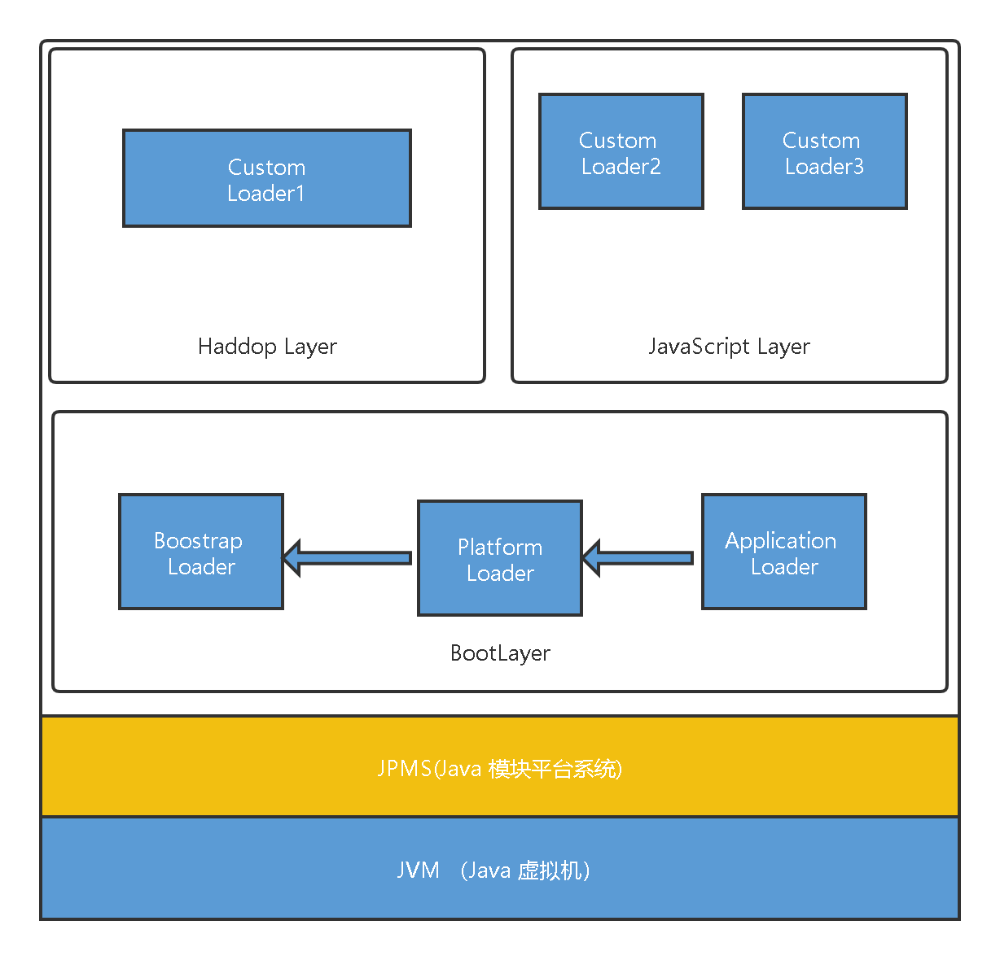
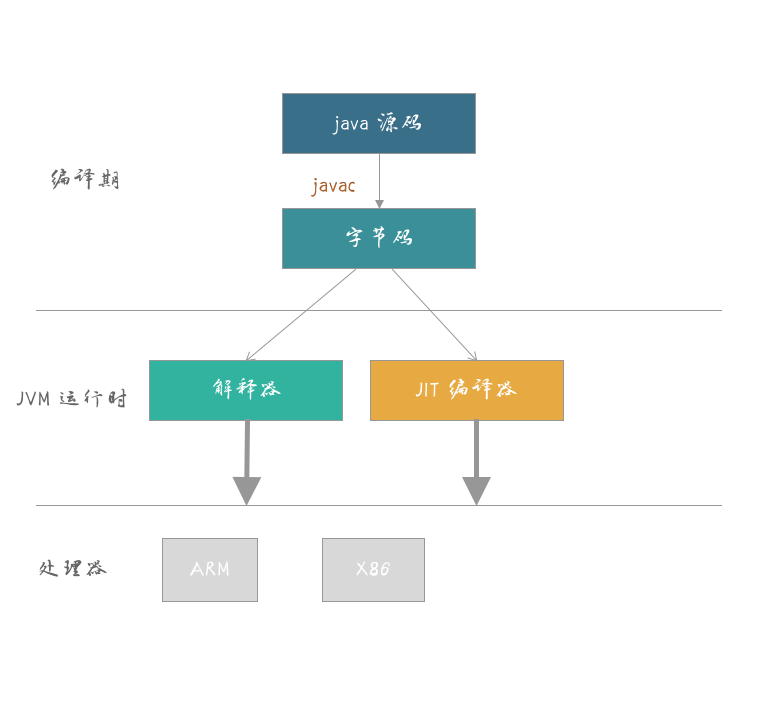
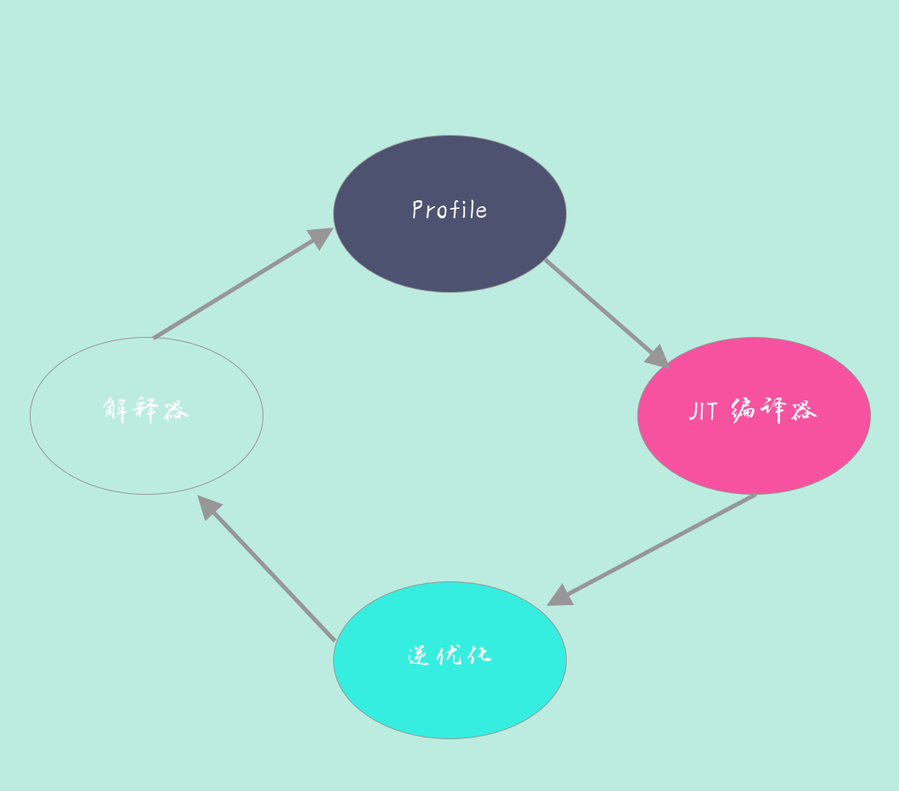

## 类与虚拟机


### 类加载过程

- 加载
  - `Java` 将字节码数据从不同的数据源读取到 `JVM` 中，并映射为 `JVM` 认可的数据结构（`Class` 对象）
    - 数据源可能是各种各样的形态，如 `jar` 文件、`class` 文件，甚至是网络数据源
- 链接
  - 把原始的类定义信息平滑地转化入 `JVM` 运行的过程中
  - 验证
    - 核验字节信息是符合 `Java` 虚拟机规范的，否则就被认为是 `VerifyError`
  - 准备 
    - 创建类或接口中的静态变量，并初始化静态变量的初始值
    - 分配所需要的内存空间，不会去执行更进一步的 `JVM` 指令  
  - 解析
    - 将常量池中的符号引用替换为直接引用  
- 初始化
  - 真正去执行类初始化的代码逻辑
    - 静态字段赋值的动作
    - 执行类定义中的静态初始化块内的逻辑
    - 父类型的初始化逻辑优先于当前类型的逻辑
    
### 双亲委派模型    
当类加载器（`Class-Loader`）试图加载某个类型的时候，除非父加载器找不到相应类型，否则尽量将这个任务代理给当前加载器的父加载器去做。

- 作用
  - 避免重复加载 Java 类型
  
示例：


```java

public class CLPreparation {
    public static int a = 100;
    public static final int INT_CONSTANT = 1000;
    public static final Integer INTEGER_CONSTANT = 10000;
}
```  

编译为字节码后并输出字节码文件的信息：

```bash 

Javap –v CLPreparation.class
```

输出的内容信息：

```text
  static {};
    descriptor: ()V
    flags: ACC_STATIC
    Code:
      stack=1, locals=0, args_size=0
         0: bipush        100
         2: putstatic     #2                  // Field a:I
         5: sipush        10000
         8: invokestatic  #3                  // Method java/lang/Integer.valueOf:(I)Ljava/lang/Integer;
        11: putstatic     #4                  // Field INTEGER_CONSTANT:Ljava/lang/Integer;
        14: return
      LineNumberTable:
        line 3: 0
        line 5: 5
}
```

普通原始类型静态变量和引用类型（即使是常量），是需要额外调用 `putstatic` 等 `JVM` 指令的

### `Java 8` 以前各种类加载器的结构

- 启动类加载器

  - 加载 `jre/lib` 下面的 `jar` 文件，如 `rt.jar`。它是个超级公民
  
修改 `JDK` 的基础代码:

```bash 

# 指定新的bootclasspath，替换java.*包的内部实现
java -Xbootclasspath:<your_boot_classpath> your_App
 
# a意味着append，将指定目录添加到bootclasspath后面
java -Xbootclasspath/a:<your_dir> your_App
 
# p意味着prepend，将指定目录添加到bootclasspath前面
java -Xbootclasspath/p:<your_dir> your_App
```
  
- 扩展类加载器

  - 加载我们放到 `jre/lib/ext/` 目录下面的 `jar` 包，这就是所谓的 `extension` 机制。  
  - 覆盖方式：设置 `java.ext.dirs`
 
- 应用类加载器

  - 加载我们最熟悉的 `classpath` 的内容  
  - 系统（`System`）类加载器
    - 默认就是 `JDK` 内建的应用类加载器
 
修改 `JDK` 的内建类加载器：

```java

java -Djava.system.class.loader=com.yourcorp.YourClassLoader HelloWorld
```    

### 类加载机制有三个基本特征

- 双亲委派模型
  - 特殊情况
     - `JNDI`、`JDBC`、文件系统、`Cipher` 都是是可能要加载用户代码的
       - 利用所谓的上下文加载器
- 可见性
  - 子类加载器可以访问父加载器加载的类型
  - 反向不行
- 单一性
  - 父加载器的类型对于子加载器是可见的
  - 父加载器中加载过的类型，就不会在子加载器中重复加载
  - 类加载器“邻居”间，同一类型仍然可以被加载多次，因为互相并不可见。
  

### `JAVA 9` 之后的类加载器

对相应模块的修补：

确认要修改的类文件已经编译好，并按照对应模块（假设是 java.base）结构存放  

```bash

java --patch-module java.base=your_patch yourApp
```
- 扩展类加载器被重命名为平台类加载器
- 部分不需要 `AllPermission` 的 `Java` 基础模块，被降级到平台类加载器中，相应的权限也被更精细粒度地限制起来。
- `rt.jar` 和 `tools.jar` 同样是被移除了！
- 增加了 `Layer` 的抽象， `JVM` 启动默认创建 `BootLayer`


目前的 JVM 内部结构就变成了下面的层次，
内建类加载器都在 `BootLayer` 中，
其他 `Layer` 内部有自定义的类加载器，
不同版本模块可以同时工作在不同的 `Layer`




### 自定义类加载器

常见场景

- 实现类似进程内隔离，类加载器实际上用作不同的命名空间，以提供类似容器、模块化的效果。
- 应用需要从不同的数据源获取类定义信息
- 需要自己操纵字节码，动态修改或者生成类型

自定义类加载过程：

1. 通过指定名称，找到其二进制实现
2. 创建 `Class` 对象，并完成类加载过程


有什么通用办法，不需要代码和其他工作量，就可以降低类加载的开销呢？

- AOT
  - 直接编译成机器码，降低的其实主要是解释和编译开销
- `AppCDS`（Application Class-Data Sharing）

`AppCDS` 基本原理和工作过程：

-  JVM 将类信息加载， 解析成为元数据
- 根据需求是否需要修改进行分类：
  - `Read-Only` 部分
  - `Read-Write` 部分
  
这些元数据直接存储在文件系统中，作为所谓的 `Shared Archive`

命令：

```bash

Java -Xshare:dump -XX:+UseAppCDS -XX:SharedArchiveFile=<jsa>  \
         -XX:SharedClassListFile=<classlist> -XX:SharedArchiveConfigFile=<config_file>
```

应用程序启动时，指定归档文件，并开启 `AppCDS`:

```bash

Java -Xshare:on -XX:+UseAppCDS -XX:SharedArchiveFile=<jsa> yourApp
```

`JVM` 会通过内存映射技术，直接映射到相应的地址空间，免除了类加载、解析等各种开销。


### 动态生成 `Java` 类

使用 `Java Compiler API`

`JDK` 提供的标准 `API`，里面提供了与 `javac` 对等的编译器功能

[文档](https://docs.oracle.com/javase/9/docs/api/javax/tools/package-summary.html)

如何让 `JVM` 加载字节码？
- 符合 `JVM` 规范的字节码
- 利用 `Java` 字节码操纵工具和类库来实现
  - [ASM](https://asm.ow2.io/)
  - [javassist](http://www.javassist.org/)

### 类从字节码到 `Class` 对象的转换

```java

protected final Class<?> defineClass(String name, byte[] b, int off, int len,
                                   ProtectionDomain protectionDomain)
protected final Class<?> defineClass(String name, java.nio.ByteBuffer b,
                                   ProtectionDomain protectionDomain)
```

`ProxyGenerator` 生成字节码，并以 byte 数组的形式保存，然后通过调用 `Unsafe` 提供的 `defineClass` 入口。

```java

byte[] proxyClassFile = ProxyGenerator.generateProxyClass(
      proxyName, interfaces.toArray(EMPTY_CLASS_ARRAY), accessFlags);
try {
  Class<?> pc = UNSAFE.defineClass(proxyName, proxyClassFile,
                                   0, proxyClassFile.length,
                                   loader, null);
  reverseProxyCache.sub(pc).putIfAbsent(loader, Boolean.TRUE);
  return pc;
} catch (ClassFormatError e) {
// 如果出现ClassFormatError，很可能是输入参数有问题，比如，ProxyGenerator有bug
}
```

使用硬编码的方式生成字节码：


```java
import java.io.DataOutputStream;
import java.io.IOException;

import static sun.tools.java.RuntimeConstants.opc_wide;

public class GenerateHardCodedBitCoce {
    public static void main(String[] args) {

    }

    private void codeLocalLoadStore(int lvar, int opcode, int opcode_0, DataOutputStream out) throws IOException {
        assert lvar >= 0 && lvar <= 0xFFFF;
        // 根据变量数值，以不同格式，dump操作码
        if (lvar <= 3) {
            out.writeByte(opcode_0 + lvar);
        } else if (lvar <= 0xFF) {
            out.writeByte(opcode);
            out.writeByte(lvar & 0xFF);
        } else {
            // 使用宽指令修饰符，如果变量索引不能用无符号byte
            out.writeByte(opc_wide);
            out.writeByte(opcode);
            out.writeShort(lvar & 0xFFFF);
        }
    }
}

```
普通的 `Java` 动态代理，其实现过程可以简化成为:

- 提供一个基础的接口，作为被调用类型和代理类之间的统一入口
- 实现 `InvocationHandler` ，对代理对象方法的调用，会被分派到其 `invoke` 方法来真正实现动作。
- 通过 `Proxy` 类，调用其 `newProxyInstance` 方法，生成一个实现了相应基础接口的代理类实例

动态代码生成是具体发生在什么阶段?

> 是在 `newProxyInstance` 生成代理类实例的时候

第一步，生成对应的类:

```java

ClassWriter cw = new ClassWriter(ClassWriter.COMPUTE_FRAMES);

cw.visit(V1_8,                      // 指定Java版本
      ACC_PUBLIC,               // 说明是public类型
        "com/mycorp/HelloProxy",  // 指定包和类的名称
      null,                     // 签名，null表示不是泛型
      "java/lang/Object",               // 指定父类
      new String[]{ "com/mycorp/Hello" }); // 指定需要实现的接口
```

按照需要为代理对象实例，生成需要的方法和逻辑:

```java

MethodVisitor mv = cw.visitMethod(
      ACC_PUBLIC,               // 声明公共方法
      "sayHello",               // 方法名称
      "()Ljava/lang/Object;",   // 描述符
      null,                     // 签名，null表示不是泛型
      null);                      // 可能抛出的异常，如果有，则指定字符串数组

mv.visitCode();
// 省略代码逻辑实现细节
cw.visitEnd();                      // 结束类字节码生成
```

字节码操纵技术，除了动态代理，还可以应用在什么地方？

- 各种 Mock 框架
- ORM 框架
- IOC 容器
- 部分 Profiler 工具，或者运行时诊断工具等
- 生成形式化代码的工具


### 监控和诊断JVM堆内存堆外存

分析一个简单的 `Hello` 程序：

在源码目录下通过以下命令执行命令：

```bash 
java -XX:NativeMemoryTracking=summary -XX:+UnlockDiagnosticVMOptions -XX:+PrintNMTStatistics Hello
```

NMT 的输出: 

```text


Native Memory Tracking:

Total: reserved=10092994KB, committed=649038KB
-                 Java Heap (reserved=8388608KB, committed=528384KB)
                            (mmap: reserved=8388608KB, committed=528384KB) 
 
-                     Class (reserved=1056878KB, committed=4974KB)
                            (classes #487)
                            (  instance classes #413, array classes #74)
                            (malloc=110KB #539) 
                            (mmap: reserved=1056768KB, committed=4864KB) 
                            (  Metadata:   )
                            (    reserved=8192KB, committed=4352KB)
                            (    used=140KB)
                            (    free=4212KB)
                            (    waste=0KB =0.00%)
                            (  Class space:)
                            (    reserved=1048576KB, committed=512KB)
                            (    used=7KB)
                            (    free=505KB)
                            (    waste=0KB =0.00%)
 
-                    Thread (reserved=17482KB, committed=17482KB)
                            (thread #17)
                            (stack: reserved=17408KB, committed=17408KB)
                            (malloc=56KB #104) 
                            (arena=18KB #32)
 
-                      Code (reserved=247724KB, committed=7584KB)
                            (malloc=36KB #396) 
                            (mmap: reserved=247688KB, committed=7548KB) 
 
-                        GC (reserved=367866KB, committed=76178KB)
                            (malloc=22742KB #2190) 
                            (mmap: reserved=345124KB, committed=53436KB) 
 
-                  Compiler (reserved=167KB, committed=167KB)
                            (malloc=3KB #40) 
                            (arena=165KB #5)
 
-                  Internal (reserved=550KB, committed=550KB)
                            (malloc=518KB #915) 
                            (mmap: reserved=32KB, committed=32KB) 
 
-                    Symbol (reserved=1130KB, committed=1130KB)
                            (malloc=770KB #27) 
                            (arena=360KB #1)
 
-    Native Memory Tracking (reserved=126KB, committed=126KB)
                            (malloc=5KB #60) 
                            (tracking overhead=122KB)
 
-        Shared class space (reserved=11284KB, committed=11284KB)
                            (mmap: reserved=11284KB, committed=11284KB) 
 
-               Arena Chunk (reserved=974KB, committed=974KB)
                            (malloc=974KB) 
 
-                   Logging (reserved=5KB, committed=5KB)
                            (malloc=5KB #196) 
 
-                 Arguments (reserved=13KB, committed=13KB)
                            (malloc=13KB #418) 
 
-                    Module (reserved=59KB, committed=59KB)
                            (malloc=59KB #1038) 
 
-                 Safepoint (reserved=8KB, committed=8KB)
                            (mmap: reserved=8KB, committed=8KB) 
 
-           Synchronization (reserved=119KB, committed=119KB)
                            (malloc=119KB #1773) 


```

 参数

-  `-XX:NativeMemoryTracking=summary `

开启 NMT 并选择 summary 模式，

- `-XX:+UnlockDiagnosticVMOptions -XX:+PrintNMTStatistics`

在应用退出时打印 NMT 统计信息

- `Class` 内存占用，它所统计的就是 `Java` 类元数据所占用的空间
  - 调整参数： `-XX:MaxMetaspaceSize=value`
  
- 调整启动类加载器元数据区
  - `-XX:InitialBootClassLoaderMetaspaceSize=30720`
  
面对进程时间较为短暂的函数式服务，如何降低内存的占用率
- 降低其并行线程数目
- 切换 `GC` 类型

`JIT` 编译默认开启了 `TieredCompilation`

关闭 `TieredCompilation` 并 更换 `GC` 

```bash
java -XX:NativeMemoryTracking=summary -XX:+UnlockDiagnosticVMOptions -XX:+PrintNMTStatistics -XX:-TieredCompilation -XX:+UseParallelGC  Hello

```

输出内容如下：

```text
Native Memory Tracking:

Total: reserved=9862960KB, committed=874120KB
-                 Java Heap (reserved=8388608KB, committed=524288KB)
                            (mmap: reserved=8388608KB, committed=524288KB) 
 
-                     Class (reserved=1056879KB, committed=4975KB)
                            (classes #501)
                            (  instance classes #426, array classes #75)
                            (malloc=111KB #537) 
                            (mmap: reserved=1056768KB, committed=4864KB) 
                            (  Metadata:   )
                            (    reserved=8192KB, committed=4352KB)
                            (    used=121KB)
                            (    free=4231KB)
                            (    waste=0KB =0.00%)
                            (  Class space:)
                            (    reserved=1048576KB, committed=512KB)
                            (    used=6KB)
                            (    free=506KB)
                            (    waste=0KB =0.00%)
 
-                    Thread (reserved=12341KB, committed=12341KB)
                            (thread #11)
                            (stack: reserved=12288KB, committed=12288KB)
                            (malloc=40KB #74) 
                            (arena=13KB #23)
 
-                      Code (reserved=49562KB, committed=2542KB)
                            (malloc=26KB #318) 
                            (mmap: reserved=49536KB, committed=2516KB) 
 
-                        GC (reserved=341736KB, committed=316140KB)
                            (malloc=35256KB #185) 
                            (mmap: reserved=306480KB, committed=280884KB) 
 
-                  Compiler (reserved=164KB, committed=164KB)
                            (malloc=1KB #21) 
                            (arena=163KB #3)
 
-                  Internal (reserved=535KB, committed=535KB)
                            (malloc=503KB #882) 
                            (mmap: reserved=32KB, committed=32KB) 
 
-                    Symbol (reserved=1151KB, committed=1151KB)
                            (malloc=791KB #1389) 
                            (arena=360KB #1)
 
-    Native Memory Tracking (reserved=90KB, committed=90KB)
                            (malloc=3KB #42) 
                            (tracking overhead=87KB)
 
-        Shared class space (reserved=11284KB, committed=11284KB)
                            (mmap: reserved=11284KB, committed=11284KB) 
 
-               Arena Chunk (reserved=492KB, committed=492KB)
                            (malloc=492KB) 
 
-                   Logging (reserved=5KB, committed=5KB)
                            (malloc=5KB #196) 
 
-                 Arguments (reserved=13KB, committed=13KB)
                            (malloc=13KB #418) 
 
-                    Module (reserved=59KB, committed=59KB)
                            (malloc=59KB #1038) 
 
-                 Safepoint (reserved=8KB, committed=8KB)
                            (mmap: reserved=8KB, committed=8KB) 
 
-           Synchronization (reserved=33KB, committed=33KB)
                            (malloc=33KB #416) 

```

Thread 从 17 降到了 11

`Code` 统计信息，也就是 `CodeCache` 相关内存，即 `JIT compiler` 存储编译热点方法等信息的地方

设置初始值和最大值的参数

```text

## 初始值
-XX:InitialCodeCacheSize=value
## 保存code 缓存的大小
-XX:ReservedCodeCacheSize=value
```

我们进行下一步的实验：

```bash
java -XX:NativeMemoryTracking=summary -XX:+UnlockDiagnosticVMOptions -XX:+PrintNMTStatistics -XX:-TieredCompilation -XX:+UseParallelGC -XX:InitialCodeCacheSize=4096  Hello

```

这是实验的输出值：

```text
Native Memory Tracking:

Total: reserved=9862960KB, committed=872060KB
-                 Java Heap (reserved=8388608KB, committed=524288KB)
                            (mmap: reserved=8388608KB, committed=524288KB) 
 
-                     Class (reserved=1056879KB, committed=4975KB)
                            (classes #501)
                            (  instance classes #426, array classes #75)
                            (malloc=111KB #537) 
                            (mmap: reserved=1056768KB, committed=4864KB) 
                            (  Metadata:   )
                            (    reserved=8192KB, committed=4352KB)
                            (    used=121KB)
                            (    free=4231KB)
                            (    waste=0KB =0.00%)
                            (  Class space:)
                            (    reserved=1048576KB, committed=512KB)
                            (    used=6KB)
                            (    free=506KB)
                            (    waste=0KB =0.00%)
 
-                    Thread (reserved=12341KB, committed=12341KB)
                            (thread #11)
                            (stack: reserved=12288KB, committed=12288KB)
                            (malloc=40KB #74) 
                            (arena=13KB #23)
 
-                      Code (reserved=49562KB, committed=482KB)
                            (malloc=26KB #318) 
                            (mmap: reserved=49536KB, committed=456KB) 
 
-                        GC (reserved=341736KB, committed=316140KB)
                            (malloc=35256KB #185) 
                            (mmap: reserved=306480KB, committed=280884KB) 
 
-                  Compiler (reserved=164KB, committed=164KB)
                            (malloc=1KB #21) 
                            (arena=163KB #3)
 
-                  Internal (reserved=535KB, committed=535KB)
                            (malloc=503KB #883) 
                            (mmap: reserved=32KB, committed=32KB) 
 
-                    Symbol (reserved=1151KB, committed=1151KB)
                            (malloc=791KB #1389) 
                            (arena=360KB #1)
 
-    Native Memory Tracking (reserved=90KB, committed=90KB)
                            (malloc=3KB #42) 
                            (tracking overhead=87KB)
 
-        Shared class space (reserved=11284KB, committed=11284KB)
                            (mmap: reserved=11284KB, committed=11284KB) 
 
-               Arena Chunk (reserved=492KB, committed=492KB)
                            (malloc=492KB) 
 
-                   Logging (reserved=5KB, committed=5KB)
                            (malloc=5KB #196) 
 
-                 Arguments (reserved=13KB, committed=13KB)
                            (malloc=13KB #418) 
 
-                    Module (reserved=59KB, committed=59KB)
                            (malloc=59KB #1038) 
 
-                 Safepoint (reserved=8KB, committed=8KB)
                            (mmap: reserved=8KB, committed=8KB) 
 
-           Synchronization (reserved=33KB, committed=33KB)
                            (malloc=33KB #416) 
 

```

### 关于GC 

Remembered Set 通常都会占用 20%~30% 的堆空间。

#### Serial GC 

改为序列化的方式

增加以下的参数

```text

-XX:+UseSerialGC
```

运行

```bash
java -XX:NativeMemoryTracking=summary -XX:+UnlockDiagnosticVMOptions -XX:+PrintNMTStatistics -XX:-TieredCompilation -XX:+UseSerialGC -XX:InitialCodeCacheSize=4096   Hello

```

输出结果：
```text
Native Memory Tracking:

Total: reserved=9547523KB, committed=556623KB
-                 Java Heap (reserved=8388608KB, committed=524288KB)
                            (mmap: reserved=8388608KB, committed=524288KB) 
 
-                     Class (reserved=1056879KB, committed=4975KB)
                            (classes #501)
                            (  instance classes #426, array classes #75)
                            (malloc=111KB #536) 
                            (mmap: reserved=1056768KB, committed=4864KB) 
                            (  Metadata:   )
                            (    reserved=8192KB, committed=4352KB)
                            (    used=121KB)
                            (    free=4231KB)
                            (    waste=0KB =0.00%)
                            (  Class space:)
                            (    reserved=1048576KB, committed=512KB)
                            (    used=6KB)
                            (    free=506KB)
                            (    waste=0KB =0.00%)
 
-                    Thread (reserved=11313KB, committed=11313KB)
                            (thread #11)
                            (stack: reserved=11264KB, committed=11264KB)
                            (malloc=37KB #68) 
                            (arena=12KB #21)
 
-                      Code (reserved=49562KB, committed=482KB)
                            (malloc=26KB #318) 
                            (mmap: reserved=49536KB, committed=456KB) 
 
-                        GC (reserved=27336KB, committed=1740KB)
                            (malloc=24KB #118) 
                            (mmap: reserved=27312KB, committed=1716KB) 
 
-                  Compiler (reserved=164KB, committed=164KB)
                            (malloc=1KB #21) 
                            (arena=163KB #3)
 
-                  Internal (reserved=531KB, committed=531KB)
                            (malloc=499KB #813) 
                            (mmap: reserved=32KB, committed=32KB) 
 
-                    Symbol (reserved=1151KB, committed=1151KB)
                            (malloc=791KB #1389) 
                            (arena=360KB #1)
 
-    Native Memory Tracking (reserved=87KB, committed=87KB)
                            (malloc=3KB #35) 
                            (tracking overhead=85KB)
 
-        Shared class space (reserved=11284KB, committed=11284KB)
                            (mmap: reserved=11284KB, committed=11284KB) 
 
-               Arena Chunk (reserved=492KB, committed=492KB)
                            (malloc=492KB) 
 
-                   Logging (reserved=5KB, committed=5KB)
                            (malloc=5KB #196) 
 
-                 Arguments (reserved=13KB, committed=13KB)
                            (malloc=13KB #418) 
 
-                    Module (reserved=59KB, committed=59KB)
                            (malloc=59KB #1038) 
 
-                 Safepoint (reserved=8KB, committed=8KB)
                            (mmap: reserved=8KB, committed=8KB) 
 
-           Synchronization (reserved=33KB, committed=33KB)
                            (malloc=33KB #407) 

```

### `GC` 调优思路

#### 目标是什么？

- 内存占用（`footprint`: 英文直译是脚印）
- 延时（`latency`：直译是潜在因素）
- 吞吐量（`throughput`）

#### 其他因素

- `OOM` 也可能与不合理的 `GC` 相关参数有关
- 应用启动速度方面的需求

#### 调优思路：

- 理解应用需求和问题，确定调优目标。
- 掌握 `JVM` 和 `GC` 的状态，定位具体的问题，确定真的有 `GC` 调优的必要
  - jstat 等工具查看 GC 等相关状态
  - 开启 `GC` 日志，或者是利用操作系统提供的诊断工具
 
- 选择的 `GC` 类型是否符合我们的应用特征
  - 是 `Minor GC` 过长，还是 `Mixed GC` 等出现异常停顿情况
  - `CMS` 和 `G1` 都是更侧重于低延迟的 `GC`
  
- 分析确定具体调整的参数或者软硬件配置
- 验证是否达到调优目标，如果达到目标，即可以考虑结束调优


#### G1 GC 的内部结构和主要机制

- 其内部是类似棋盘状的一个个 `region` 组成
- `region` 的大小是一致的，数值是在 1M 到 32M 字节之间的一个 2 的幂值数  
- `G1` 会将超过 `region` 50% 大小的对象（在应用中，通常是 `byte` 或 `char` 数组）归类为 `Humongous`(巨大的) 对象
- Humongous region 算是老年代的一部分

##### 副作用

- `region` 大小和大对象很难保证一致，这会导致空间的浪费

##### `G1` 选择的是复合算法

- 在新生代，`G1` 采用的仍然是并行的复制算法，所以同样会发生 `Stop-The-World` 的暂停。
- 在老年代，大部分情况下都是并发标记，是增量进行的
- 人们喜欢把新生代 `GC`（`Young GC`）叫作 `Minor GC`
- 老年代 `GC` 叫作 `Major GC`
- `Minor GC` 仍然存在，虽然具体过程会有区别。涉及 `Remembered Set` 等相关处理
- 老年代回收，则是依靠 `Mixed GC`

具体的参数：

```text
# 触发阈值，并且设定最多被包含在一次 Mixed GC 中的 region 比例。
–XX:G1MixedGCLiveThresholdPercent
–XX:G1OldCSetRegionThresholdPercent
```

#### Remembered Set

- `G1` 的很多开销都是源自 `Remembered Set`

##### 问题的来源：

`Humongous` 对象的分配和回收

> `Humongous region` 作为老年代的一部分，通常认为它会在并发标记结束后才进行回收，但是在新版 G1 中，Humongous 对象回收采取了更加激进的策略。
>阻止它被回收的唯一可能，就是新生代是否有对象引用了它，但这个信息是可以在 Young GC 时就知道的

##### `G1` 的类型卸载有什么改进吗？

现代的 G1 已经不是如此了，8u40 以后，G1 增加并默认开启下面的选项

```text

-XX:+ClassUnloadingWithConcurrentMark
```

并发标记阶段结束后，JVM 即进行类型卸载.
最新的 JDK， Full GC 也是并行进行的了，在通用场景中的表现还优于 Parallel GC 的 Full GC 实现。

##### G1 调优建议

- 建议尽量升级到较新的 JDK 版本
- 掌握 `GC` 调优信息收集途径。掌握尽量全面、详细、准确的信息，是各种调优的基础，不仅仅是 GC 调优。

常用的选项：

```text

-XX:+PrintGCDetails
-XX:+PrintGCDateStamps
```

其他选项：特定问题的诊断都是要依赖这些选项

```text

-XX:+PrintAdaptiveSizePolicy // 打印G1 Ergonomics相关信息
```

引用清理不及时的情况：

```text
##打开

-XX:+PrintReferenceGC

##开启选项下面的选项进行并行引用处理

-XX:+ParallelRefProcEnabled
```
> `JDK 9` 中 `JVM` 和 `GC` 日志机构进行了重构，其实我前面提到的 `PrintGCDetails` 已经被标记为废弃，而 `PrintGCDateStamps` 已经被移除

可使用以下参数进行：

```text

java -Xlog:help
```

- `Young GC` 非常耗时，这很可能就是因为新生代太大了，我们可以：

```text
## 减小新生代的最小比例
-XX:G1NewSizePercent

## 降低其最大值
-XX:G1MaxNewSizePercent
```

##### Mixed GC 延迟较长

可以利用下面参数提高 Mixed GC 的个数

```text

-XX:G1MixedGCCountTarget
```

### `Java` 内存模型中的 `happen-before`

> 是 `Java` 内存模型中保证多线程操作可见性的机制，也是对早期语言规范中含糊的可见性概念的一个精确定义
>

#### 具体表现形式:

- 线程内执行的每个操作，都保证 `happen-before` 后面的操作
-  对于 `volatile` 变量，对它的写操作，保证 `happen-before` 在随后对该变量的读取操作
-  对于一个锁的解锁操作，保证 `happen-before` 加锁操作
- 对象构建完成，保证 `happen-before` 于 `finalizer` 的开始动作
- 类似线程内部操作的完成，保证 `happen-before` 其他 `Thread.join()` 的线程

-  happen-before 关系是存在着传递性的

#### 学习 `JMM` 的建议

- 明确目的，克制住技术的诱惑。除非你是编译器或者 `JVM` 工程师
- 克制住对“秘籍”的诱惑。尽量遵循语言规范进行


### 为什么需要 `JMM`(Java 内存模型（Java Memory Model，JMM）)

- 简化多线程编程、保证程序可移植性

- 让普通 `Java` 开发者和编译器、`JVM` 工程师，能够清晰地达成共识

- 相对简单并准确地判断出，多线程程序什么样的执行序列是符合规范的。

JMM 内部的实现通常是依赖于所谓的内存屏障，通过禁止某些重排序的方式，提供内存可见性保证，也就是实现了各种 happen-before 规则

### `JMM` 提供的可见性，体现在类似 `volatile` 上，具体行为是什么样呢？

 `volatile` 变量的可见性发生了增强，能够起到守护其上下文的作用


### Java程序运行在Docker等容器环境

`Docker` 其内存、`CPU` 等资源限制是通过 `CGroup`（Control Group）实现的
早期的 JDK 不能识别这些限制
#### 问题：
- 未配置合适的 `JVM` 堆和元数据区、直接内存等参数，`Java` 就有可能试图使用超过容器限制的内存，最终被容器 `OOM kill`，或者自身发生 `OOM`
- 错误判断了可获取的 `CPU` 资源
- 镜像非常多的时候，镜像的存储等开销就比较明显了。
- `Java` 自身的大小、内存占用、启动速度，都存在一定局限性

#### `Docker` 到底有什么特别？

- `Docker` 并不是一种完全的虚拟化技术，而更是一种轻量级的隔离技术。

- `Docker` 基于 `namespace`，为每个容器提供了单独的命名空间，对网络、`PID`、用户、`IPC` 通信、文件系统挂载点等实现了隔离
- `Docker` 通过 `CGroup` 进行管理管理计算资源
-  `Docker` 仅在类似 `Linux` 内核之上实现了有限的隔离和虚拟化

#### 未隐藏的底层信息带来了很多意外的困难

- 容器环境对于计算资源的管理方式是全新的，`CGroup` 作为相对比较新的技术，历史版本的 Java 显然并不能自然地理解相应的资源限制
- `namespace` 对于容器内的应用细节增加了一些微妙的差异，比如 `jcmd`、`jstack` 等工具会依赖于“/proc//”下面提供的部分信息
  - `Docker` 的设计改变了这部分信息的原有结构
   
##### `Ergonomics` 机制

-  `JVM` 会大概根据检测到的内存大小，设置最初启动时的堆大小为系统内存的 `1/64`  
- `JVM` 检测到系统的 `CPU` 核数，则直接影响到了 `Parallel GC` 的并行线程数目 、 `JIT complier` 线程数目
- 由于容器环境的差异，`Java` 的判断很可能是基于错误信息而做出的
-  `JVM` 的一些原有诊断或备用机制也会受到影响。
   - 为保证服务的可用性，一种常见的选择是依赖“-XX:OnOutOfMemoryError”功能
     - 这种机制是基于 fork 实现的，当 Java 进程已经过度提交内存时，fork 新的进程往往已经不可能正常运行了

##### 如何解决问题     

- 升级到最新的 `JDK` 版本

- 针对内存限制，可以使用下面的参数设置

```text
## 只支持 Linux 环境。而对于 CPU 核心数限定，
-XX:+UnlockExperimentalVMOptions
-XX:+UseCGroupMemoryLimitForHeap

```
实践中发现有问题，也可以使用“-XX:-UseContainerSupport”，关闭 Java 的容器支持特性，这可以作为一种防御性机制，避免新特性破坏原有基础功能


##### 只能使用老版本的 `JDK` 怎么办？

在环境中，这样限制容器内存

```bash

$ docker run -it --rm --name yourcontainer -p 8080:8080 -m 800M repo/your-java-container:openjdk
```
额外配置下面的环境变量，直接指定 `JVM` 堆大小

```text

-e JAVA_OPTIONS='-Xmx300m'
```

明确配置 `GC` 和 `JIT` 并行线程数目，以避免二者占用过多计算资源

```text

-XX:ParallelGCThreads
-XX:CICompilerCount
```

明确告知 `JVM` 系统内存限额。

```text

-XX:MaxRAM=`cat /sys/fs/cgroup/memory/memory.limit_in_bytes`
```

也可以指定 Docker 运行参数

```text

--memory-swappiness=0
```

##### 借助社区工具

[java-buildpack-memory-calculator](https://github.com/cloudfoundry/java-buildpack-memory-calculator)

对于容器镜像大小的问题，如果你使用的是 `JDK 9` 以后的版本，完全可以使用 `jlink` 工具定制最小依赖的 `Java` 运行环境，将 `JDK` 裁剪为几十 M 的大小，这样运行起来并不困难。


### 后台服务出现明显“变慢”，谈谈你的诊断思路？

- 清晰地定位问题：
  - 是长时间的还是突发性的
  - 是否重复出现
  - 是系统对其他方面的请求的反应延时变长吗

- 理清问题的症状：
  - 问题可能来自于 `Java` 服务自身，也可能仅仅是受系统里其他服务的影响   
    - 一些 `Java` 诊断工具也可以用于这个诊断，例如通过 `JFR`
  - 监控应用是否大量出现了某种类型的异常。
    - 有：异常可能就是个突破点
    - 无： 先检查系统级别的资源等情况
      - CPU、内存等资源是否被其他进程大量占用
      - 并且这种占用是否不符合系统正常运行状况
  - 监控 `Java` 服务自身，例如 `GC` 日志里面是否观察到 `Full GC` 等恶劣情况出现    
    - 利用 `jstat` 等工具，获取内存使用的统计信息也是个常用手段；
    - 利用 `jstack` 等工具检查是否出现死锁等
  - 如果还不能确定具体问题，对应用进行 `Profiling` 也是个办法 
  - 定位了程序错误或者 `JVM` 配置的问题后，就可以采取相应的补救措施 
  
 #### 业界最广泛的性能分析方法论。
 
- 系统架构不同
  - 分布式
  - 单体式  

`Charlie Hunt` 曾将其方法论总结为两类：  
- 自上而下。从应用的顶层，逐步深入到具体的不同模块，或者更近一步的技术细节单元，找到可能的问题和解决办法。
- 自下而上。从类似 `CPU` 这种硬件底层，判断类似 `Cache-Miss` 之类的问题和调优机会，出发点是指令级别优化

#### 上而下分析中，各个阶段的常见工具和思路：
系统性能分析中，`CPU、内存和 `IO` 是主要关注项。

先用 `top` 命令查看负载状况

`top` 命令获取相应 `pid`，“-H”代表 `thread` 模式，你可以配合 `grep` 命令更精准定位。

```bash 
top –H
```

转换为十六进制

```bash

printf "%x" your_pid
```


利用 `jstack` 获取的线程栈，对比相应的 `ID` 即可。

更加通用的诊断方向，利用 `vmstat` 之类，查看上下文切换的数量

```text

vmstat -1 -10
```
如果上下文切换很高，就表明是由于不合理的多线程调用引起的。

当然还需要利用 `pidstat` 等手段，进行更加具体的定位


`JVM` 层面的性能分析

- 利用 `JMC、JConsole` 等工具进行运行时监控。
- 利用各种工具，在运行时进行堆转储分析，或者获取各种角度的统计数据
- `GC` 日志等手段，诊断 `Full GC`、`Minor GC`，或者引用堆积


`JFR/JMC` 完全具备了生产系统 `Profiling` 的能力，

不需要重新启动系统或者提前增加配置。例如，你可以在运行时启动 `JFR` 记录，并将这段时间的信息写入文件：
```text

Jcmd <pid> JFR.start duration=120s filename=myrecording.jfr
```

### 有人说“Lambda 能让 Java 程序慢 30 倍”？

#### 基准测试

- 基准测试是一个非常有效的通用手段，让我们以直观、量化的方式，判断程序在特定条件下的性能表现。
- 基准测试必须明确定义自身的范围和目标，否则很有可能产生误导的结果。
- 虽然 `Lambda/Stream` 为 `Java` 提供了强大的函数式编程能力，但是也需要正视其局限性：
  - `Lambda/Stream` 提供了与传统方式接近对等的性能，但是如果对于性能非常敏感，就不能完全忽视它在特定场景的性能差异了，例如：初始化的开销。 
  - 增加了程序诊断等方面的复杂性，程序栈要复杂很多
#### 基准测试的主要目的和特征

- 性能往往是特定情景下的评价，泛泛地说性能“好”或者“快”，往往是具有误导性的
- 通过引入基准测试，我们可以定义性能对比的明确条件、具体的指标，进而保证得到定量的、可重复的对比数据，这是工程中的实际需要。

#### 什么时候需要开发微基准测试呢？  
- 开发共享类库，为其他模块提供某种服务的 `API`
- `API` 对于性能，如延迟、吞吐量有着严格的要求
  
#### 如何构建自己的微基准测试，选择什么样的框架比较好？

最为广泛的框架之一就是 `JMH`。
使用 `JMH` 也非常简单，你可以直接将其依赖加入 `Maven` 工程。
使用 `mvn` 命令生成一个项目

````bash

$ mvn archetype:generate \
        -DinteractiveMode=false \
        -DarchetypeGroupId=org.openjdk.jmh \
          -DarchetypeArtifactId=jmh-java-benchmark-archetype \
        -DgroupId=org.sample \
        -DartifactId=test \
        -Dversion=1.0
````

`JMH` 利用注解（`Annotation`），定义具体的测试方法，以及基准测试的详细配置

- @Benchmark”以标识它是个基准测试方法
-  BenchmarkMode 则指定了基准测试模式

```java

@Benchmark
@BenchmarkMode(Mode.Throughput)
public void testMethod() {
   // Put your benchmark code here.
}
```

实现了具体的测试后，就可以利用下面的 `Maven` 命令构建:

```bash 

mvn clean install
```

运行：


java -jar target/benchmarks.jar


#### 基准测试避坑指南

需要从白盒层面理解代码，尤其是具体的性能开销，不管是 CPU 还是内存分配

- 需要保证我们写出的基准测试符合测试目的，确实验证的是我们要覆盖的功能点
- 通常对于微基准测试，我们通常希望代码片段确实是有限的，
- 微基准测试基本上都是体量较小的 `API` 层面测试，最大的威胁来自于过度“聪明”的 JVM！

##### 几个方面需要重点关注：
- 保证代码经过了足够并且合适的预热。
   - 在 server 模式下，JIT 会在一段代码执行 10000 次后，将其编译为本地代码，client 模式则是 1500 次以后。我们需要排除代码执行初期的噪音，保证真正采样到的统计数据符合其稳定运行状态。
   
使用下面的参数来判断预热工作到底是经过了多久   

```text

-XX:+PrintCompilation
```   
避免后台编译：

```text

-Xbatch
```

也要保证预热阶段的代码路径和采集阶段的代码路径是一致的.


防止 JVM 进行无效代码消除（Dead Code Elimination）:

```java

public void testMethod() {
   
}
```

尽量保证方法有返回值，而不是 `void` 方法，或者使用 `JMH` `提供的BlackHole设施`，

```java

public void testMethod(Blackhole blackhole) {
   int left = 10;
   int right = 100;
   int mul = left * right;
   blackhole.consume(mul);
}
```

防止发生常量折叠:

`JVM` 如果发现计算过程是依赖于常量或者事实上的常量，就可能会直接计算其结果，所以基准测试并不能真实反映代码执行的性能。`JMH` 提供了 `State` 机制来解决这个问题


 `JMH` 还会对 `State` 对象进行额外的处理，以尽量消除伪共享（False Sharing）的影响
 
 
 ## `JVM` 优化 `Java` 代码时都做了什么？
 
 `JVM` 的优化方式仅仅作用在运行应用代码的时候
 
 - `runtime`
   - 解释执行和动态编译通用的一些机制
     - 锁机制
     - 内存分配机制
     - 专门用于优化解释执行效率的
       - 模版解释器
       - inline cache
         - 优化虚方法调用的动态绑定
 - `JIT`
   - 将热点代码以方法为单位转换成机器码，直接运行在底层硬件之上
   - 多种优化方式
     - 方法内联
     - 逃逸分析
     - 基于程序运行 `profile` 的投机性优化
     
    
### java 代码生命周期

请看图

> 我自己绘制の
>
 
     
- 字节码     
     
`Java` 通过引入字节码这种中间表达方式，屏蔽了不同硬件的差异，由 `JVM` 负责完成从字节码到机器码的转化     

- 编译期

 `javac` 等编译器或者相关 `API` 等将源码转换成为字节码的过程。此阶段，会进行少量类似常量折叠之类的优化，只要利用反编译工具，就可以直接查看细节。
 `javac` 优化与 `JVM` 内部优化也存在关联，毕竟它负责了字节码的生成
 
 
###  `JVM` 运行时的优化

请看图：



`JVM` 会根据统计信息，动态决定:

- 什么方法被编译，
- 什么方法解释执行，
- 即使是已经编译过的代码，也可能在不同的运行阶段不再是热点，
- `JVM` 有必要将这种代码从 `Code Cache` 中移除出去，

毕竟其大小是有限的。

#### 解释器和编译器也会进行一些通用优化:

- 锁优化，
- `Intrinsic` 机制 (内建方法)，就是针对特别重要的基础方法
- 即时编译器（`JIT`），则是更多优化工作的承担者
  - 另外一个优化场景，则是最针对所谓热点循环代码，利用通常说的栈上替换技术
  - `JIT` 可以看作就是基于两个计数器实现
    - 方法计数器和回边计数器提供给 `JVM` 统计数据，以定位到热点代码。
    - `JIT` 机制要复杂得多
      - 逃逸分析、循环展开、方法内联
 
#### 有哪些手段可以探查这些优化的具体发生情况呢
 
 - 打印编译发生的细节。
 
 ```text

-XX:+PrintCompilation
```

- 输出更多编译的细节
  - `LogFile` 选项是可选的，不指定则会输出到
```text

-XX:UnlockDiagnosticVMOptions -XX:+LogCompilation -XX:LogFile=<your_file_path>
```

- 打印内联的发生，可利用下面的诊断选项，也需要明确解锁

```text

-XX:+PrintInlining
```

#### 如何知晓 `Code Cache` 的使用状态

- JMC、JConsole 之类
-  NMT

#### 有哪些可以触手可及的调优角度和手段

- 调整热点代码门限值

```text

-XX:CompileThreshold=N
```

还有一个办法就是关闭计数器衰减。

```text

-XX:-UseCounterDecay
```

 `debug` 版本的 `JDK`，还可以利用下面的参数进行试验
 
 ```text

-XX:CounterHalfLifeTime
```

- 调整 `Code Cache` 大小

如果 `Code Cache` 太小，可能只有一小部分代码可以被 `JIT` 编译，其他的代码则没有选择，只能解释执行

```text

-XX:ReservedCodeCacheSize=<SIZE>
```

调整其初始大小

```text

-XX:InitialCodeCacheSize=<SIZE>
```

-调整编译器线程数，或者选择适当的编译器模式

`client` 模式默认只有一个编译线程，而 `server` 模式则默认是两个
通过下面的参数指定的编译线程数:
```text

-XX:CICompilerCount=N
```

- 减少进入安全点

> 它远远不只是发生在动态编译的时候，GC 阶段发生的更加频繁，你可以利用下面选项诊断安全点的影响
>
```text

-XX:+PrintSafepointStatistics ‑XX:+PrintGCApplicationStoppedTime
```
!> 注意，在 `JDK 9` 之后，`PrintGCApplicationStoppedTime` 已经被移除了，你需要使用“-Xlog:safepoint”之类方式来指定。


和安全点相关:

- 在 `JIT` 过程中，逆优化等场景会需要插入安全点
- 常规的锁优化阶段也可能发生
  - 偏斜锁的设计目的是为了避免无竞争时的同步开销，但是当真的发生竞争时，撤销偏斜锁会触发安全点，是很重的操作
  
在并发场景中偏斜锁的价值其实是被质疑的，经常会明确建议关闭偏斜锁。

```text

-XX:-UseBiasedLocking
```  

